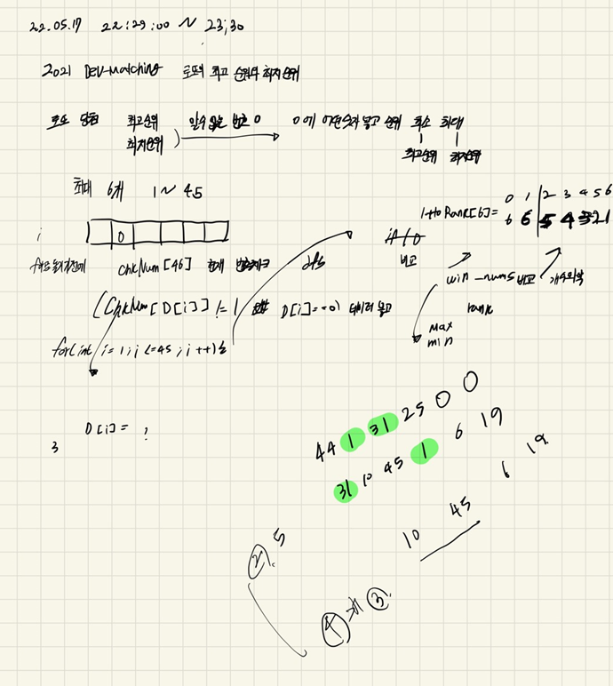

## 2022-05-17-2021Dev-Matchig-로또의최고순위와-최저순위

문제링크: [Click](https://programmers.co.kr/learn/courses/30/lessons/77484?language=cpp)



## 01.문제 풀이 

- 이문제에서 실수 한것 1 -45 까지 다 돌려서 확인하려고 했음
- 더 빠르게 풀수 있는것은 로또 당첨 번호가 있는지 확인 하고 그 번호가 주어진 번호와 비교한것이 최저순위
- 중복되지 않은 당첨번호를 추출해서 그 번호로 조합해서 순위결정한 것이 최고 순위
  - 위와 같이 하면 빠르게 정답을 얻을 수 있음
- 현재는 중복을 제거하지 않아서 완벽한 답은 아니지만 그래도 빠르게 풀 수 있음

## 02.소스 코드

```c++
#include <string>
#include <vector>
#include <algorithm>
#include <string.h>
using namespace std;
int lottoRank[7] = { 6,6,5,4,3,2,1};
int chkNum[46];
int removeNum;
int maxRet;
int minRet;
int D[6] = { 0, };

void dfs(int idx,int cnt,vector<int> &lottos, vector<int> &win_nums, vector<int> &number)
{
	if (idx == number.size()+1)return;
	if (cnt == removeNum) {
		vector<int> copy_lottos = lottos;
		int copy_idx = 0;
		for (int i = 0; i < copy_lottos.size(); i++) {
			if (copy_lottos[i] == 0) {
				copy_lottos[i] = D[copy_idx];
				copy_idx++;
			}
		}
		int lottoCnt = 0;
		for (int i = 0; i < win_nums.size(); i++) {
			for (int j = 0; j < copy_lottos.size(); j++) {
				if (win_nums[i] == copy_lottos[j]) {
					lottoCnt++;
				}
			}
		}
		minRet = min(minRet, lottoRank[lottoCnt]);
		return;
	}
	for (int i = idx; i < number.size(); i++) {
			D[idx] = number[i];
			dfs(idx + 1, cnt + 1, lottos, win_nums,number);
			D[cnt] = 0;
	}
	idx = 0;
}
vector<int> solution(vector<int> lottos, vector<int> win_nums) {
	vector<int> answer;
	removeNum = 0;
	maxRet = 0x80000000;// 최대가 6등
	minRet = 0x7fffffff;// 최소가 1등
	vector<int>number;
	memset(chkNum, 0, sizeof(chkNum));
	for (int i = 0; i < lottos.size(); i++) {
		if (lottos[i] == 0) {
			removeNum++;
		}
		else {
			for (int j = 0; j < win_nums.size(); j++) {
				if (lottos[i] == win_nums[j])
				{
					chkNum[j] = 1;
				}
			}
		}
	}
	
	for (int i = 0; i < 6; i++) {
		if (chkNum[i] == 0) {
			number.push_back(win_nums[i]);
		}
	}
	int num = 6 - number.size();
	maxRet = lottoRank[num];
	dfs(0,0,lottos, win_nums,number);
	answer.push_back(minRet);
	answer.push_back(maxRet);
	return answer;
}
```

