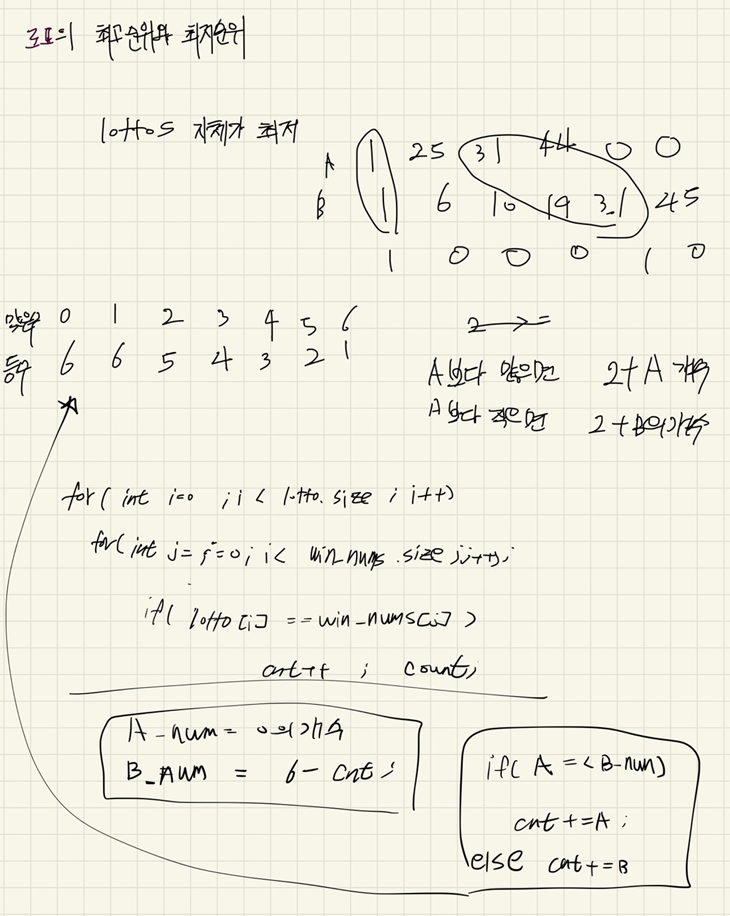
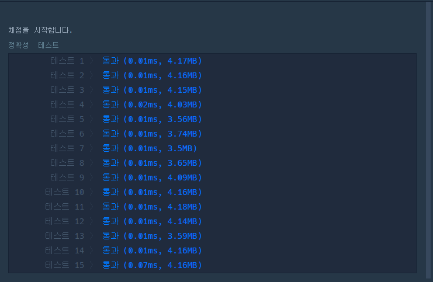
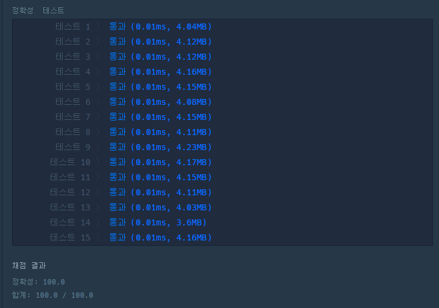

## 2022-06-13-로또의-최고순위와-최저순위-리팩토링

## 목차

> 01.풀이 과정
>
> 02.소스코드
>
> 03.결과

## 01.풀이 과정



- 이전에는 dfs를 이용해서 무슨 순열까지 해서 문제를 풀었는데 정말 비효율적 이였음

  - 그냥 간단히 생각해보면 lottos로 주어지는 백터에서 win_num에 있는 숫자의 개수가 최저등수가 됨

  - 그리고 최고 등수는 조건을 두가지로 구분할 수 있음

    - lottos에서 0으로 주어지는 개수 <=  6 - (lottos의 번호가 win_num에 일치하는 개수)
      - 즉, **위에서 A의 0의 개수**: lottos에서 0으로 주어지는 개수
      - **위에서 맞은숫자 빼고 남은 개수**: 6 - (lottos의 번호가 win_num에 일치하는 개수
        - 위의 경우라면 남은 0의개수를 더한것의 개수가 최대가 되고 

    - 그것이 아니라면 B에서 맞은 것 빼고 남은 개수를 더한것의 개수가 최대가 된다.

## 02.소스코드

- before

  ```c++
  #include <string>
  #include <vector>
  #include <algorithm>
  #include <string.h>
  using namespace std;
  int lottoRank[7] = { 6,6,5,4,3,2,1};
  int chkNum[46];
  int removeNum;
  int maxRet;
  int minRet;
  int D[6] = { 0, };
  
  void dfs(int idx,int cnt,vector<int> &lottos, vector<int> &win_nums, vector<int> &number)
  {
      if (idx == number.size()+1)return;
      if (cnt == removeNum) {
          vector<int> copy_lottos = lottos;
          int copy_idx = 0;
          for (int i = 0; i < copy_lottos.size(); i++) {
              if (copy_lottos[i] == 0) {
                  copy_lottos[i] = D[copy_idx];
                  copy_idx++;
              }
          }
          int lottoCnt = 0;
          for (int i = 0; i < win_nums.size(); i++) {
              for (int j = 0; j < copy_lottos.size(); j++) {
                  if (win_nums[i] == copy_lottos[j]) {
                      lottoCnt++;
                  }
              }
          }
          minRet = min(minRet, lottoRank[lottoCnt]);
          return;
      }
      for (int i = idx; i < number.size(); i++) {
              D[idx] = number[i];
              dfs(idx + 1, cnt + 1, lottos, win_nums,number);
              D[cnt] = 0;
      }
      idx = 0;
  }
  vector<int> solution(vector<int> lottos, vector<int> win_nums) {
      vector<int> answer;
      removeNum = 0;
      maxRet = 0x80000000;// 최대가 6등
      minRet = 0x7fffffff;// 최소가 1등
      vector<int>number;
      memset(chkNum, 0, sizeof(chkNum));
      for (int i = 0; i < lottos.size(); i++) {
          if (lottos[i] == 0) {
              removeNum++;
          }
          else {
              for (int j = 0; j < win_nums.size(); j++) {
                  if (lottos[i] == win_nums[j])
                  {
                      chkNum[j] = 1;
                  }
              }
          }
      }
  
      for (int i = 0; i < 6; i++) {
          if (chkNum[i] == 0) {
              number.push_back(win_nums[i]);
          }
      }
      int num = 6 - number.size();
      maxRet = lottoRank[num];
      dfs(0,0,lottos, win_nums,number);
      answer.push_back(minRet);
      answer.push_back(maxRet);
      return answer;
  }
  ```

- after

  ```c++
  #include <string>
  #include <vector>
  
  using namespace std;
  int rank1[]={6,6,5,4,3,2,1};
  
  vector<int> solution(vector<int> lottos, vector<int> win_nums) {
      vector<int> answer;
      int a_num=0, b_num=0;
      int cnt=0;
      
      for(int i=0;i<lottos.size();i++){
          if(lottos[i]==0) a_num++;
          for(int j=0;j<win_nums.size();j++){
              if(lottos[i]==win_nums[j]){
                  cnt++;
                  continue;
              }
          }
      }
      b_num = 6-cnt;
  
       //최고 등수
      if(a_num<=b_num){
          a_num+=cnt;
          answer.push_back({rank1[a_num]});
      }
      else {
          b_num+=cnt;
          answer.push_back({rank1[b_num]});
      }
      //최저 등수
      answer.push_back({rank1[cnt]});
    
      return answer;
  }
  ```

- 확연한 소스의 양의 차이를 볼 수 있음

  - 사실상 처음했던 방식대로 풀면 안되는 문제였음
  - 단순한 완전 탐색이라고 생각하면 좋음

## 03.결과

- before 속도

  

- after 속도

  

  - 사실 엄청 큰 차이는없지만 구현속도의 차이가 크고 어렵게 생각할 문제가 아님