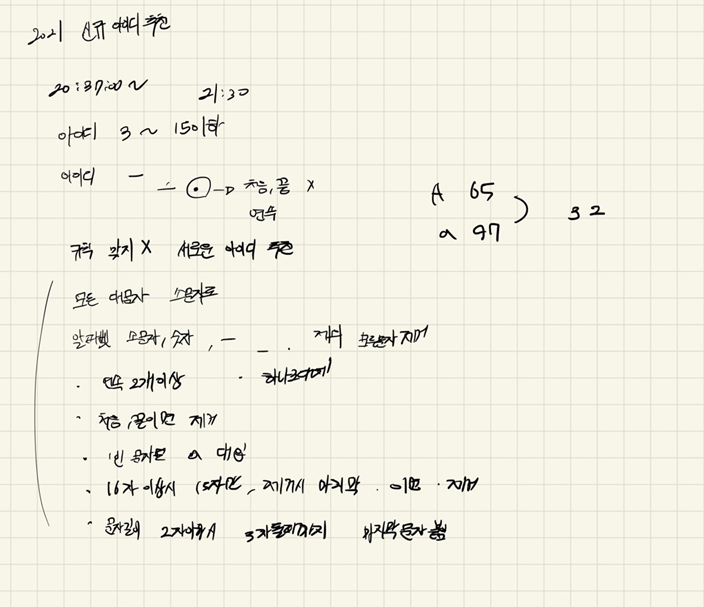

## 2022-06-14-카카오_신규아이디추천

## 목차

>  01.설계
>
>  02.구현 코드단계별로 보기
>
>  >  02.1 `1단계`
>  >
>  >  02.2 `2단계`
>  >
>  >  02.3 `3단계`
>  >
>  >  02.4 `4단계`
>  >
>  >  02.5 `5단계`
>  >
>  >  02.6 `6단계`
>  >
>  >  02.7 `7단계`
>
>  03.전체소스

## 01.설계



- 사실 문제에 주어진대로 구현하면됨

## 02.구현 코드단계별로 보기

### 02.1 `1단계`

- 1단계 new_id의 모든 대문자를 대응되는 소문자로 치환합니다.

  ```sql
  for (int i = 0; i< new_id.size(); i++) {//대문자를 소문자로 변경
  		if('A'<=new_id[i]&&new_id[i]<='Z')
  		new_id[i] += 32;
  }
  ```

### 02.2 `2단계`

- 2단계 new_id에서 알파벳 소문자, 숫자, 빼기(-), 밑줄(_), 마침표(.)를 제외한 모든 문자를 제거합니다.

  ```sql
  for (int i = 0; i < new_id.size(); i++) {
  		if (('0' <= new_id[i] && new_id[i] <= '9')||('a' <= new_id[i] && new_id[i] <= 'z')
              ||new_id[i] == '.'||new_id[i] == '-'||new_id[i] == '_') {
  
  		}
  		else {
  			if (new_id.size() == 0)break;
  			new_id.erase(new_id.begin() + i);
  			i--;
  		}	
  }
  ```

### 02.3 `3단계`

- 3단계 new_id에서 마침표(.)가 2번 이상 연속된 부분을 하나의 마침표(.)로 치환합니다.

  ```sql
  for (int i = 0; i < new_id.size()-1; i++) {
  		if (new_id.size() == 1)break;
  		if (new_id.size()&&new_id[i] == '.'&& new_id[i+1]=='.') {
  			for (int j = i+1; j < new_id.size(); j++)
  			{
  				if (new_id.size() == 1)break;
  				if (new_id.size() == 0)break;
  				if(new_id[j]=='.') new_id.erase(new_id.begin() + j);
  				else break;
  				j--;
  				i = j;
  			}
  		}
  }
  ```

### 02.4 `4단계`

- 4단계 new_id에서 마침표(.)가 처음이나 끝에 위치한다면 제거합니다.

  ```sql
  if(new_id.size()!=0&&new_id[0]=='.') new_id.erase(new_id.begin());//4단계
  
  int size = 0;
  if (new_id.size() != 0 && new_id[size] == '.') {
  		new_id.erase(new_id.end()-1);
  	}
  ```

### 02.5 `5단계`

- 5단계 new_id가 빈 문자열이라면, new_id에 "a"를 대입합니다.

  ```sql
  if (new_id.size() == 0) new_id.push_back('a');
  ```

### 02.6 `6단계`

- 6단계 new_id의 길이가 16자 이상이면, new_id의 첫 15개의 문자를 제외한 나머지 문자들을 모두 제거합니다.
       만약 제거 후 마침표(.)가 new_id의 끝에 위치한다면 끝에 위치한 마침표(.) 문자를 제거합니다.

  ```sql
  while (new_id.size()>= 16) {
  	new_id.pop_back();
  }
  if (new_id.size()&&new_id[new_id.size() - 1] == '.')new_id.pop_back();
  ```

### 02.7 `7단계`

- 7단계 new_id의 길이가 2자 이하라면, new_id의 마지막 문자를 new_id의 길이가 3이 될 때까지 반복해서 끝에 붙입니다.

  ```sql
  if (new_id.size()&&new_id.size() <= 2) {
  		char c = new_id[new_id.size() - 1];
  		while (new_id.size()!=3) {
  			new_id.push_back(c);
  		}
  }
  ```

## 03.전체소스

```sql
#include <string>
#include <vector>
#include <iostream>

using namespace std;

string solution(string new_id) {
	string answer = "";

	//1
	for (int i = 0; i< new_id.size(); i++) {//대문자를 소문자로 변경
		if('A'<=new_id[i]&&new_id[i]<='Z')
		new_id[i] += 32;
	}

	//2
	for (int i = 0; i < new_id.size(); i++) {
		if (('0' <= new_id[i] && new_id[i] <= '9')||('a' <= new_id[i] && new_id[i] <= 'z')
			||new_id[i] == '.'||new_id[i] == '-'||new_id[i] == '_') {

		}
		else {
			if (new_id.size() == 0)break;
			new_id.erase(new_id.begin() + i);
			i--;
		}	
	}

	//3
	for (int i = 0; i < new_id.size()-1; i++) {
		if (new_id.size() == 1)break;
		if (new_id.size()&&new_id[i] == '.'&& new_id[i+1]=='.') {
			for (int j = i+1; j < new_id.size(); j++)
			{
				if (new_id.size() == 1)break;
				if (new_id.size() == 0)break;
				if(new_id[j]=='.') new_id.erase(new_id.begin() + j);
				else break;
				j--;
				i = j;
			}
		}
	}

	//4
	if(new_id.size()!=0&&new_id[0]=='.') new_id.erase(new_id.begin());//4단계

	int size = 0;
	if (new_id.size() != 0 && new_id[size] == '.') {
		new_id.erase(new_id.end()-1);
	}

	//5
	if (new_id.size() == 0) new_id.push_back('a');

	//6
	while (new_id.size()>= 16) {

		new_id.pop_back();
	}

	if (new_id.size()&&new_id[new_id.size() - 1] == '.')new_id.pop_back();

	//7
	if (new_id.size()&&new_id.size() <= 2) {
		char c = new_id[new_id.size() - 1];
		while (new_id.size()!=3) {
			new_id.push_back(c);
		}
	}

	answer = new_id;
	return answer;
}

int main(void)
{
	//cout << solution("ssssssssssssssssssssssssadasdafafafaliehaklsfhjk3@34jiuo23h48972rn au3r98f2a3lruj2389ry239rynq2789gr?@#rq23rq#@RQ@#*(rq2893nryq2389yr98sssssssssssssssssssssssssssssssssssssssssssssssssssssssssssssssssssssssssssssssssssssssssssssss") << endl;
	//cout<<solution("...!@BaT#*..y.abcdefghijklm")<<endl;
	//cout << solution("z-+.^.") << endl;
	//cout << solution("aaa") << endl;
	//cout << solution("123_.def") << endl;
	cout << solution("abcdefghijklmn.p") << endl;
	return 0;
}
```


