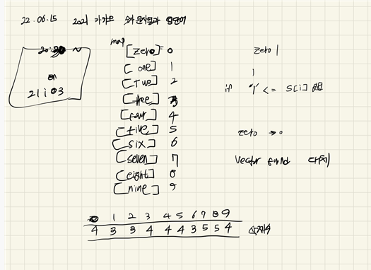
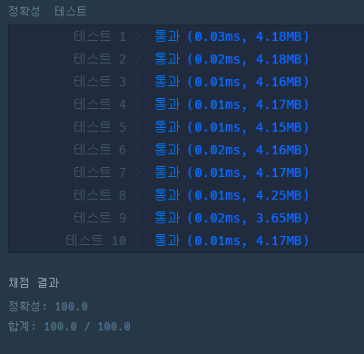
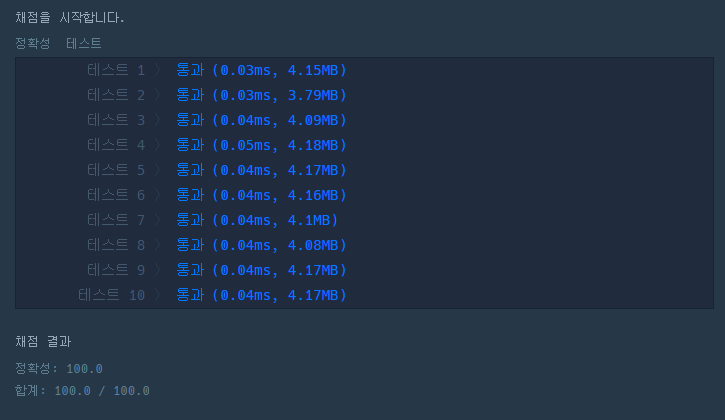

## 2022-06-15-2021카카오-숫자문자열과-영단어

문제 링크 : [Click](https://programmers.co.kr/learn/courses/30/lessons/81301?language=cpp)

## 목차
>01.설계
>
>02.풀이
>
>03.소스코드
>
##  01.설계



## 02.풀이

- 간단히 replace를 이용해서 zero인 문자열을 0 
  - 각 영문에 맞게 replace를 해주면됨

## 03.소스코드

- 나의 풀이

  ```sql
  #include <string>
  #include <vector>
  #include <iostream>
  #include <map>
  
  using namespace std;
  int numberRemove[] = { 4,3,3,5,4,4,3,5,5,4 };
  string alphaNumber[] = {
  	"zero","one","two","three","four","five","six","seven","eight","nine"
  };
  string alphaNumberIdx[] = {
  	"0","1","2","3","4","5","6","7","8","9"
  };
  int zeroNumber[] = { 0,1,10,100,1000,10000,100000,1000000 };
  map<string, int> numberA;
  
  map<int, int>a;
  
  
  int solution(string s) {
  	int answer = 0;
  	numberA["zero"] = 0;
  	numberA["one"] = 1;
  	numberA["two"] = 2;
  	numberA["three"] = 3;
  	numberA["four"] = 4;
  	numberA["five"] = 5;
  	numberA["six"] = 6;
  	numberA["seven"] = 7;
  	numberA["eight"] = 8;
  	numberA["nine"] = 9;
  
  	for (int i = 0; i <= 9; i++) {
  		while (s.find(alphaNumber[i]) != s.npos) {
  			s.replace(s.find(alphaNumber[i]), numberRemove[numberA[alphaNumber[i]]], alphaNumberIdx[i]);
  		}
  	}
  	int len = s.size()-1;
  	for (int ten = 1, i = len; i >= 0; i--, ten *= 10) {
  		answer += (s[i]-'0') * ten;
  	}
  	return answer;
  }
  int main(void)
  {
  	cout << solution("one4seveneight"	);
  	return 0;
  }
  ```

  

- regex를 이용한 풀이

  ```sql
  #include <string>
  #include <vector>
  using namespace std;
  
  int solution(string s) {
  	s = regex_replace(s, regex("zero"), "0");
  	s = regex_replace(s, regex("one"), "1");
  	s = regex_replace(s, regex("two"), "2");
  	s = regex_replace(s, regex("three"), "3");
  	s = regex_replace(s, regex("four"), "4");
  	s = regex_replace(s, regex("five"), "5");
  	s = regex_replace(s, regex("six"), "6");
  	s = regex_replace(s, regex("seven"), "7");
  	s = regex_replace(s, regex("eight"), "8");
  	s = regex_replace(s, regex("nine"), "9");
  	return stoi(s);
  }
  int main(void)
  {
  	cout << solution("one4seveneight");
  
  	return 0;
  }
  ```

  - regex : 정규식을 이용해서 더 쉽게 풀 수 있음

  

