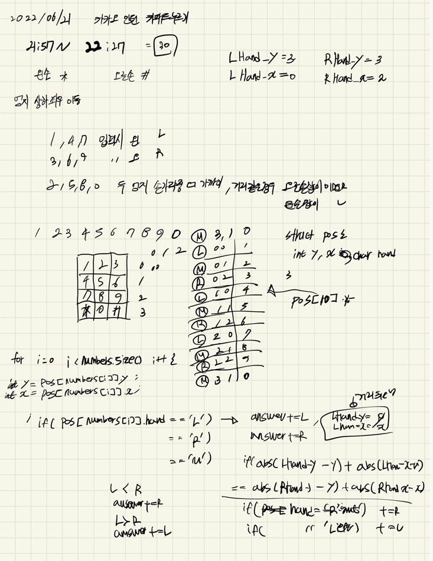
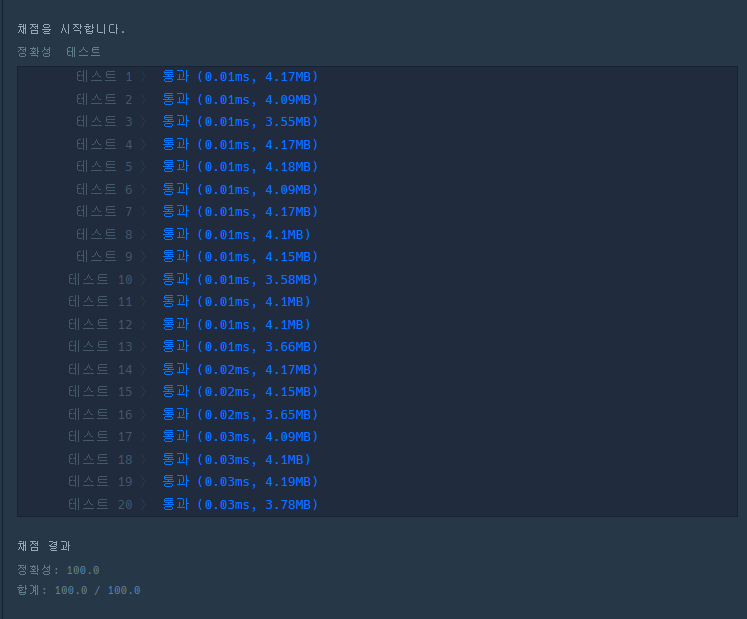

## 2022-06-21-프로그래머스-카카오인턴십-키패드누르기

문제링크: [Click](https://school.programmers.co.kr/learn/courses/30/lessons/67256)

## 목차

>01.설계
>
>02.소스코드

## 01.설계



- 정말 간단하게 각 위치의 정보와  왼손으로 누르는지 오른손으로 누르는지 저장하고
  - 조건에 맞게 사실상 L, R을 문자열에 넣는다
    - 이때, 중요한것은 나중에 M즉, 가운데 영역의 있는 숫자의 경우 현재 손의 위치의 거리를 측정해야하므로, 그 위치로 손의 위치를 이동시켜줘야한다.

## 02.소스코드

```c++
#include <string>
#include <vector>
#include <algorithm>
#include <iostream>

using namespace std;
struct pos {
	int y, x; char hand;
};
pos numberPos[10] = {
{3,1,'M'},
{0,0,'L'},
{0,1,'M'},
{0,2,'R'},
{1,0,'L'},
{1,1,'M'},
{1,2,'R'},
{2,0,'L'},
{2,1,'M'},
{2,2,'R'}};

string solution(vector<int> numbers, string hand) {
	int LHand_y = 3, LHand_x = 0;
	int RHand_y = 3, RHand_x = 2;
	string answer = "";

	for (int i = 0; i < numbers.size(); i++) {
		int y = numberPos[numbers[i]].y;
		int x = numberPos[numbers[i]].x;
		if (numberPos[numbers[i]].hand == 'L') {
			answer += 'L';
			LHand_y = y; LHand_x = x;
		}
		else if (numberPos[numbers[i]].hand == 'R') {
			answer += 'R';
			RHand_y = y; RHand_x = x;
		}
		else if (numberPos[numbers[i]].hand == 'M') {
			int absL = abs(LHand_y - y) + abs(LHand_x - x);
			int absR = abs(RHand_y - y) + abs(RHand_x - x);
			if (absL < absR) {
				answer += 'L';
				LHand_y = y; LHand_x = x;
			}
			else if (absL > absR) {
				answer += 'R';
				RHand_y = y; RHand_x = x;
			}
			else if (absL == absR) {
				if (hand == "right") {
					answer += 'R';
					RHand_y = y; RHand_x = x;
				}
				else if (hand == "left") {
					answer += 'L';
					LHand_y = y; LHand_x = x;
				}
			}
		}
	}

	return answer;
}

int main(void)
{
	cout << solution({ 7, 0, 8, 2, 8, 3, 1, 5, 7, 6, 2 }, "left");
	return 0;
}
```

