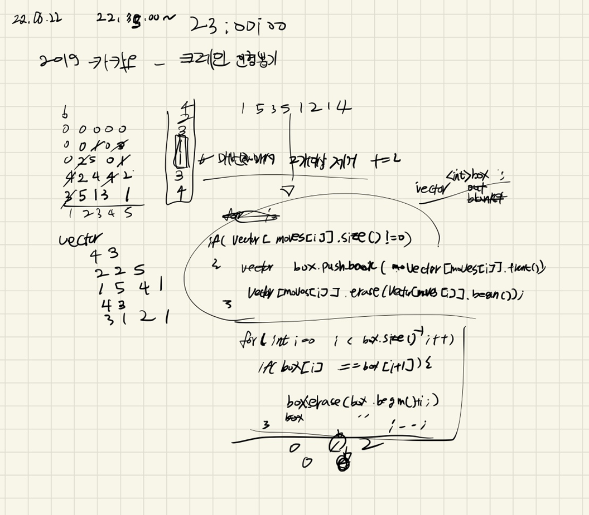
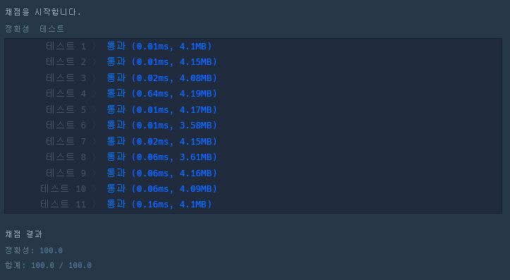

## 2022-06-22-2019카카오-크레인인형뽑기게임

문제 링크: [Click](https://programmers.co.kr/learn/courses/30/lessons/64061)

## 목차

> 01.설계
>
> 02.소스코드

## 01.설계



- 조금은 비효율적일 수 있지만

  - 배열의 1번 열의 모든것을 0 빼고 다른 백터에 저장 

    - 여기서는 lineDoll[1]에 저장되는것

      - 위와 같은 형식으로 모든 배열의 숫자를 넣는다.

        ``` c++
        for (int j = 0; j < board.size(); j++) {//뽑아내기
            for (int i = 0; i < board.size(); i++) {
                if (board[i][j] != 0) {
                    lineDoll[j].push_back(board[i][j]);
                }
            }
        }
        ```

  - 그리고 box라는 곳에 moves에 맞게 넣어야하는데 여기서 중요한것은

    - moves의 인덱스는 1부터 시작 우리가 넣는 백터는 0부터 시작이므로 소스를 보면

      ``` c++
      if (lineDoll[moves[m]-1].size() != 0) {
          box.push_back(lineDoll[moves[m]-1][0]);
          lineDoll[moves[m]-1].erase(lineDoll[moves[m]-1].begin());
      }
      ```

      - `moves[m]-1`을 해야지 제대로 결과가 나옴

  - 2개이상일때 부터 비교하게 했음

    - 그리고 2개이상의 숫자가 같으면 box백터의 두개의 값을 지우고 +2 씩 answer에 더하는 식으로 구현

      ```c++
      if (box.size() >= 2) {
          for (int i = 0; i < box.size() - 1; i++) {
              if (box.size()==0||box.size() == 1)break;
              if (box[i] == box[i + 1]) {
                  box.erase(box.begin() + i, box.begin() + i+2);
                  i--;
                  answer += 2;
              }
          }
      }
      ```

## 02.소스코드

``` c++
#include <string>
#include <vector>
#include <iostream>

using namespace std;

int solution(vector<vector<int>> board, vector<int> moves) {
	int answer = 0;

	vector<int>box;
	vector<int>lineDoll[31];

	for (int j = 0; j < board.size(); j++) {//뽑아내기
		for (int i = 0; i < board.size(); i++) {
			if (board[i][j] != 0) {
				lineDoll[j].push_back(board[i][j]);
			}
		}
	}

	for (int m = 0; m < moves.size(); m++) {
		if (lineDoll[moves[m]-1].size() != 0) {
			box.push_back(lineDoll[moves[m]-1][0]);
			lineDoll[moves[m]-1].erase(lineDoll[moves[m]-1].begin());
		}

		//인형 두개 이상인지 확인하고 같은 종류 두개인지 확인후 제거 점수 추가
		if (box.size() >= 2) {
			for (int i = 0; i < box.size() - 1; i++) {
				if (box.size()==0||box.size() == 1)break;
				if (box[i] == box[i + 1]) {
					box.erase(box.begin() + i, box.begin() + i+2);
					i--;
					answer += 2;
				}
			}
		}
	}
	return answer;
}

int main(void)
{
	cout << solution({ {0, 0, 0, 0, 0}, {0, 0, 1, 0, 3}, {0, 2, 5, 0, 1}, {4, 2, 4, 4, 2}, {3, 5, 1, 3, 1} }, { 1, 5, 3, 5, 1, 2, 1, 4});
	return 0;
}
```

