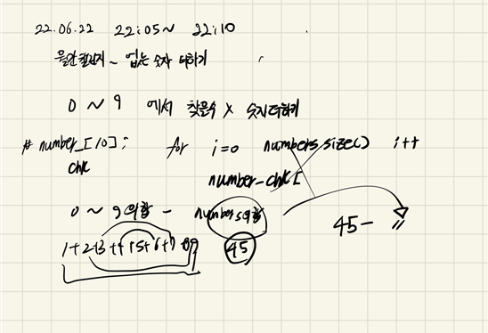

## 2022-06-22-월간코드챌리지시즌3-없는-숫자더하기

## 목차

> 01.설계
>
> 02.소스코드

[문제 링크:  [Click](https://programmers.co.kr/learn/courses/30/lessons/86051)]

## 01.설계



- 이문제는 쉬운것이 사실 0 ~ 9 한개의 숫자만 들어가고 그중에 중복된 것도 없이
  - 없는 숫자의합을 빼면됨
- 0 ~ 9의 전체합은 45이고
  - numbers에 합을 45에서 빼면 해당하는 원하는 답
    - 없는 숫자의 합을 구할 수 있음
- 없는 숫자의 합 = 45 - numbers 백터의 합

## 02.소스코드

```c++
#include <string>
#include <vector>

using namespace std;

int solution(vector<int> numbers) {
	int answer =0;
	for (int i = 0; i < numbers.size(); i++) {
		answer += numbers[i];
	}

	return 45-answer;
}

int main(void)
{
	return 0;
}
```


