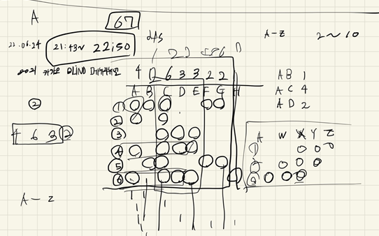
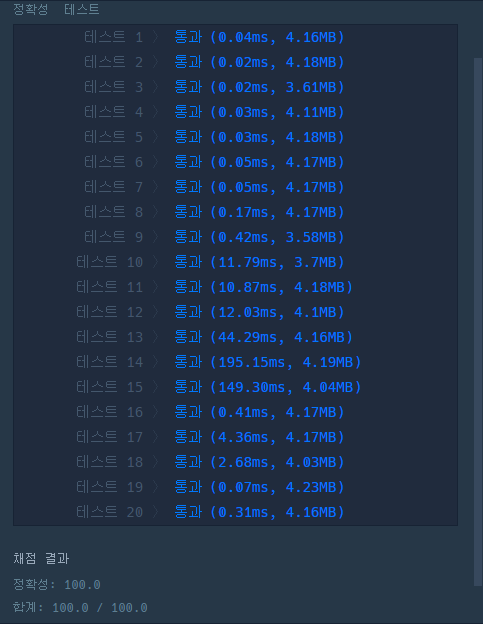

## 2022-06-24-2021카카오블라인드-메뉴리뉴얼

문제링크: [Click](https://school.programmers.co.kr/learn/courses/30/lessons/72411)

## 목차

>01.설계
>
>02.소스 코드
>
>>  02.1 순열로 조합 뽑기
>>>
>>  02.2 알파벳 숫자 형식으로 변환
>>>
>>  02.3 정렬
>
>03.전체소스

## 01.설계



- 순열을 이용해서 2개씩 또는 3개씩 뽑음
  - 대신 그 최대값을 저장하면서 해당하는 알파벳을 저장
  - 그러고 최대의 알파벳만 답으로 지정해서 정렬해서 출력

## 02.소스 코드

### 02.1 순열로 조합 뽑기

```c++
void dfs(int idx, int cnt,int number) {
	if (idx == idx_size+2)return;
	if (cnt == number) {
		int people_cnt = 0;
		for (int i = 0; i < y_size; i++) {
			int cnt = 0;
			for (int j = 0; j < D.size(); j++) {
				if (orders_A[i][D[j]] == 1) cnt++;
			}

			if (cnt == number) {
				people_cnt++;
			}
		}
		if (people_cnt >= 2 && ret <= people_cnt) {
			ret = people_cnt;
  			string a;
			for (int i = 0; i < D.size(); i++) {
				a += D[i] + 'A';
			}
			A[ret].push_back(a);
		}
		return;
	}
	D.push_back(idx);
	dfs(idx + 1, cnt + 1, number);
	D.pop_back();
	dfs(idx + 1, cnt, number);
}
```

### 02.2 알파벳 숫자 형식으로 변환

```c++
for (int i = 0; i < orders.size(); i++) {
    for (int j = 0; j < orders[i].size(); j++) {
        maxNumber = max(maxNumber, orders[i][j] - 'A');
        orders_A[i][orders[i][j] - 'A'] = 1;
    }
}
```

### 02.3 정렬

```c++
sort(answer.begin(), answer.end());
```

## 03.전체소스

```c++
#include <string>
#include <vector>
#include <iostream>
#include <algorithm>


using namespace std;
//int D[24];
vector<int>D;
int idx_size = 0;
int y_size = 0;
int orders_A[28][28];
int ret;
struct Data {
	string alpha;
};
vector<string> A[28];
void dfs(int idx, int cnt,int number) {
	if (idx == idx_size+2)return;
	if (cnt == number) {
		int people_cnt = 0;
		for (int i = 0; i < y_size; i++) {
			int cnt = 0;
			for (int j = 0; j < D.size(); j++) {
				if (orders_A[i][D[j]] == 1) cnt++;
			}

			if (cnt == number) {
				people_cnt++;
			}
		}
		if (people_cnt >= 2 && ret <= people_cnt) {
			ret = people_cnt;
  			string a;
			for (int i = 0; i < D.size(); i++) {
				a += D[i] + 'A';
			}
			A[ret].push_back(a);
		}
		return;
	}
	D.push_back(idx);
	dfs(idx + 1, cnt + 1, number);
	D.pop_back();
	dfs(idx + 1, cnt, number);
}
vector<string> solution(vector<string> orders, vector<int> course) {
	vector<string> answer;
	y_size = orders.size();
	int maxNumber = -1;
	for (int i = 0; i < orders.size(); i++) {
		for (int j = 0; j < orders[i].size(); j++) {
			maxNumber = max(maxNumber, orders[i][j] - 'A');
			orders_A[i][orders[i][j] - 'A'] = 1;
		}
	}
	idx_size = maxNumber;
	for (int i = 0; i < course.size(); i++) {
		ret = -1;
		dfs(0, 0,course[i]);

		if (A[ret].size() != 0) {
			if (ret == -1)break;
			for (int j = 0; j < A[ret].size(); j++) {
				string a = A[ret][j];
				answer.push_back(a);
			}
		}
		for (int i = 0; i < 28; i++) {
			A[i].clear();
		}
	}
	sort(answer.begin(), answer.end());
	return answer;
}

int main(void) {
	vector<string> a;
	a = solution({ "XYZ", "XWY", "WXA"}, { 2,3,4 });
	for (int i = 0; i < a.size(); i++) {
		cout << a[i] << " ";
	}
	return 0;
}
```




