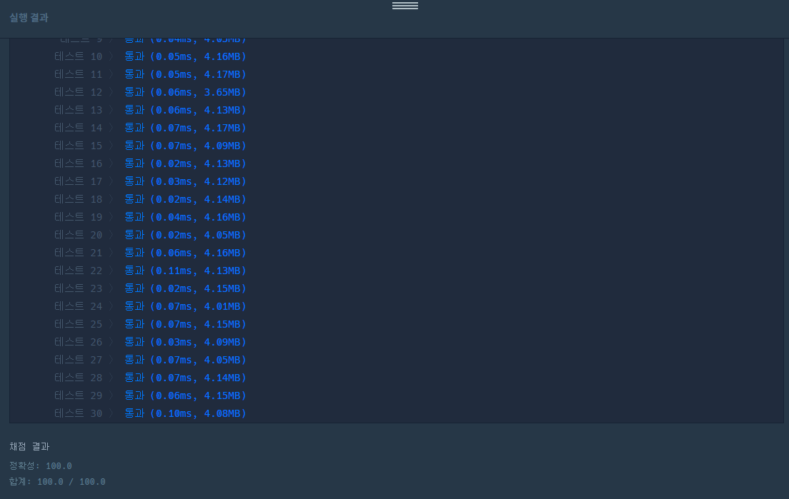

## 2022-06-26-2021-카카오인턴-수식최대화

## 목차

>01.설계
>
>02.소스코드
>
>>  02.0 연산자 우선 순위 변수화
>>
>>  02.1 string -> vector<string>으로 변환
>>
>>  02.2 계산하고 최댓값 뽑아내는 부분
>
>03.전체소스

## 01.설계


- 쉽게 접근함
  - 우선 우선 순위 자체를 지정하고 계산하는 식으로 접근
  - 그렇게 해서 각 우선 순위에 맞추어 값 계산하고 이값의 최대값 뽑기
- 주의
  - long long 형임을 잊지말기
  - 변수도 신경써서 자료형 맞춤
  - string -> long long 변환하는 함수 적용
    - stoll()사용, 사용법의 경우 인터넷 참고

## 02.소스코드

### 02.0 연산자 우선 순위 변수화

```c++
string ordering[6][3] = {
	{"+","-","*"},
	{"+","*","-"},
	{"-","+","*"},
	{"-","*","+"},
	{"*","-","+"},
	{"*","+","-"}
};
```

### 02.1 string -> vector<string>으로 변환

```c++
vector<string>calNumber;
string number;
for (int i = 0; i < expression.size(); i++) {
    if ('0' <= expression[i] && expression[i] <= '9') {
        number += expression[i];
    }
    else {
        calNumber.push_back(number);
        number.clear();
        number += expression[i];
        calNumber.push_back(number);
        number.clear();
    }
    if(i== expression.size()-1)
        calNumber.push_back(number);
}
```

### 02.2 계산하고 최댓값 뽑아내는 부분

```c++
for (int i = 0; i < 6; i++) {
    for (int j = 0; j < 3; j++) {
        long long sum = 0;
        for (int e = 0; e < calNumber.size(); e++) {
            if (calNumber[e] == ordering[i][j]) {
                long long firstNum = stoll (calNumber[e - 1]);
                long long secondNum = stoll(calNumber[e + 1]);

                if (calNumber[e] == "+") {
                    sum = firstNum + secondNum;
                }
                else if (calNumber[e] == "-") {
                    sum = firstNum - secondNum;
                }
                else if (calNumber[e] == "*") {
                    sum = firstNum * secondNum;
                }
                else break;
                calNumber.erase(calNumber.begin() + (e - 1), calNumber.begin() + (e - 1) + 3);
                e--;
                string number = to_string(sum);
                calNumber.insert(calNumber.begin() + e, number);
            }
        }
    } 
    answer = max(answer, abs(stoll(calNumber[0])));
    calNumber = copy_calNumber;
```

## 03.전체소스

```c++
#include <vector>
#include <string>
#include <algorithm>
#include <iostream>

using namespace std;
string ordering[6][3] = {
	{"+","-","*"},
	{"+","*","-"},
	{"-","+","*"},
	{"-","*","+"},
	{"*","-","+"},
	{"*","+","-"}
};
long long solution(string expression) {
	long long answer = 0;
	vector<string>calNumber;
	string number;
	for (int i = 0; i < expression.size(); i++) {
		if ('0' <= expression[i] && expression[i] <= '9') {
			number += expression[i];
		}
		else {
			calNumber.push_back(number);
			number.clear();
			number += expression[i];
			calNumber.push_back(number);
			number.clear();
		}
		if(i== expression.size()-1)
			calNumber.push_back(number);
	}


	vector<string>copy_calNumber=calNumber;

	for (int i = 0; i < 6; i++) {
		for (int j = 0; j < 3; j++) {
			long long sum = 0;
			for (int e = 0; e < calNumber.size(); e++) {
				if (calNumber[e] == ordering[i][j]) {
					long long firstNum = stoll (calNumber[e - 1]);
					long long secondNum = stoll(calNumber[e + 1]);

					if (calNumber[e] == "+") {
						sum = firstNum + secondNum;
					}
					else if (calNumber[e] == "-") {
						sum = firstNum - secondNum;
					}
					else if (calNumber[e] == "*") {
						sum = firstNum * secondNum;
					}
					else break;
					calNumber.erase(calNumber.begin() + (e - 1), calNumber.begin() + (e - 1) + 3);
					e--;
					string number = to_string(sum);
					calNumber.insert(calNumber.begin() + e, number);
				}
			}
		} 
		answer = max(answer, abs(stoll(calNumber[0])));
		calNumber = copy_calNumber;

	}
	return answer;
}

int main(void)
{
	cout<<solution("50*6-3*2");
	return 0;
}
```

