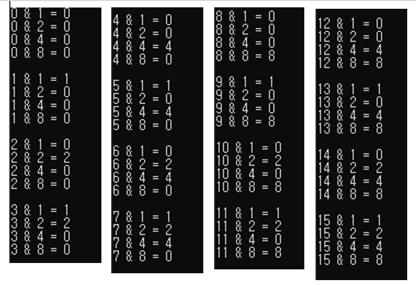
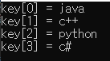
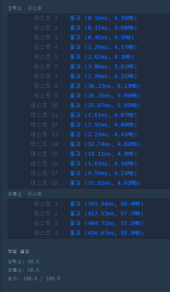

## 2022-06-30-2021-KAKAO-BLIND-RECRUITMENT-순위검색

문제링크: [Click](https://programmers.co.kr/learn/courses/30/lessons/72412)

## 목차

>  01.필요한 코드와 개념
>
>  >  01.1 순열?
>  >
>  >  01.2 istringstream
>  >
>  >  01.3 lower_bound()
>  >
>  >  01.4 unordered_map
>
>  02.전체소스

## 01.필요한 코드와 개념

### 01.1 순열?

- 순열이라고 하는게 맞는지 모르겠지만

  ```markdown
  1.	0000
  2.	0001
  3.	0010
  4.	0011
  5.	0100
  6.	0101
  7.	0110
  8.	0111
  
  9.	1000
  10.	1001
  11.	1010
  12.	1011
  13.	1100
  14. 1101
  15. 1110
  16. 1111
  ```

  - 위와 같이 뽑을줄 알아야함

    ```c++
    for (int mask = 0; mask < 16; mask++) {
    		for (int i = 0; i < 4; i++) {
                cout << mask <<" & "<< (1<<i) << " = " << (mask & (1 << i)) << endl;
            }
    	cout<<endl;
    }
    ```

    

    - 여기서는 1,2,4,8로 표현 됬지만 위에서 1이라고 생각하면됨
    - 사실 dfs를 돌려서 해도됨

### 01.2 istringstream

- 문자열 포맷을 parsing 할 때 사용
- 헤더의 경우 (#include <sstream>) 선언하고 사용

- **예제로 알아보는  istringstream**

  ```c++
  string inf = "java and c++ and python and c#";
  string key[4], rm;
  
  istringstream iss(inf);
  iss >> key[0] >> rm >> key[1] >> rm >> key[2] >> rm >> key[3];
  cout << "key[0]" << " = " << key[0] << endl
      << "key[1]" << " = " << key[1] << endl
      << "key[2]" << " = " << key[2] << endl
      << "key[3]" << " = " << key[3] << endl;
  ```

  

  

  - 위와 같이 and를 제외하고 뽑아낼 수 있음

- 실제 사용 소스

  ```c++
  vector<int> answer;
  string key[4], tmp;
  int point;
  
  for (auto& inf : info) {
      istringstream iss(inf);
      iss >> key[0] >> key[1] >> key[2] >> key[3] >> point;
      insert(key, point);
  }
  
  
  for (auto& que : query) {
      istringstream iss(que);
      iss >> key[0] >> tmp >> key[1] >> tmp >> key[2] >> tmp >> key[3] >>
          point;
      string s = key[0] + key[1] + key[2] + key[3];
      vector<int>& v = map[s];
      answer.push_back(v.end() - lower_bound(v.begin(), v.end(), point));
  }
  ```

### 01.3 lower_bound()

- 이진탐색으로 원소를 탐색하는 것 upper_bound()함수도 있음

- 용도: 찾으려는 key 값보다 같거나 큰 숫자가  배열의 몇번째 처음 등장하는지 찾음

- 헤더의 경우 (#include <algorithm>)선언하고 사용

- 실제 사용 소스

  ```c++
  answer.push_back(v.end() - lower_bound(v.begin(), v.end(), point));
  ```

  - 일단 무조건 정렬되어 있어야하고 이렇게 빼면 100이상인것의 개수를 구한다고 하면 구할 수 있음

### 01.4 unordered_map

- map 보다 더 빠른 탐색을 하기 위한 자료구조
  - 해쉬테이블로 구현한 자료구조로 시간 복잡도 O(1)
  - 중복 데이터 허용하지 않음, 데이터 많은경우 map에 비해 월등히 좋은 성능가짐
    - ket가 유사한 데이터가 많으면 해시 충돌로 인해 성능이 떨어질 수 있음

- 헤더의 경우 (#include <unordered_map>) 선언하고 사용

- 실제 사용 소스

  ```c++
  unordered_map<string, vector<int>> map;
  
  string s = "";
  int point;
  map[s].push_back(point);
  
  for (auto& m : map) sort(m.second.begin(), m.second.end());// 정렬하는 법
  ```

## 02.전체소스

```c++
#include <vector>
#include <unordered_map>
#include <algorithm>
#include <sstream>
#include <iostream>

using namespace std;

const string ALL = "-";
unordered_map<string, vector<int>> map;

void insert(string* key, int point) {
	for (int mask = 0; mask < 16; mask++) {

		string s = "";
		for (int i = 0; i < 4; i++) {
			s += (mask & (1 << i)) ? ALL : key[i];
			map[s].push_back(point);
		}
	}
}

vector<int> solution(vector<string> info, vector<string> query) {
	vector<int> answer;
	string key[4], tmp;
	int point;

	for (auto& inf : info) {
		istringstream iss(inf);
		iss >> key[0] >> key[1] >> key[2] >> key[3] >> point;
		insert(key, point);
	}

	for (auto& m : map) sort(m.second.begin(), m.second.end());// 정렬

	for (auto& que : query) {
		istringstream iss(que);
		iss >> key[0] >> tmp >> key[1] >> tmp >> key[2] >> tmp >> key[3] >>
			point;
		string s = key[0] + key[1] + key[2] + key[3];
		vector<int>& v = map[s];
		answer.push_back(v.end() - lower_bound(v.begin(), v.end(), point));
	}

	return answer;
}
int main(void)
{
	vector<int> a = solution({ "java backend junior pizza 150", "python frontend senior chicken 210", "python frontend senior chicken 150", "cpp backend senior pizza 260", "java backend junior chicken 80", "python backend senior chicken 50" },
		{ "java and backend and junior and pizza 100","python and frontend and senior and chicken 200","cpp and - and senior and pizza 250","- and backend and senior and - 150","- and - and - and chicken 100","- and - and - and - 150" });
	return 0;
}
```

