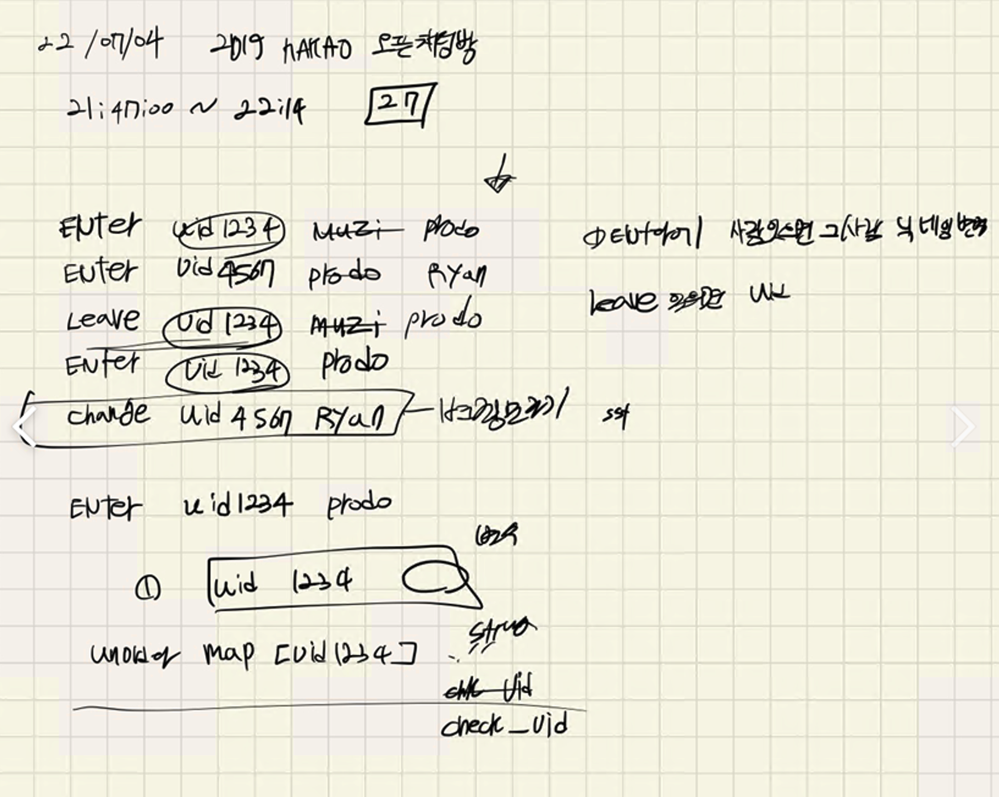
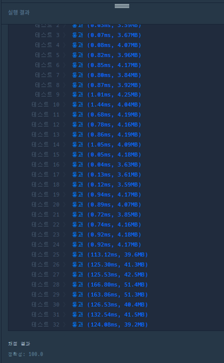

## 2022-07-04-2019카카오-오픈채팅방

## 목차

## 01.설계



- 정말 간단히 생각했을때
  - uid와 이름을 저장을 하고
    - enter, change인 경우만 이름이 바뀌게 하고
  - change의 경우는 출력에서 제외하고 저장해놓고
  - 마지막에 uid와 이름 저장한것을 이용해서 이름을 최신화 하여 출력하면됨

## 02.부분 코드 확인

### 02.1 uid이름 저장하는 부분과 데이터 저장부분

```c++
unordered_map<string, string> map;
vector<Data> sub_answer;
for (auto& rec : record)
{
    string key[3];
    istringstream iss(rec);
    iss >> key[0] >> key[1] >> key[2];
    if(key[0] != "Change")sub_answer.push_back({ key[0],key[1]});
    if(key[0]!="Leave")	map[key[1]] = key[2];
}
```

### 02.2 answer 마지막에 이름 최신화해서 저장하는 부분

```c++
for (auto& sub_a : sub_answer) {
    if (sub_a.actor == "Enter") {
        string sumString;
        sumString += map[sub_a.uid] + "님이 들어왔습니다.";
        answer.push_back(sumString);
    }
    else  if (sub_a.actor == "Leave") {
        string sumString;
        sumString += map[sub_a.uid] + "님이 나갔습니다.";
        answer.push_back(sumString);
    }
}
```

## 03.전체 소스코드

- before

  ```c++
  #include <string>
  #include <vector>
  #include<map>
  #include<queue>
  using namespace std;
  vector<string> record1;
  string temp;
  vector<string>v;
  map<string, string>m;
  vector<string> answer;
  struct Data {
  	string statusUser, id;
  };
  queue<Data>q;
  void queueData() {
  	//정리 
  	if (v[0] == "Enter") {
  		q.push({ v[0],v[1] });
  		m[v[1]] = v[2];
  	}
  	if (v[0] == "Leave") {
  		q.push({ v[0],v[1] });
  	}
  	if (v[0] == "Change") {
  		m[v[1]] = v[2];
  	}
  }
  void tempSplit(){
  	for (int i = 0; i < record1.size(); i++) {
  		temp.clear();
  		v.clear();
  		for (int j = 0; j < record1[i].size(); j++) {
  			if (record1[i][j] == ' ') {// 빈공간이면 나눠주기
  				v.push_back(temp);
  				temp.clear();
  			}
  			else {
  				temp.push_back(record1[i][j]);
  			}
  		}
  		v.push_back(temp);
  		queueData();
  	}
  }
  void answer1() {
  	while (!q.empty()) {
  		Data c = q.front(); q.pop();
  		if (c.statusUser == "Enter") {
  			answer.push_back({ m[c.id] + "님이 들어왔습니다." });
  		}
  		if (c.statusUser == "Leave") {
  			answer.push_back({ m[c.id] + "님이 나갔습니다." });
  		}
  	}
  }
  vector<string> solution(vector<string> record) {
  	record1 = record;
  	tempSplit();
  	answer1();
  	return answer;
  }
  int main(void) {
  	solution({ "Enter uid1234 Muzi", "Enter uid4567 Prodo", "Leave uid1234", "Enter uid1234 Prodo", "Change uid4567 Ryan" });
  	return 0;
  }
  ```

- after

  ```c++
  
  #include <string>
  #include <vector>
  #include <sstream>
  #include <unordered_map>
  
  using namespace std;
  struct Data {
  	string actor;
  	string uid;
  };
  
  vector<string> solution(vector<string> record) {
  	vector<string> answer;
  	unordered_map<string, string> map;
  	vector<Data> sub_answer;
  	for (auto& rec : record)
  	{
  		string key[3];
  		istringstream iss(rec);
  		iss >> key[0] >> key[1] >> key[2];
  		if(key[0] != "Change")sub_answer.push_back({ key[0],key[1]});
  		if(key[0]!="Leave")	map[key[1]] = key[2];
  	}
  	for (auto& sub_a : sub_answer) {
  		if (sub_a.actor == "Enter") {
  			string sumString;
  			sumString += map[sub_a.uid] + "님이 들어왔습니다.";
  			answer.push_back(sumString);
  		}
  		else  if (sub_a.actor == "Leave") {
  			string sumString;
  			sumString += map[sub_a.uid] + "님이 나갔습니다.";
  			answer.push_back(sumString);
  		}
  	}
  	return answer;
  }
  
  int main(void) {
  
  	solution({ "Enter uid1234 Muzi", "Enter uid4567 Prodo","Leave uid1234","Enter uid1234 Prodo","Change uid4567 Ryan" });
  	return 0;
  }
  ```

  - 이전에 비해서 확실히 소스의 양이 줄었고 간편하게 문제를 풀이를 했음 

