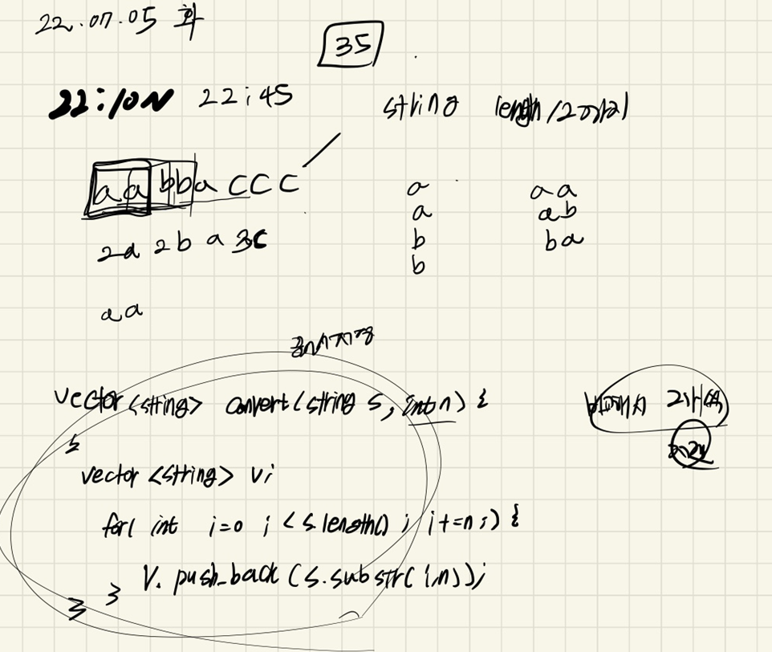
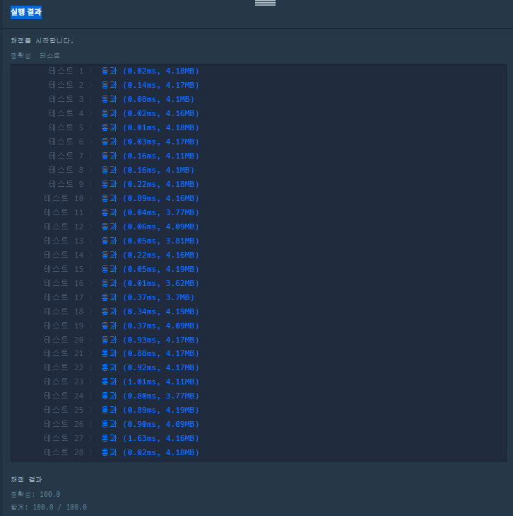

## 2022-07-05-2020카카오-문자열압축

문제링크: [Click](https://school.programmers.co.kr/learn/courses/30/lessons/60057)

## 목차

>  01.설계
>
>  02.백터로 묶는 소스
>
>  03.비교하여 압축하는 소스
>
>  04.전체소스

## 01.설계



- 각 하나씩 백터로 묶는 과정을 가지고 그 상태로 비교해서 압축하는 식으로 진행함

## 02.백터로 묶는 소스

```c++
vector<string> splitString(string s, int n) {
	vector<string> v;
	for (int i = 0; i < s.size(); i += n) {
		v.push_back(s.substr(i, n));
	}
	return v;
}
```

## 03.비교하여 압축하는 소스

```c++
for (int i = 1; i < splitS.size(); i++) {
    if (beforeCmpS == splitS[i]) cnt++;
    else{
        if (cnt != 1) zipS += to_string(cnt);
        zipS += beforeCmpS;
        beforeCmpS = splitS[i];
        cnt = 1;
    }
}
if (cnt != 1) zipS += to_string(cnt);
zipS += beforeCmpS;
```

## 04.전체소스

- before

  ```c++
  #include <string>
  #include <vector>
  #include <iostream>
  using namespace std;
  
  int solution(string s) {
  	int ret = 0x7fffffff;
  	int answer = 0;
  
  	for (int c = 1; c <= s.size(); c++) {
  		int idx = 0;
  		string copyS[1001];
  		answer = 0;
  		for (int i = 0; i < s.size();) {
  			int C = c;
  			while (C--) {
  				if (i == (s.size()))break;
  				copyS[idx].push_back(s[i++]);
  			}
  			idx++;
  		}
  		for (int i = 0; i < idx;) {
  			int cnt = 1;
  			int ci = 0;
  			for (int j = i + 1; j < idx; j++) {
  				if (copyS[i] == copyS[j]) {//압축 가능한경우
  					cnt++;
  				}
  				else {
  					if (cnt != 1) {//개수 포함 저장
  						answer += to_string(cnt).size();
  						answer += copyS[i].size();
  					}
  					else if (cnt == 1) {//1은 제외 하고 저장
  						answer += copyS[i].size();
  					}
  					i = j;
  					if (i == idx - 1) {
  						answer += copyS[i].size();
  						i++;
  					}
  					break;
  				}
  				ci = j;
  			}
  			if (ci == idx - 1) {
  				i = idx;
  				if (cnt != 1) {//개수 포함 저장
  					answer += to_string(cnt).size();
  					answer += copyS[i - 1].size();
  				}
  				else if (cnt == 1) {//1은 제외 하고 저장
  					answer += copyS[i - 1].size();
  				}
  			}
  		}
  
  		ret = ret > answer ? answer : ret;
  	}
  	return ret;
  }
  int main(void) {
  	cout << solution("aaaaaaaaaa");
  	return 0;
  }
  ```

- after

  ```c++
  #include <string>
  #include <vector>
  #include <iostream>
  #include <algorithm>
  using namespace std;
  
  vector<string> splitString(string s, int n) {
  	vector<string> v;
  	for (int i = 0; i < s.size(); i += n) {
  		v.push_back(s.substr(i, n));
  	}
  	return v;
  }
  
  int solution(string s) {
  	int answer = 0x7fffffff;
  	vector<string> splitS;
  	string beforeCmpS;
  	int cnt = 1;
  	for (int cmpCnt = 1; cmpCnt <= s.size() / 2; cmpCnt++) {
  		splitS = splitString(s, cmpCnt);
  		string zipS;
  		beforeCmpS = splitS[0];
  		cnt=1;
  		for (int i = 1; i < splitS.size(); i++) {
  			if (beforeCmpS == splitS[i]) cnt++;
  			else{
  				if (cnt != 1) zipS += to_string(cnt);
  				zipS += beforeCmpS;
  				beforeCmpS = splitS[i];
  				cnt = 1;
  			}
  		}
  		if (cnt != 1) zipS += to_string(cnt);
  		zipS += beforeCmpS;
  		answer = min(answer, (int)zipS.length());
  		//cout << zipS << endl;
  	}
  
  	return answer==0x7fffffff?1:answer;
  }
  
  int main(void) {
  	cout << solution("a");
  	return 0;
  }
  ```

  - 확실히 개선된 소스를 볼 수 있음

    