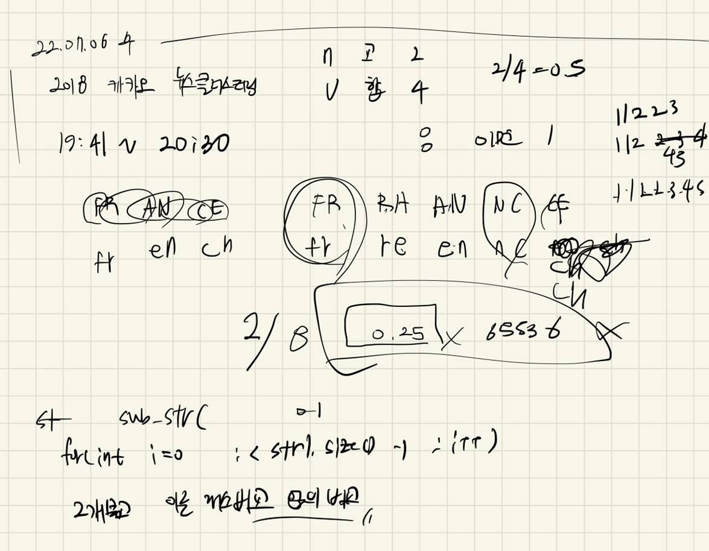
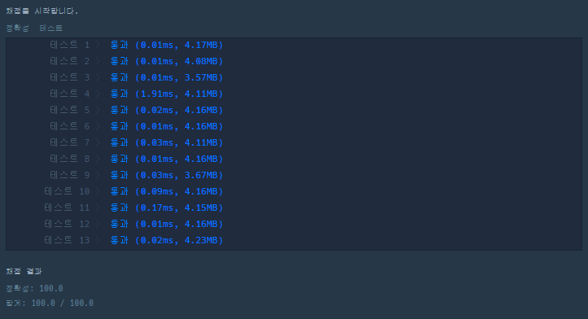

## 2022-07-06-2018카카오-1차뉴스클러스터링

문제링크: [Click](https://school.programmers.co.kr/learn/courses/30/lessons/17677)

## 목차

>  01.설계
>
>  02.문자열 분리
>
>  03.공집합 합집합 찾는 부분
>
>  04.전체소스

## 01.설계



- 비교적 간단한게 풀 수 있음
- 문자열은 2개로 나누어 string 백터에 저장하고 비교하는데
  - 같은 것은 지운다. 
- 그리고 여기서 백터 두개의 합이 합집합
- 같은것을 저장한 A의 변수는 교집합이 된다.

## 02.문자열 분리

- 문자열 분리시 
- 대소문자구분 없이가 있고 영문자만 가능하다
  - 그래서 아래는 대문자로 다만들고 영문자가 아닌것은 지웠음

```c++
vector<string> splitS(string s){
    vector<string> v;
    for (int i = 0; i < s.size(); i++) s[i]= toupper(s[i]);

    for (int i = 0; i < s.size()-1; i++) {
        v.push_back(s.substr(i, 2));
    }
    for (int i = 0; i < v.size(); i++) {
        if (v.size() == 0)break;
        for (int j = 0; j < 2; j++) {
            if (!('A' <= v[i][j] && v[i][j] <= 'Z')) {
                v.erase(v.begin()+i);
                i--;
                break;
            }
        }
    }
    return v;
}
```

## 03.공집합 합집합 찾는 부분

```c++
for (int i = 0; i < v1.size(); i++) {
    for (int j = 0; j < v2.size(); j++) {
        if (v1[i] == v2[j]) {
            v2.erase(v2.begin() + j);
            A++;//공집합
            j--;
            break;
        }
    }
}

B = v1.size() + v2.size();//합집합
```

## 04.전체소스

- before

  ```c++
  #include <string>
  #include<vector>
  #include<algorithm>
  
  using namespace std;
  
  int solution(string str1, string str2) {
  	int answer = 0;
  	for (int i = 0; i < str1.size(); i++) {
  		if (65 <= str1[i] && str1[i] <= 90) {
  
  		}
  		else if (97 <= str1[i] && str1[i] <= 122)
  		{
  			str1[i] -= 32;
  		}
  		else {//나머지 숫자들이랑 특수문자
  			str1[i] = ' ';
  		}
  	}
  	for (int i = 0; i < str2.size(); i++) {
  		if (65 <= str2[i] && str2[i] <= 90) {
  
  		}
  		else if (97 <= str2[i] && str2[i] <= 122)
  		{
  			str2[i] -= 32;
  		}
  		else {//나머지 숫자들이랑 특수문자
  			str2[i] = ' ';
  		}
  	}
  	// 변환
  
  	vector<string>v;
  	vector<string>v1;
  
  	for (int i = 0; i < str1.size() - 1; i++) {
  		string s1;
  		s1.push_back(str1[i]);
  		s1.push_back(str1[i + 1]);
  		if (s1[0] != ' ' && s1[1] != ' ') {
  			v.push_back(s1);
  		}
  	}
  	for (int j = 0; j < str2.size() - 1; j++) {
  		string s1;
  		s1.push_back(str2[j]);
  		s1.push_back(str2[j + 1]);
  		if (s1[0] != ' ' &&s1[1] != ' ') {
  			v1.push_back(s1);
  		}
  	}
  	int cnt = 0;
  	int r = 0;
  
  	if (v.size() + v1.size() != 0) {
  		sort(v.begin(), v.end());
  		sort(v1.begin(), v1.end());
  		if (v1.size() >= v.size()) {
  			for (int i = 0; i < v1.size(); i++) {
  				for (int j = 0; j < v.size(); j++) {
  					if (v1[i] == v[j]) {
  						v.erase(v.begin() + j);
  						j--;
  
  						cnt++;
  						break;
  					}
  				}
  			}
  		}
  		else {
  			for (int i = 0; i < v.size(); i++) {
  				for (int j = 0; j < v1.size(); j++) {
  					if (v1[j] == v[i]) {
  						v1.erase(v1.begin() + j);
  						j--;
  						cnt++;
  						break;
  					}
  				}
  			}
  		}
  
  	}
  
  	r = v.size() + v1.size();
  	if (v.size() == 0 && v1.size() == 0)return 65536;
  
  	else {
  
  		double aa = ((double)cnt / (double)r) * 65536;
  		return (int)aa;
  	}
  	return answer;
  }
  ```

- after

  ```c++
  #include <iostream>
  #include <string>
  #include <vector>
  using namespace std;
  
  vector<string> splitS(string s){
  	vector<string> v;
  	for (int i = 0; i < s.size(); i++) s[i]= toupper(s[i]);
  
  	for (int i = 0; i < s.size()-1; i++) {
  		v.push_back(s.substr(i, 2));
  	}
  	for (int i = 0; i < v.size(); i++) {
  		if (v.size() == 0)break;
  		for (int j = 0; j < 2; j++) {
  			if (!('A' <= v[i][j] && v[i][j] <= 'Z')) {
  				v.erase(v.begin()+i);
  				i--;
  				break;
  			}
  		}
  	}
  	return v;
   }
  int solution(string str1, string str2) {
  	double answer = 0;
  	vector<string> v1 = splitS(str1);
  	vector<string> v2 = splitS(str2);
  	int A=0;
  	int B=0;
  
  	for (int i = 0; i < v1.size(); i++) {
  		for (int j = 0; j < v2.size(); j++) {
  			if (v1[i] == v2[j]) {
  				v2.erase(v2.begin() + j);
  				A++;//공집합
  				j--;
  				break;
  			}
  		}
  	}
  
  	B = v1.size() + v2.size();//합집합
  	if (v1.size() == 0 && v2.size() == 0) answer = 65536;
  	else 
  	answer = ((double)A / (double)B) * 65536;
  
  	return answer ;
  }
  
  int main(void)
  {
  	cout<<solution("E=M*C^2", "e=m*c^2");
  	return 0;
  }
  ```

  - 확실히 조금씩 소스량이 줄어들고 필요한 부분만 제대로 구현이 되는듯
    - 문자열 문제의 경우 어려운것은 없는데 문자열을 분리하는게 어렵기때문에 잘 활용하면 좋을것 같다.



