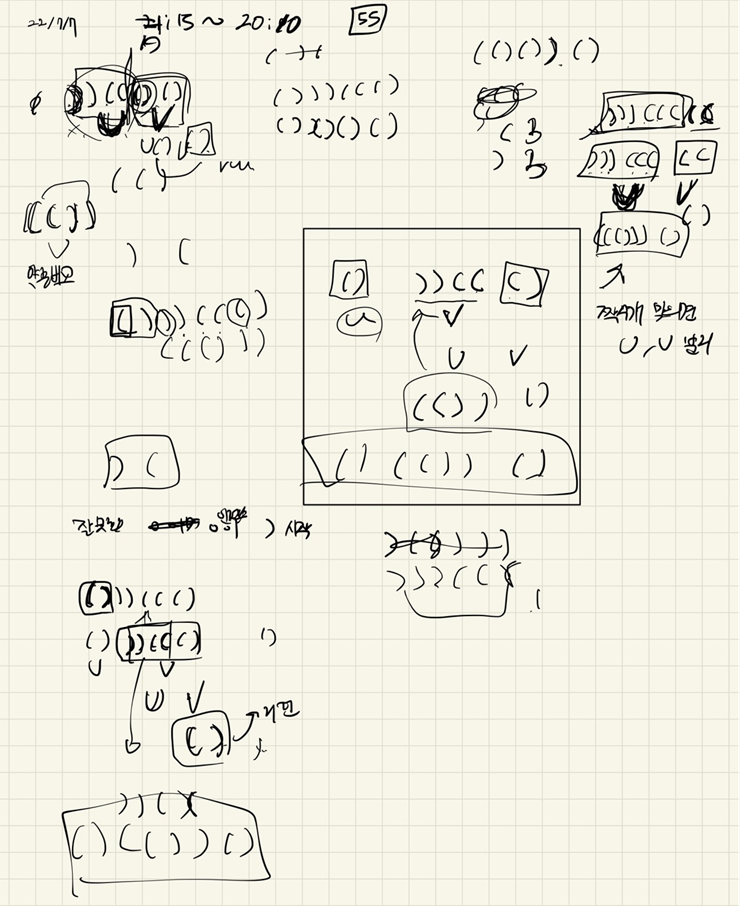

## 2022-07-07-2020카카오-괄호변환

문제링크: [Click](https://school.programmers.co.kr/learn/courses/30/lessons/60058)

## 목차

>  01.설계
>
>  >  01.1 아래 내용을 구현한 소스
>  >
>  >  01.2 올바른 문자열
>
>  02.전체소스

## 01.설계



### 01.1 아래 내용을 구현한 소스

```markdown
1. 입력이 빈 문자열인 경우, 빈 문자열을 반환합니다. 
2. 문자열 w를 두 "균형잡힌 괄호 문자열" u, v로 분리합니다. 단, u는 "균형잡힌 괄호 문자열"로 더 이상 분리할 수 없어야 하며, v는 빈 문자열이 될 수 있습니다. 
3. 문자열 u가 "올바른 괄호 문자열" 이라면 문자열 v에 대해 1단계부터 다시 수행합니다. 
  3-1. 수행한 결과 문자열을 u에 이어 붙인 후 반환합니다. 
4. 문자열 u가 "올바른 괄호 문자열"이 아니라면 아래 과정을 수행합니다. 
  4-1. 빈 문자열에 첫 번째 문자로 '('를 붙입니다. 
  4-2. 문자열 v에 대해 1단계부터 재귀적으로 수행한 결과 문자열을 이어 붙입니다. 
  4-3. ')'를 다시 붙입니다. 
  4-4. u의 첫 번째와 마지막 문자를 제거하고, 나머지 문자열의 괄호 방향을 뒤집어서 뒤에 붙입니다. 
  4-5. 생성된 문자열을 반환합니다.
```

```c++
string dfs(string p)
{
	//1. 입력이 빈 문자열인 경우, 빈 문자열을 반환합니다.
	if (p == "") return p;
	//	2. 문자열 w를 두 "균형잡힌 괄호 문자열" u, v로 분리합니다.단, u는 "균형잡힌 괄호 문자열"로 더 이상 분리할 수 없어야 하며, v는 빈 문자열이 될 수 있습니다.
	int rightopen = 0;// (
	int leftopen = 0; // )
	string u;
	string v;
	for (int i = 0; i < p.length(); i++) {
		if (p[i] == '(')rightopen++;
		if (p[i] == ')') leftopen++;
		u += p[i];
		if (rightopen + leftopen != 0 && rightopen == leftopen) {//U 찾기
			for (int j = i + 1; j < p.size(); j++) {
				v += p[j];
				i++;
			}
			break;
		}
	}
	//	3. 문자열 u가 "올바른 괄호 문자열" 이라면 문자열 v에 대해 1단계부터 다시 수행합니다.
	//	3 - 1. 수행한 결과 문자열을 u에 이어 붙인 후 반환합니다.
	if (check(u))return u + dfs(v);
	//	4. 문자열 u가 "올바른 괄호 문자열"이 아니라면 아래 과정을 수행합니다.

	else {
		//빈 문자열에 "("을 붙인다
		string temp = "(";
		//v를 재귀수행후 ")"를 붙인다
		temp += dfs(v) + ")";
		//u의  제일앞과 마지막 문자를 제거
		u = u.substr(1, u.length() - 2);
		//문자열 괄호 변경
		for (int i = 0; i < u.length(); i++) {
			if (u[i] == '(')    temp += ')';
			else    temp += '(';
		}
		return temp;
	}
}
```

### 01.2 올바른 문자열

```c++
bool check(string p) {
	int t;
	for (int i = 0; i < p.length(); i++) {
		if (p[i] == '(') t++;
		else {
			//괄호가 맞지 않음
			if (!t)     return false;
			t--;
		}
	}
	return true;
}
```

## 02.전체소스

```c++
#include <string>
#include <vector>
#include <iostream>

using namespace std;
bool check(string p) {
	int t;
	for (int i = 0; i < p.length(); i++) {
		if (p[i] == '(') t++;
		else {
			//괄호가 맞지 않음
			if (!t)     return false;
			t--;
		}
	}
	return true;
}

string dfs(string p)
{
	//1. 입력이 빈 문자열인 경우, 빈 문자열을 반환합니다.
	if (p == "") return p;
	//	2. 문자열 w를 두 "균형잡힌 괄호 문자열" u, v로 분리합니다.단, u는 "균형잡힌 괄호 문자열"로 더 이상 분리할 수 없어야 하며, v는 빈 문자열이 될 수 있습니다.
	int rightopen = 0;// (
	int leftopen = 0; // )
	string u;
	string v;
	for (int i = 0; i < p.length(); i++) {
		if (p[i] == '(')rightopen++;
		if (p[i] == ')') leftopen++;
		u += p[i];
		if (rightopen + leftopen != 0 && rightopen == leftopen) {//U 찾기
			for (int j = i + 1; j < p.size(); j++) {
				v += p[j];
				i++;
			}
			break;
		}
	}
	//	3. 문자열 u가 "올바른 괄호 문자열" 이라면 문자열 v에 대해 1단계부터 다시 수행합니다.
	//	3 - 1. 수행한 결과 문자열을 u에 이어 붙인 후 반환합니다.
	if (check(u))return u + dfs(v);
	//	4. 문자열 u가 "올바른 괄호 문자열"이 아니라면 아래 과정을 수행합니다.

	else {
		//빈 문자열에 "("을 붙인다
		string temp = "(";
		//v를 재귀수행후 ")"를 붙인다
		temp += dfs(v) + ")";
		//u의  제일앞과 마지막 문자를 제거
		u = u.substr(1, u.length() - 2);
		//문자열 괄호 변경
		for (int i = 0; i < u.length(); i++) {
			if (u[i] == '(')    temp += ')';
			else    temp += '(';
		}
		return temp;
	}
}


string solution(string p) {
	string answer = "";
	answer = dfs(p);
	return answer;
}

int main(void)
{
	cout << solution("()))((()");
	return 0;
}
```

