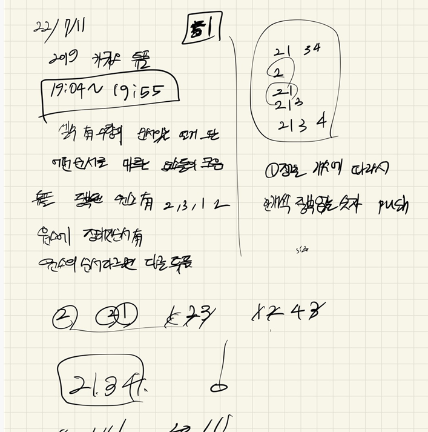

## 2022-07-11-2019카카오-튜플

## 목차

> 01.설계
>
> 02.소스코드

## 01.설계



- 우선 저렇게 각각 을 하나의 스트링으로 나눈다 
- 그리고 정렬 조건을 길이로 지정하여 정렬을 진행한다
- 그리고 그 순서대로 중복 없이 순서대로 answer에 숫자를 푸시하면 됨

## 02.소스코드

```c++
#include <string>
#include <vector>
#include <algorithm>
#include <sstream>
using namespace std;
int chk[1000004];
bool cmp(string a, string b) {
   
   return a.size() < b.size();
}
vector<int> solution(string s) {
   vector<int> answer;
   vector<string> vectorS;
   string s1[4];
   for (int i = 1; i < s.size() - 1; i++ ) {
      string copyS;
      if (s[i] == '{') {
         i++;
         while (1) {
            if (s[i] == '}')break;
            copyS += s[i];
            i++;
         }
         vectorS.push_back(copyS);
      }
   }
   sort(vectorS.begin(), vectorS.end(), cmp);

   vector<string> vectorSS;
   for (int i = 0; i < vectorS.size(); i++) {
      string vs;
      int flag = 0;
      for (int j = 0; j < vectorS[i].size(); j++) {
         if (vectorS[i][j] != ',') {
            vs += vectorS[i][j];
         }
         else {
            
            vectorSS.push_back(vs);
            vs.clear();
         }
      }
      vectorSS.push_back(vs);
   }

   for (int i = 0 ; i < vectorSS.size(); i++) {
      if (chk[stoi(vectorSS[i])] == 0) {
         answer.push_back(stoi(vectorSS[i]));
         chk[stoi(vectorSS[i])] = 1;
      }
   }
   
   return answer;
}

int main(void)
{
   vector<int>a;
   a = solution("{{20,111},{111}}");
   return 0;
}
```

- 근데 이렇게 하면 아래 소스 때문에 문제가 생길것 같다

  ```c++
     for (int i = 1; i < s.size() - 1; i++ ) {
        string copyS;
        if (s[i] == '{') {
           i++;
           while (1) {
              if (s[i] == '}')break;
              copyS += s[i];
              i++;
           }
           vectorS.push_back(copyS);
        }
     }
     sort(vectorS.begin(), vectorS.end(), cmp);
  ```

  - 이대로 하면 순서상 길이로만 순서를 정하면 안됨 
  - 원래는 개수로 그것을 파악해야함

- 개선 소스

  ```c++
  #include <string>
  #include <vector>
  #include <algorithm>
  #include <sstream>
  using namespace std;
  int chk[1000004];
  vector<string> vectorSS[1000004];
  
  bool cmp(string a, string b) {
  	
  	return a.size() < b.size();
  }
  vector<int> solution(string s) {
  	vector<int> answer;
  	vector<string> vectorS;
  	string s1[4];
  	for (int i = 1; i < s.size() - 1; i++ ) {
  		string copyS;
  		if (s[i] == '{') {
  			i++;
  			while (1) {
  				if (s[i] == '}')break;
  				copyS += s[i];
  				i++;
  			}
  			vectorS.push_back(copyS);
  		}
  	}
  	sort(vectorS.begin(), vectorS.end(), cmp);
  
  	for (int i = 0; i < vectorS.size(); i++) {
  		string vs;
  		int flag = 0;
  		vector<string> s1;
  		for (int j = 0; j < vectorS[i].size(); j++) {
  			if (vectorS[i][j] != ',') {
  				vs += vectorS[i][j];
  			}
  			else {
  				s1.push_back(vs);
  				vs.clear();
  			}
  		}
  		s1.push_back(vs);
  
  		for (int k = 0; k < s1.size(); k++) {
  			vectorSS[s1.size()].push_back(s1[k]);
  		}
  	}
  
  	for (int j = 0; j <= 1000000; j++) {
  		for (int i = 0; i < vectorSS[j].size(); i++) {
  			if (chk[stoi(vectorSS[j][i])] == 0) {
  				answer.push_back(stoi(vectorSS[j][i]));
  				chk[stoi(vectorSS[j][i])] = 1;
  			}
  		}
  	}
  	
  	return answer;
  }
  
  int main(void)
  {
  	vector<int>a;
  	a = solution("{{2},{2,1},{2,1,3},{2,1,3,4}}");
  
  	return 0;
  }
  ```

  - 좀 느릴 수 있지만 이렇게 하면 위의 문제를 어느정도 해결이 가능하다.


