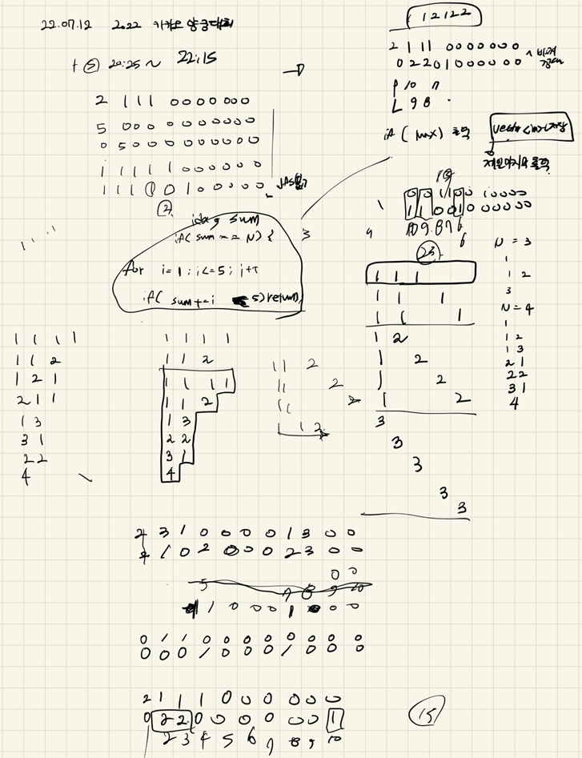
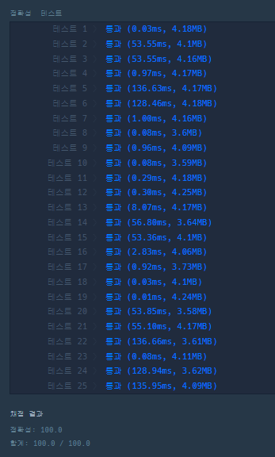

## 2022-07-12-2022카카오-양궁대회

문제링크: [click](https://school.programmers.co.kr/learn/courses/30/lessons/92342?language=cpp)

## 목차

>01.설계
>
>02.소스 코드
>
>>  02.1 dfs 소스 
>
>>  02.2 dfs1 소스
>
>>  02.3 전체소스

## 01.설계



- 좀 비효율적으로 한 느낌이 있지만
  - 우선 첫 번째 dfs에서는
    - N이 4라고 한다면
      - 1 1 1 1
      - 1 1 2 
      - 1 2 1
      - 2 1 1 
      - 2 2 
      - 1 3
      - 3 1
      - 4
        - 이런식으로 뽑았고 이것을 가지고 
  - 두 번째 dfs에서는  그것들의 위치를 지정해줌
    - 1 1 1 1 을 5칸의 공간에 배치시켰다면
      - 1 1 1 1 0
      - 1 1 1 0 1
      - 1 1 0 1 1
      - 1 0 1 1 1
      - 0 1 1 1 1
        - 이런식으로 위치를 지정해주고 점수를 계산해서 가장 작은 수를 가지고 있는것을 저장하는식으로 풀이함
- 실수한것 라이언의 최대값이 큰것을 찾는것이 아님 
  - 라이언이 어피치보다 더 많은 점수는 맞지만 라이언과 어피치의 점수차이의 최대임
    - 이부분을 제대로 못봐서 왜? 틀리지 했음 주의 할 것

## 02.소스 코드

### 02.1 dfs 소스 

N이 4라고 한다면

- 1 1 1 1
- 1 1 2 
- 1 2 1
- 2 1 1 
- 2 2 
- 1 3
- 3 1
- 4

```c++
void dfs(int idx, int sum, int N, vector<int> info)
{
	if (sum == N) {
		//for (int i = 0; i < D.size(); i++) {
		//	cout << D[i] << " ";
		//}
		//cout << endl;
		dfs1(0, 0,N,D,info);
		return;
	}
	for (int i = 1; i <= N; i++) {
		if (sum + i > N)continue;
		D.push_back(i);
		dfs(idx + 1, sum+i, N, info);
		D.pop_back();
	}
}
```

### 02.2 dfs1 소스

두 번째 dfs에서는  그것들의 위치를 지정해줌

- 1 1 1 1 을 5칸의 공간에 배치시켰다면
  - 1 1 1 1 0
  - 1 1 1 0 1
  - 1 1 0 1 1
  - 1 0 1 1 1
  - 0 1 1 1 1

```c++
void dfs1(int idx, int cnt,int N,vector<int>dfs_D, vector<int> info) {
	if (idx > 11) return;
	if(cnt==dfs_D.size())
	{
		int apeach = 0;
		int lion = 0;
		int lion_idx = 0;
		
		int dfs1D1[11];

		for (int i = 0; i < 11; i++) {
			dfs1D1[i] = dfs1D[i];
			if (dfs1D1[i] == 1) {
				dfs1D1[i] = dfs1D[i] * dfs_D[lion_idx];
				lion_idx++;
			}
		}
		for (int i = 0, score=10; i < 11; i++, score--) {
			if (info[i] == 0 && dfs1D1[i] == 0) continue;
				if (info[i] >= dfs1D1[i]) {
					apeach += score;
				}
				else {
					lion += score;
				}
		}
		if (lion > apeach ) {//라이언이 점수 더 높은 경우
			if (ret <= lion-apeach) {
				if (ret < lion - apeach) {
					ret = max(ret, lion - apeach);
					retD.clear();
					for (int i = 0; i < 11; i++) {
						retD.push_back({ dfs1D1[i] });
						//cout << retD[i] << " ";
					}
				}
				else if (ret == lion - apeach) {
					if (retD.size() == 0) {
						for (int i = 0; i < 11; i++) {
							retD.push_back(0);
						}
					}
					int flag = 0;
					for (int i = 10; i >= 0; i--) {
						if (retD[i] == 0 && dfs1D1[i] == 0)continue;
						if (retD[i] < dfs1D1[i]) {
							flag = 1;
							break;
						}
						else break;
					}
					if (flag == 1) {
						//cout << ret << endl;

						retD.clear();
						for (int i = 0; i < 11; i++) {
							retD.push_back({ dfs1D1[i] });
							//cout << retD[i] << " ";
						}
						//cout << endl;
					}
				}
			}
		}
		return;
	}
		dfs1D[idx] = 1;
		dfs1(idx + 1, cnt + 1, N, dfs_D, info);
		dfs1D[idx] = 0;
		dfs1(idx + 1, cnt, N, dfs_D, info);
		dfs1D[idx] = 0;
}
```

### 02.3 전체소스

```c++
#include <string>
#include <vector>
#include <iostream>
#include <algorithm>
using namespace std;
vector<int>D;
vector<int>retD;
int dfs1D[11];
int ret = -1;
void dfs1(int idx, int cnt,int N,vector<int>dfs_D, vector<int> info) {
	if (idx > 11) return;
	if(cnt==dfs_D.size())
	{
		int apeach = 0;
		int lion = 0;
		int lion_idx = 0;
		
		int dfs1D1[11];

		for (int i = 0; i < 11; i++) {
			dfs1D1[i] = dfs1D[i];
			if (dfs1D1[i] == 1) {
				dfs1D1[i] = dfs1D[i] * dfs_D[lion_idx];
				lion_idx++;
			}
		}
		for (int i = 0, score=10; i < 11; i++, score--) {
			if (info[i] == 0 && dfs1D1[i] == 0) continue;
				if (info[i] >= dfs1D1[i]) {
					apeach += score;
				}
				else {
					lion += score;
				}
		}
		if (lion > apeach ) {//라이언이 점수 더 높은 경우
			if (ret <= lion-apeach) {
				if (ret < lion - apeach) {
					ret = max(ret, lion - apeach);
					retD.clear();
					for (int i = 0; i < 11; i++) {
						retD.push_back({ dfs1D1[i] });
						//cout << retD[i] << " ";
					}
				}
				else if (ret == lion - apeach) {
					if (retD.size() == 0) {
						for (int i = 0; i < 11; i++) {
							retD.push_back(0);
						}
					}
					int flag = 0;
					for (int i = 10; i >= 0; i--) {
						if (retD[i] == 0 && dfs1D1[i] == 0)continue;
						if (retD[i] < dfs1D1[i]) {
							flag = 1;
							break;
						}
						else break;
					}
					if (flag == 1) {
						//cout << ret << endl;

						retD.clear();
						for (int i = 0; i < 11; i++) {
							retD.push_back({ dfs1D1[i] });
							//cout << retD[i] << " ";
						}
						//cout << endl;
					}
				}
			}
		}
		return;
	}
		dfs1D[idx] = 1;
		dfs1(idx + 1, cnt + 1, N, dfs_D, info);
		dfs1D[idx] = 0;
		dfs1(idx + 1, cnt, N, dfs_D, info);
		dfs1D[idx] = 0;
}
void dfs(int idx, int sum, int N, vector<int> info)
{
	if (sum == N) {
		//for (int i = 0; i < D.size(); i++) {
		//	cout << D[i] << " ";
		//}
		//cout << endl;
		dfs1(0, 0,N,D,info);
		return;
	}
	for (int i = 1; i <= N; i++) {
		if (sum + i > N)continue;
		D.push_back(i);
		dfs(idx + 1, sum+i, N, info);
		D.pop_back();
	}
}
vector<int> solution(int n, vector<int> info) {
	vector<int> answer;
	dfs(0, 0, n, info);
	if (ret == -1) {
		retD.clear();
		retD.push_back(-1);
	}
	return retD;
}

int main(void)
{
	dfs(0, 0, 10,{ 0, 0, 0, 0, 0, 0, 0, 0, 3, 4, 3 });
	return 0;
}
```

