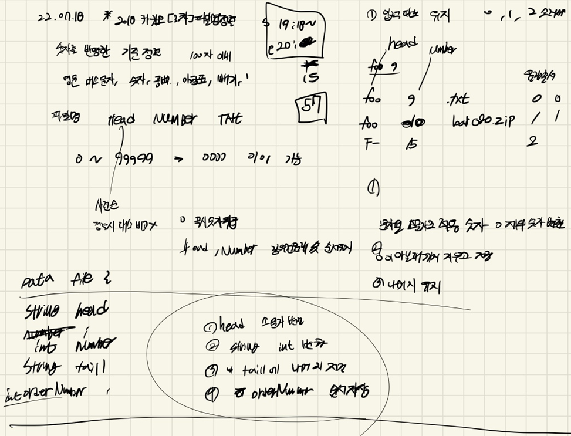
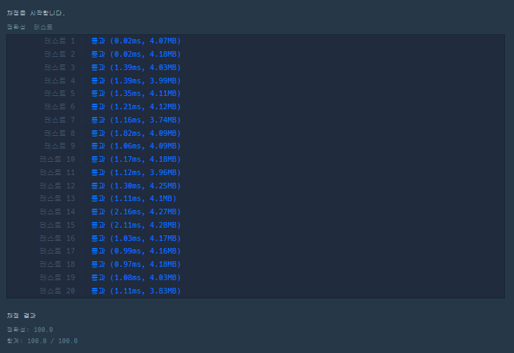

## 2022-07-18-2018카카오-[3차]파일명정렬

## 목차

>01.설계
>
>02.구현 상세 부분
>
>>  02.1 head, number, tail 분리한 부분
>>
>>  02.2 cmp 비교하는부분
>
>03.전체소스코드

## 01.설계



- head와 number tail로 나누는데 사실상 tail은 필요가 없음
- 기존 string 저장해서 나중에 기존 string출력하면되는데
  - 여기서 잠깐 실수 했던것이 number값 저장할때 체크를 하는 부분을 빼서 몇개가 틀리는 경우가 발생함

## 02.구현 상세 부분

### 02.1 head, number, tail 분리한 부분

```c++
bool headFlag = 0;
bool numberFlag = 0;

for (int i = 0; i < files.size(); i++) {
    string head;
    string number;
    string tail;
    for (int j = 0; j < files[i].size(); j++) {
        if (numberFlag==0 &&'0' <= files[i][j] && files[i][j] <= '9') {//숫자인경우
            headFlag = 1;

            number += files[i][j];
        }
        else if (headFlag == 1 &&!('0' <= files[i][j] && files[i][j] <= '9')) {
            tail += files[i][j];
            numberFlag = 1;
        }
        if (headFlag == 0) head += files[i][j];
    }
    string originFiles = files[i];
    for (int j = 0; j < head.size(); j++) {
        head[j] = tolower(head[j]);
    }
    filesCollection.push_back({originFiles,head,stoi(number),tail,i });
    headFlag = 0;
    numberFlag = 0;
}
sort(filesCollection.begin(), filesCollection.end(), cmp);
for (int i = 0; i < filesCollection.size(); i++) {
    answer.push_back(filesCollection[i].originFiles);
}
```

### 02.2 cmp 비교하는부분

```c++
bool cmp(File a, File b) {
	if (a.head == b.head&& a.number == b.number) {
		return a.orderNumber < b.orderNumber;
	}
	else if (a.head == b.head) {
		return a.number < b.number;
	}
	else return a.head < b.head;
}
```

## 03.전체소스코드

```c++
#include <string>
#include <vector>
#include <algorithm>
using namespace std;
struct File {
	string originFiles;
	string head;
	int number;
	string tail;
	int orderNumber;
};

bool cmp(File a, File b) {
	if (a.head == b.head&& a.number == b.number) {
		return a.orderNumber < b.orderNumber;
	}
	else if (a.head == b.head) {
		return a.number < b.number;
	}
	else return a.head < b.head;
}

vector<string> solution(vector<string> files) {
	vector<string> answer;
	vector<File> filesCollection;

	bool headFlag = 0;
	bool numberFlag = 0;

	for (int i = 0; i < files.size(); i++) {
		string head;
		string number;
		string tail;
		for (int j = 0; j < files[i].size(); j++) {
			if (numberFlag==0 &&'0' <= files[i][j] && files[i][j] <= '9') {//숫자인경우
				headFlag = 1;

				number += files[i][j];
			}
			else if (headFlag == 1 &&!('0' <= files[i][j] && files[i][j] <= '9')) {
				tail += files[i][j];
				numberFlag = 1;
			}
			if (headFlag == 0) head += files[i][j];
		}
		string originFiles = files[i];
		for (int j = 0; j < head.size(); j++) {
			head[j] = tolower(head[j]);
		}
		filesCollection.push_back({originFiles,head,stoi(number),tail,i });
		headFlag = 0;
		numberFlag = 0;
	}
	sort(filesCollection.begin(), filesCollection.end(), cmp);
	for (int i = 0; i < filesCollection.size(); i++) {
		answer.push_back(filesCollection[i].originFiles);
	}
	return answer;
}

int main(void)
{
	solution({ "O00321", "O49qcGPHuRLR5FEfoO00321" });
	//solution({ "F-5 Freedom Fighter", "B-50 Superfortress", "A-10 Thunderbolt II", "F-14 Tomcat" });
	//solution({ "F-5 Freedom Fighter", "B-50 Superfortress", "A-10 Thunderbolt II", "F-14 Tomcat" });

	return 0;
}
```

