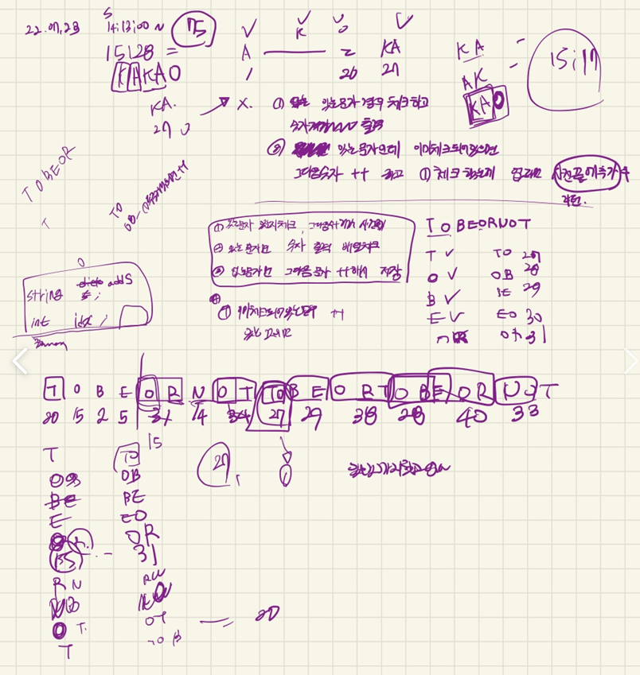
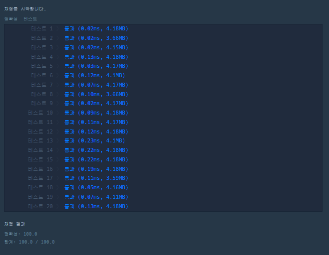

## 2022-07-23-카카오-[3차]압축

문제링크 : [Click](https://school.programmers.co.kr/learn/courses/30/lessons/17684#)

## 목차

> 01.설계
>
> 02.소스코드

## 01.설계



## 02.소스코드

- 실패코드

  ```csharp
  #include <string>
  #include <vector>
  #include <iostream>
  #include <unordered_map>
  #include <map>
  using namespace std;
  struct Data1 {
  	string zip;
  	bool isZip;
  };
  int chk[3000];//배열 체크
  vector<int> solution1(string msg) {
  	vector<int> answer;
  	map<string, int> m;
  	unordered_map<string, int, int> map;
  	for (int i = 0; i < 27-1; i++) {
  		string str;
  		str += (char)'A' + i;
  		m[str] = i + 1;
  	}
  	int idx = 27;
  	int w = 0; int c = 1;
  	string a;
  	for (; c < msg.size();) {
  		a += msg[c];
  		if (m[a]!=0) {
  			c++;
  		}
  		else if (m[a] == 0) {
  			m[a] = idx++;
  			c = w + c;
  			a.clear();
  		}
  	}
  	return answer;
  }
  struct Data {
  	string addS;
  	int idx;
  	int visit;
  };
  int findS(string a, vector<Data>dic) {
  	int chk = 0;
  	for (int i = 0; i < dic.size(); i++) {
  		if (a == dic[i].addS) {
  			chk = i+1;
  		}
  	}
  	return chk;
  }
  int find_visit(string a, vector<Data>&dic) {
  	for (int i = 0; i < dic.size(); i++) {
  		if (a == dic[i].addS&& dic[i].visit==0) {
  			dic[i].visit = 1;
  			return dic[i].idx;
  		}
  	}
  	return 0;
  }
  
  vector<int> solution(string msg) {
  	vector<int> answer;
  	vector<Data>dic;
  	for (int i = 0; i < 26; i++) {
  		string a;
  		a += i + (char)'A';
  		dic.push_back({a,i + 1 });
  	}
  	//1.문자열체크
  	for (int i = 0; i < msg.size(); i++) {
  		string first_a;
  		string a;
  		int chk = 0;
  		a = first_a= msg[i];
  		if (findS(a, dic)) {
  			chk = findS(a, dic);
  			if (i + 1 == msg.size())break;
  			a += msg[i+1];
  			int size = dic.size();
  			if (!findS(a, dic)) {
  				answer.push_back(chk);
  				dic.push_back({ a,size + 1 });
  			}
  			else {
  				int idx = i + 2;
  				int chk = 0;
  				while (1) {
  					if (idx == msg.size()) {
  						answer.push_back(chk);
  						int size1 = dic.size();
  						if (!findS(a, dic))
  						dic.push_back({ a,size1+1 });
  						i = idx - 2;
  
  						break;
  					}
  					if (findS(a, dic)) {
  						chk = findS(a, dic);
  						first_a = a;
  						a += msg[idx++];
  					}
  					else {
  						int size1 = dic.size();
  						answer.push_back(chk);
  						dic.push_back({ a,size1+1 });
  						i = idx - 2;
  					}
  				}
  			}
  		}
  	}
  	return answer;
  }
  int main(void) {
  	solution("TOBEORNOTTOBEORTOBEORNOT");
  	return 0;
  }
  ```

- 성공코드

  ```csharp
  #include <string>
  #include <vector>
  #include <iostream>
  #include <unordered_map>
  #include <map>
  using namespace std;
  
  vector<int> solution(string msg) {
  	vector<int> answer;
  	unordered_map<string, int> m;
  	int index;
  	string temp = "";
  
  	for (index = 1; index < 27; index++) {
  		temp += 'A' + index - 1;
  		m.emplace(temp, index);
  		temp = "";
  	}
  	for (int i = 0; i < msg.size(); i++) {
  		string s = "";
  		s += msg[i];
  		int idx = i;
  		while (m.find(s) != m.end()) {
  			s += msg[++idx];
  		}
  		i = idx - 1;
  		m[s] = index++; //m.emplace(s, index++);
  		s.pop_back();
  		answer.push_back(m[s]);//answer.emplace_back(m[temp]);
  
  	}
  	return answer;
  }
  int main(void) {
  	solution("TOBEORNOTTOBEORTOBEORNOT");
  	return 0;
  }
  ```

  - unordered_map과 find함수를 이용하면 좀더 빠르게 구현이 가능하다.

    