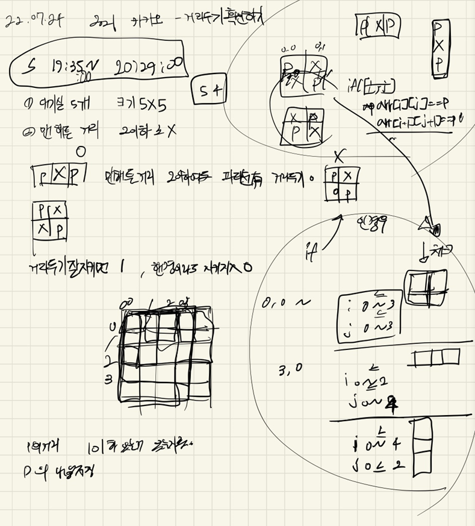

## 2022-07-24-2021카카오-거리두기확인하기

## 목차

>01.설계
>
>02.부분소스
>
>>  02.1 `4 by 4` 완전탐색
>>
>>  02.2 `2 by 2`  완전탐색
>
>03.전체소스

## 01.설계



- 우선 완전탐색을 하는 방법으로 진행했음
  - 4 by 4, 2 by 2를 조건을 분리를 했음
  - 그리고 거리가 1인 경우를 걸러내기위한 소스를 구현함

## 02.부분소스

### 02.1 `4 by 4` 완전탐색

```c++
int checkFourByFour(vector<string> places) {
	for (int i = 0; i <=3; i++) {
		for (int j = 0; j <= 3; j++) {
			if (places[i][j] == 'P'&&places[i + 1][j + 1] == 'P'){
				if (!(places[i][j + 1] == 'X'&& places[i + 1][j] == 'X')) {
					return -1;
				}
			}

			if (places[i][j+1] == 'P'&&places[i + 1][j] == 'P') {
				if (!(places[i][j] == 'X'&& places[i+1][j+1] == 'X')) {
					return -1;
				}
			}
		}
	}
	return 1;
}
```

### 02.2 `2 by 2`  완전탐색

```c++
int checkTwoByTwo(vector<string> places) {
	for (int i = 0; i <= 2; i++) {
		for (int j = 0; j <= 4; j++) {
			if (places[i][j] == 'P'&&places[i+2][j] == 'P') {
				if (!(places[i+1][j] == 'X')) {
					return -1;
				}
			}
		}
	}

	for (int i = 0; i <= 4; i++) {
		for (int j = 0; j <= 2; j++) {
			if (places[i][j] == 'P'&&places[i][j+2] == 'P') {
				if (!(places[i][j+1] == 'X')) {
					return -1;
				}
			}
		}
	}
	return 1;
}
```

## 03.전체소스

```c++
#include <string>
#include <algorithm>
#include <vector>
using namespace std;

struct Data {
	int y, x;
};
int checkFourByFour(vector<string> places) {
	for (int i = 0; i <=3; i++) {
		for (int j = 0; j <= 3; j++) {
			if (places[i][j] == 'P'&&places[i + 1][j + 1] == 'P'){
				if (!(places[i][j + 1] == 'X'&& places[i + 1][j] == 'X')) {
					return -1;
				}
			}

			if (places[i][j+1] == 'P'&&places[i + 1][j] == 'P') {
				if (!(places[i][j] == 'X'&& places[i+1][j+1] == 'X')) {
					return -1;
				}
			}
		}
	}
	return 1;
}
int checkTwoByTwo(vector<string> places) {
	for (int i = 0; i <= 2; i++) {
		for (int j = 0; j <= 4; j++) {
			if (places[i][j] == 'P'&&places[i+2][j] == 'P') {
				if (!(places[i+1][j] == 'X')) {
					return -1;
				}
			}
		}
	}

	for (int i = 0; i <= 4; i++) {
		for (int j = 0; j <= 2; j++) {
			if (places[i][j] == 'P'&&places[i][j+2] == 'P') {
				if (!(places[i][j+1] == 'X')) {
					return -1;
				}
			}
		}
	}
	return 1;
}

vector<int> solution(vector<vector<string>> places) {
	vector<int> answer;
	for (int n = 0; n < places.size(); n++) {
		int flag = 0;
		if (checkFourByFour(places[n]) == -1) {
			flag = 1;
		}
		if (checkTwoByTwo(places[n]) == -1) {
			flag = 1;
		}
		if (flag == 1) {
			answer.push_back(0);
			continue;
		}
		

		vector<Data>pPoint;
		for (int i = 0; i < 5; i++) {
			for (int j = 0; j < 5; j++) {
				if (places[n][i][j] == 'P') {
					pPoint.push_back({ i, j });
				}
			}
		}

		for (int i = 0; i < pPoint.size(); i++) {
			for (int j = 0; j < pPoint.size(); j++) {
				if (i == j)continue;
				int distance = abs(pPoint[i].y - pPoint[j].y) + abs(pPoint[i].x - pPoint[j].x);
				if (distance == 1){
					flag=1;
					break;
				}
			}
			if (flag == 1)break;
		}
		if (flag == 1)answer.push_back(0);
		else answer.push_back(1);
	}
	
	return answer;
}

int main(void)
{
	solution({{"POOOP", "OXXOX", "OPXPX", "OOXOX", "POXXP"}, {"POOPX", "OXPXP", "PXXXO", "OXXXO", "OOOPP"}, {"PXOPX", "OXOXP", "OXPOX", "OXXOP", "PXPOX"}, {"OOOXX", "XOOOX", "OOOXX", "OXOOX", "OOOOO"}, {"PXPXP", "XPXPX", "PXPXP", "XPXPX", "PXPXP"}});

	return 0;
}
```

