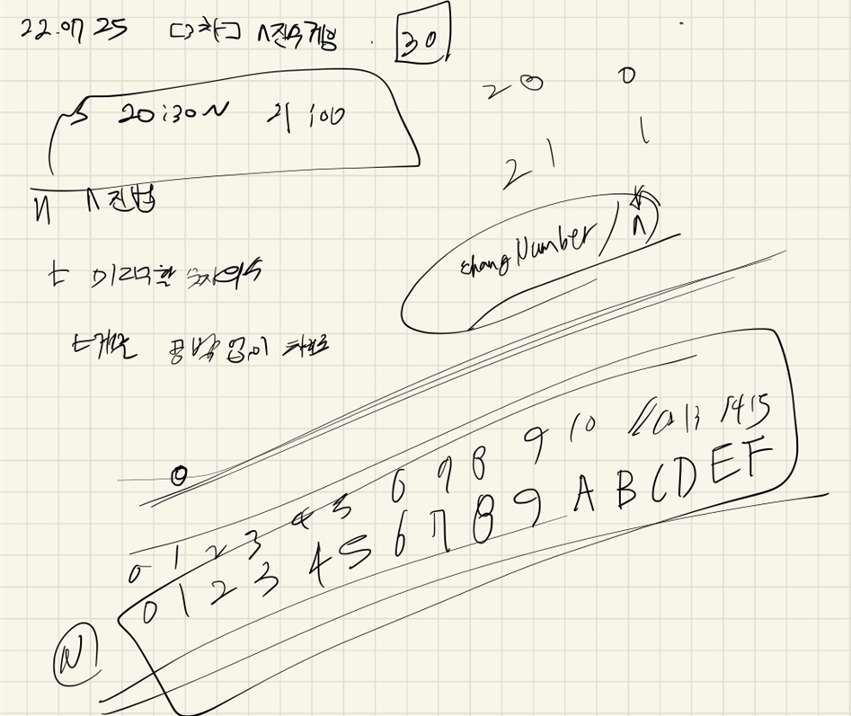

## 2022-07-25-2018카카오-[3차]n진수게임

## 목차

>01.설계
>
>02.소스코드

## 01.설계



- n진법에 따라 문자가 다르기 때문에 따로 배열에 저장하고 
  - 가져다 쓰는 형식으로 진행

## 02.소스코드

- 개선전 코드

  ```c++
  #include <string>
  #include <vector>
  
  using namespace std;
  char numberChar[] = { '0','1','2','3','4','5','6','7','8','9','A','B','C','D','E','F' };
  
  string nChange(int changeNumber, int nNumber) {
  	string nString;
  	while (changeNumber / nNumber!=0) {
  		string temp = nString;
  		nString = numberChar[changeNumber%nNumber];
  		nString += temp;
  		changeNumber /= nNumber;
  	}
  	string temp = nString;
  	nString = numberChar[changeNumber%nNumber];
  	nString += temp;
  	changeNumber /= nNumber;
  	return nString;
  }
  
  string solution(int n, int t, int m, int p) {
  	string answer = "";
  	string s;
  	int Cnt = 0;
  	for (int i = 0; i < t*m; i++)s+=nChange(i, n);
  	for (int i = p - 1, cnt = 0; i < s.length(), cnt<t; i += m) {
  		answer += s[i];
  		cnt++;
  	}
  
  	return answer;
  }
  
  int main(void) {
  	string a = nChange(10, 2);
  }
  ```

- 리팩토링 

  ```c++
  #include <string>
  #include <vector>
  #include <algorithm>
  using namespace std;
  char numberChar[] = { '0','1','2','3','4','5','6','7','8','9','A','B','C','D','E','F' };
  
  string nChange(int changeNumber, int number)
  {
  	string nString;
  	while (changeNumber / number != 0) {
  		nString += numberChar[changeNumber%number];
  		changeNumber /= number;
  	}
  	nString += numberChar[changeNumber%number];
  	changeNumber /= number;
  	reverse(nString.begin(), nString.end());
  	return nString;
  }
  
  string solution(int n, int t, int m, int p) {
  	string answer = "";
  	string s;
  	int Cnt = 0;
  	for (int i = 0; i < t*m; i++) s += nChange(i, n);
  	for (int i = p - 1, cnt = 0; i < s.length(), cnt<t; i += m) {
  		answer += s[i];
  		cnt++;
  	}
  
  	return answer;
  }
  
  int main(void) {
  	string a = solution(16, 16, 2, 1);
  }
  ```

  

