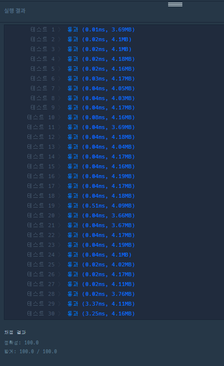

## 2022-07-31-카카오2018-[3차]방금그곡

## 목차

>01.문제해설
>
>02.소스코드
>
>>  02.1 `12:00,12:14 이런 시간을 초단위로 바꿈`
>
>>  02.2 `C# , F# 이런것을 다른 문자열로 변환`
>
>>  02.3 `대소비교를 하는법`
>
>>  02.4 `음표를 0 ~ 5까지 있는데 러닝 타임이 14라면 5에서 다시 0으로 갈 수 있는 구현법`
>
>>  02.5 `문자열을 정수형으로 변환하는 방법을 알아야한다. `
>
>03.전체소스
>
>>  03.1 실패한 소스
>
>>  03.2 리팩토링후 성공한 소스

## 01.문제해설

- 이문제는 단순한 시뮬레이션이라고 생각하면 정말 바로 문제를 풀 수 없을 것이다.
- 구현한 내용이 많은데 정리하면 아래와 같다
  - 12:00,12:14 이런 시간을 초단위로 바꿈
  - C#, F# 이런것을 다른 문자열로 변환
  - 대소비교를 하는법
  - 음표를 0 ~ 5까지 있는데 러닝 타임이 14라면 5에서 다시 0으로 갈 수 있는 구현법
  - 문자열을 정수형으로 변환하는 방법을 알아야한다. 
    - 위의 구현 내용을 봐보자

## 02.소스코드

### 02.1 `12:00,12:14 이런 시간을 초단위로 바꿈`

```c++
string h1, h2, m1, m2, title, runningMusic;
h1 = musicinfos[i].substr(0, 2);
m1 = musicinfos[i].substr(3, 2);
h2 = musicinfos[i].substr(6, 2);
m2 = musicinfos[i].substr(9, 2);

t = abs(stoi(h1) - stoi(h2))*60;
if (m1 > m2) {
    t -= 60;
    t += (stoi(m2) - stoi(m1)) + 60;
}
else t += stoi(m2) - stoi(m1);
idx = 12;
for (int j = 12; musicinfos[i][j] != ','; j++,idx++) {
    title += musicinfos[i][j];
}
```

### 02.2 `C#, F# 이런것을 다른 문자열로 변환`

```c++
void replaceAll(string &m, string from, string to) {
    int pos = 0;
    while ((pos = m.find(from)) != -1) {
        m.replace(pos, from.length(), to);
    }
}

replaceAll(m, "C#", "c");
replaceAll(m, "D#", "d");
replaceAll(m, "F#", "f");
replaceAll(m, "G#", "g");
replaceAll(m, "A#", "a");
```

### 02.3 `대소비교를 하는법`

```c++
if (idx != -1 && ans.first < t) {
    ans.first = t;
    ans.second = title;
}
```

### 02.4 `음표를 0 ~ 5까지 있는데 러닝 타임이 14라면 5에서 다시 0으로 갈 수 있는 구현법`

```c++
int remainTime = t;
idx = 0;
int size = runningMusic.size();
string music;
while (remainTime--) {
    music += runningMusic[idx++];
    if (idx == size)idx = 0;
}
```

### 02.5 `문자열을 정수형으로 변환하는 방법을 알아야한다. `

```c++
t = abs(stoi(h1) - stoi(h2))*60;
```

## 03.전체소스

### 03.1 실패한 소스

- 처음 구현을 아래와 같이 하다가 다시 고쳤다 우선 문제는 답은 나오겠지만 중요한것을 시간초과가 나는 것이다.

```c++
#include <string>
#include <vector>
#include <unordered_map>
#include <regex>
using namespace std;

struct Data {
   int time;
   string title;
   string music;
};
string solution(string m, vector<string> musicinfos) {
   string answer = "";
   string a;
   int idx = 0;
   m = regex_replace(m, regex("C#"), "c");
   m = regex_replace(m, regex("D#"), "d");
   m = regex_replace(m, regex("F#"), "f");
   m = regex_replace(m, regex("G#"), "g");
   m = regex_replace(m, regex("A#"), "a");
   vector<string> v[104];
   vector<Data> musicV;
   for (int i = 0; i < musicinfos.size(); i++) {
      for (int j = 0; j < musicinfos[i].size(); j++) {
         a += musicinfos[i][j];
         if (musicinfos[i][j] == ',') {
            v[i].push_back(a);
            a.clear();
         }
      }
      v[i].push_back(a);
      a.clear();
   }
   for (int i = 0; i < musicinfos.size(); i++) {
      string time2;
      string time1;
      int time = 0;
      int timeInt2 = 0;
      int timeInt1 = 0;
      timeInt2 = (v[i][1][0]-48)*10 + (v[i][1][1]-48);
      time1 = v[i][0][0] + v[i][0][1];
      timeInt1 = (v[i][0][0] - 48) * 10 + (v[i][0][1] - 48);
      time += timeInt2 - timeInt1;

      timeInt2 = (v[i][1][3] - 48) * 10 + (v[i][1][4] - 48);
      time1 = v[i][0][0] + v[i][0][1];
      timeInt1 = (v[i][0][3] - 48) * 10 + (v[i][0][4] - 48);
      time += timeInt2 - timeInt1;


      int remainTime = time;
      int idx = 0;
      int size = v[i][3].size();
      string music;
      while (remainTime--) {
         music += v[i][3][idx++];
         if (idx == size)idx = 0;
      }
      music = regex_replace(music, regex("C#"), "c");
      music = regex_replace(music, regex("D#"), "d");
      music = regex_replace(music, regex("F#"), "f");
      music = regex_replace(music, regex("G#"), "g");
      music = regex_replace(music, regex("A#"), "a");

      
      musicV.push_back({ time,v[i][2],music });
   }
   int max = 0x80000000;
   string title;
   for (int i = 0; i < musicV.size(); i++ ) {
      if (musicV[i].music.find(m) != string::npos) {
         if (max < musicV[i].time) {
            max = musicV[i].time;
            title = musicV[i].title;
         }
      }
   }
   title.pop_back();
   return title;
}
int main(void) {
   solution("ABC#DEC#G", { "12:00,12:14,HELLO,CDEFGAB", "13:00,13:05,WORLD,ABCDEF" });
}
```

### 03.2 리팩토링후 성공한 소스

```c++
#include <string>
#include <vector>
#include <unordered_map>
using namespace std;

void replaceAll(string &m, string from, string to) {
	int pos = 0;
	while ((pos = m.find(from)) != -1) {
		m.replace(pos, from.length(), to);
	}
}

struct Data {
	int time;
	string title;
};
string solution(string m, vector<string> musicinfos) {
	string answer = "";
	pair<int, string> ans = { 0,"" };
	replaceAll(m, "C#", "c");
	replaceAll(m, "D#", "d");
	replaceAll(m, "F#", "f");
	replaceAll(m, "G#", "g");
	replaceAll(m, "A#", "a");
	
	for (int i = 0; i < musicinfos.size(); i++) {

		int t = 0,idx = 0, pos = 0;
		string h1, h2, m1, m2, title, runningMusic;
		h1 = musicinfos[i].substr(0, 2);
		m1 = musicinfos[i].substr(3, 2);
		h2 = musicinfos[i].substr(6, 2);
		m2 = musicinfos[i].substr(9, 2);

		t = abs(stoi(h1) - stoi(h2))*60;
		if (m1 > m2) {
			t -= 60;
			t += (stoi(m2) - stoi(m1)) + 60;
		}
		else t += stoi(m2) - stoi(m1);
		idx = 12;
		for (int j = 12; musicinfos[i][j] != ','; j++,idx++) {
			title += musicinfos[i][j];
		}
		for (int j = idx+1; j < musicinfos[i].size(); j++) runningMusic += musicinfos[i][j];
		replaceAll(runningMusic, "C#", "c");
		replaceAll(runningMusic, "D#", "d");
		replaceAll(runningMusic, "F#", "f");
		replaceAll(runningMusic, "G#", "g");
		replaceAll(runningMusic, "A#", "a");

		int remainTime = t;
		idx = 0;
		int size = runningMusic.size();
		string music;
		while (remainTime--) {
			music += runningMusic[idx++];
			if (idx == size)idx = 0;
		}
		idx = 0;
		idx = music.find(m);
		if (idx != -1 && ans.first < t) {
			ans.first = t;
			ans.second = title;
		}

	}
	answer = ans.second;
	if (answer == "") answer = "(None)";

	return answer;
}
int main(void) {
	solution("ABC#DEC#G", { "12:00,12:14,HELLO,CDEFGAB", "13:00,13:05,WORLD,ABCDEF" });
}
```

