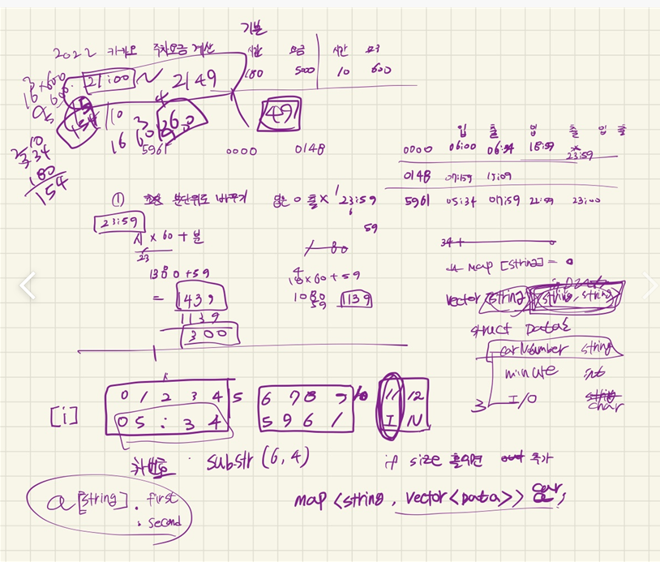
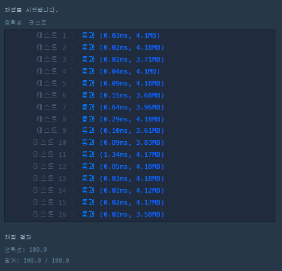

## 2022-08-02-2022카카오-주차요금계산

문제 링크 : [Click](https://school.programmers.co.kr/learn/courses/30/lessons/92341)

## 목차

>01.설계
>
>02.소스코드
>
>>  02.1 번호별로 분리하는 소스
>>
>>  02.2 홀수개 Out추가하는 소스
>>
>>  02.3 올림 조건
>>
>>  02.4 계산해서 답 넣는 부분
>
>03.전체 소스

## 01.설계



- 사실 엄청 쉽다고 생각함
  - 우선 records를 각 번호에 맞게 분리를 해준다.
  - 그리고 홀수인것은 out이 없는것 이기때문에 1439, "0"를 추가한다.
  - 조건에 맞게 기본 시간이 넘으면 계산법에 맞게 계산해서 출력한다.
    - 여기서 a 올림의 조건을 주의 딱 나누어 떨어지지 않으면 무조건 + 1을 더해서 올림해주면 끝
- 사전순으로 다시 정렬할 필요 없는 것은 이미 map함수에서 해버리기 때문

## 02.소스코드

### 02.1 번호별로 분리하는 소스

```c++
map<string, vector<pair<int, string>>>cars;

for (int i = 0; i < records.size(); i++) {
    string number;
    int minute;
    string IO;
    int hour = stoi(records[i].substr(0, 2))*60;
    minute = stoi(records[i].substr(3, 2)) + hour;
    number = records[i].substr(6, 4);
    IO = records[i].substr(11, 1);
    cars[number].push_back({ minute,IO });
}
```

### 02.2 홀수개 Out추가하는 소스

```c++
//OUT 추가
for (auto car : cars) {

    if (car.second.size() %2 != 0) {
        cars[car.first].push_back({ 1439,"O" });
    }
}
```

### 02.3 올림 조건

```c++
int a = 0;
if (((minuteS - fees[0]) % fees[2]) != 0) {
    a = ((minuteS - fees[0]) / fees[2])+1;
}
else a = ((minuteS - fees[0]) / fees[2]);
```

### 02.4 계산해서 답 넣는 부분

```c++
for (auto car : cars) {
    int minuteS=0;
    for (int i = 0; i < car.second.size(); i += 2) {
        minuteS+=(car.second[i + 1].first - car.second[i].first);
    }
    if (fees[0] < minuteS) {
        int a = 0;
        if (((minuteS - fees[0]) % fees[2]) != 0) {
            a = ((minuteS - fees[0]) / fees[2])+1;
        }
        else a = ((minuteS - fees[0]) / fees[2]);
        answer.push_back(fees[1] + a *fees[3]);
    }
    else answer.push_back(fees[1]);
}

```

## 03.전체 소스

```c++
#include <string>
#include <vector>
#include <map>
using namespace std;

vector<int> solution(vector<int> fees, vector<string> records) {
	vector<int> answer;
	map<string, vector<pair<int, string>>>cars;

	for (int i = 0; i < records.size(); i++) {
		string number;
		int minute;
		string IO;
		int hour = stoi(records[i].substr(0, 2))*60;
		minute = stoi(records[i].substr(3, 2)) + hour;
		number = records[i].substr(6, 4);
		IO = records[i].substr(11, 1);
		cars[number].push_back({ minute,IO });
	}

	//OUT 추가
	for (auto car : cars) {
	
		if (car.second.size() %2 != 0) {
			cars[car.first].push_back({ 1439,"O" });
		}
	}

	for (auto car : cars) {
		int minuteS=0;
		for (int i = 0; i < car.second.size(); i += 2) {
			minuteS+=(car.second[i + 1].first - car.second[i].first);
		}
		if (fees[0] < minuteS) {
			int a = 0;
			if (((minuteS - fees[0]) % fees[2]) != 0) {
				a = ((minuteS - fees[0]) / fees[2])+1;
			}
			else a = ((minuteS - fees[0]) / fees[2]);
			answer.push_back(fees[1] + a *fees[3]);
		}
		else answer.push_back(fees[1]);
	}
	
	return answer;
}
int main(void)
{
	solution({ 180, 5000, 10, 600 }, { "05:34 5961 IN", "06:00 0000 IN", "06:34 0000 OUT", "07:59 5961 OUT", "07:59 0148 IN", "18:59 0000 IN", "19:09 0148 OUT", "22:59 5961 IN", "23:00 5961 OUT" });
	return 0;
}
```

