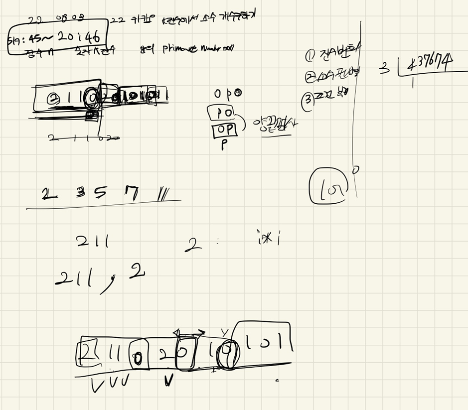
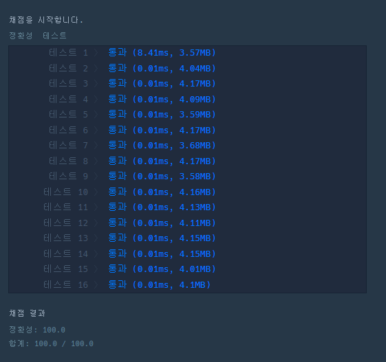

## 2022-08-03-카카오-2022-k진수에수소수개수구하기

문제 링크: [Click](https://school.programmers.co.kr/learn/courses/30/lessons/92335)

## 목차

>01.설계
>
>02.소스코드
>
>> 02.1 진수변환하는 코드
>>
>> 02.2 소수판별하는 코드
>>
>> 02.3 0을 기준으로 숫자 분리하는 것
>
>03.전체소스

## 01.설계



- 설계해놓은것은 별거 없지만
- 구현할 것
  - 진수변환하는 것
  - 소수판별하는 것
  - 0을 기준으로 숫자 분리하기
- 위의 세가지를 구현해야 성공함

## 02.소스코드

### 02.1 진수변환하는 코드

```c++
string numberC;
while (n / k != 0) {
    numberC += numberChar[n%k];
    n /= k;
}
numberC += numberChar[n%k];
reverse(numberC.begin(), numberC.end());
```

### 02.2 소수판별하는 코드

- 처음 구현한것 

  ```c++
  bool checkPrimeNumber1(long long n) {
  	if (n == 0 || n == 1) return false;
  	for (int i = 2; i*i <=  n; i++) {
  		if (n%i == 0) return false;
  	}
  	return true;
  }
  ```

- 속도 훨씬 빠른 것

  ```c++
  bool checkPrimeNumber(long long n) {
  	if (n == 0 || n == 1) return false;
  	for (int i = 2; i <= sqrt(n); i++) {
  		if (n%i == 0) return false;
  	}
  
  	return true;
  }

### 02.3 0을 기준으로 숫자 분리하는 것

```
for (int i = 0; i < numberC.size(); i++) {
if (numberC[i] == '0') {
if (num.size() == 0 ) {
continue;
}
if (checkPrimeNumber(stol(num))) answer++;
num.clear();
}
else if(numberC[i]!='0')num += numberC[i];
}
```

## 03.전체소스

```c++
#include <string>
#include <vector>
#include <iostream>
#include <algorithm>
#include <cmath>
using namespace std;
char numberChar[] = { '0','1','2','3','4','5','6','7','8','9','A','B','C','D','E','F' };

bool checkPrimeNumber(long long n) {
	if (n == 0 || n == 1) return false;
	for (int i = 2; i <= sqrt(n); i++) {
		if (n%i == 0) return false;
	}

	return true;
}
bool checkPrimeNumber1(long long n) {
	if (n == 0 || n == 1) return false;
	for (int i = 2; i*i <=  n; i++) {
		if (n%i == 0) return false;
	}
	return true;
}
int solution(int n, int k) {
	int answer = 0;

	string numberC;
	while (n / k != 0) {
		numberC += numberChar[n%k];
		n /= k;
	}
	numberC += numberChar[n%k];
	reverse(numberC.begin(), numberC.end());

	string num;
	for (int i = 0; i < numberC.size(); i++) {
		if (numberC[i] == '0') {
			if (num.size() == 0 ) {
				continue;
			}
			if (checkPrimeNumber(stol(num))) answer++;
			num.clear();
		}
		else if(numberC[i]!='0')num += numberC[i];
	}
	if (num.size()!=0&&checkPrimeNumber(stol(num))) answer++;
	//cout << num << endl;
	return answer;
}

int main(void) {

	cout<<solution(110011, 10);
	return 0;
}
```

