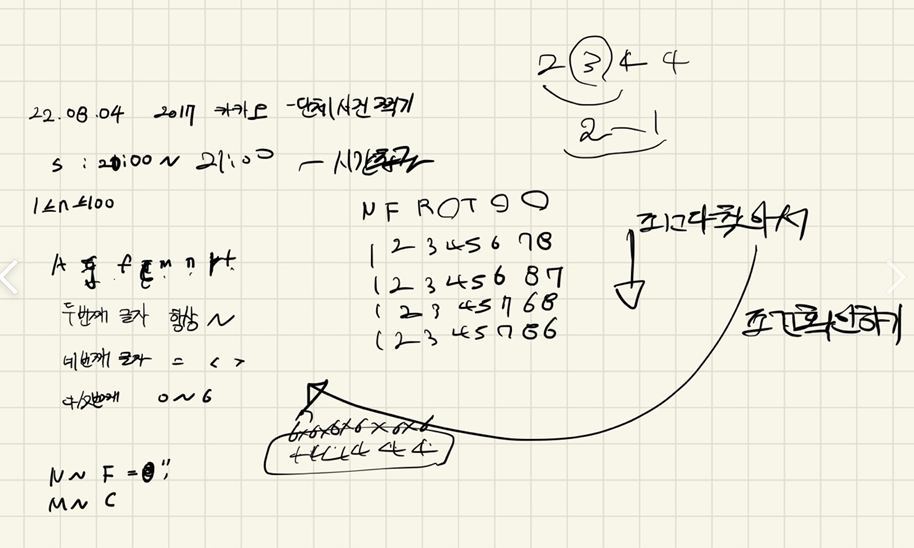

## 2022-08-04-카카오-2017-카카오단체사진찍기

문제링크: [Click](https://school.programmers.co.kr/learn/courses/30/lessons/1835)

## 목차

>01.설계
>
>02.소스코드
>
>>  02.1 모든경우의 수 뽑아내는 곳
>>
>>  02.2 조건 확인하는 부분
>
>03.전체소스

## 01.설계



- 이문제는 효율적으로 풀지는 못했지만 직관적으로 순열을 이용해서 전체의 경우를 구하고
  - 그 구한 것에 조건이 맞는지 확인 후 카운트를 세는 식으로 진행함
- 주의 할것
  - 한 테스트에서 여러 경우를 검사하는 식으로 채점이 돌아간다.
  - 전역변수를 초기화를 원래 당연히 해야하는 건데 꼭 해주자~!
  - 그리고 모든 경우를 보는 것이라 느린데 거짓인 경우는 무조건 리턴을 해줘서 속도를 향상 시켜야한다.
    - 위의 말이 처음에는 무슨 말이지 하지만 풀다보면 정말 이말대로 해야한다고 생각할 것이다.

## 02.소스코드

### 02.1 모든경우의 수 뽑아내는 곳

```c++
void dfs(int idx, int cnt, vector<string> &data,int n) {
	if (idx == 9) return;
	if (cnt == 8) {
...
		return;
	}
	for (int i = 1; i <= 8; i++) {
		if (D[idx] == 0&& num[i]==0) {
			num[i] = 1;
			D[idx] = i;
			dfs(idx+1, cnt+1, data,n);
			D[idx] = 0;
			num[i] = 0;
		}
			
	}
}
```

### 02.2 조건 확인하는 부분

```c++
int flag = 0;


for (int i = 0; i < data.size(); i++) {
    int firstFriend = m[data[i][0]];
    int secondFriend = m[data[i][2]];
    char bigSameSmall = data[i][3];
    int number =stoi(to_string(data[i][4]))-48;

    int one = 0, two = 0;
    for (int j = 0;j<8; j++) {
        if (D[j] == firstFriend) {
            one = j;
        }
        if (D[j] == secondFriend) {
            two = j;
        }
    }
    if (bigSameSmall == '=') {
        int absnum = abs(one - two)-1;
        if (absnum == number) flag++;
        else return;
    }
    else if (bigSameSmall == '<') {
        int absnum = abs(one - two)-1;
        if (absnum < number) flag++;
        else return;
    }
    else if (bigSameSmall == '>') {
        int absnum = abs(one - two)-1;
        if (absnum >number) flag++;
        else return;
    }
}
if (flag == n)ret++;
```

## 03.전체소스

```c++
#include <string>
#include <vector>
#include <map>
#include <iostream>
#include <algorithm>

using namespace std;
int D[8];
int num[9];
map<char, int> m;
int ret;
void dfs(int idx, int cnt, vector<string> &data,int n) {
	if (idx == 9) return;
	if (cnt == 8) {
		int flag = 0;


		for (int i = 0; i < data.size(); i++) {
			int firstFriend = m[data[i][0]];
			int secondFriend = m[data[i][2]];
			char bigSameSmall = data[i][3];
			int number =stoi(to_string(data[i][4]))-48;

			int one = 0, two = 0;
			for (int j = 0;j<8; j++) {
				if (D[j] == firstFriend) {
					one = j;
				}
				if (D[j] == secondFriend) {
					two = j;
				}
			}
			if (bigSameSmall == '=') {
				int absnum = abs(one - two)-1;
				if (absnum == number) flag++;
				else return;
			}
			else if (bigSameSmall == '<') {
				int absnum = abs(one - two)-1;
				if (absnum < number) flag++;
				else return;


			}
			else if (bigSameSmall == '>') {
				int absnum = abs(one - two)-1;
				if (absnum >number) flag++;
				else return;


			}
		}
		if (flag == n)ret++;
		return;
	}
	for (int i = 1; i <= 8; i++) {
		if (D[idx] == 0&& num[i]==0) {
			num[i] = 1;
			D[idx] = i;
			dfs(idx+1, cnt+1, data,n);
			D[idx] = 0;
			num[i] = 0;
		}
			
	}
}

// 전역 변수를 정의할 경우 함수 내에 초기화 코드를 꼭 작성해주세요.
int solution(int n, vector<string> data) {
	ret = 0;
	m.clear();
	for (int i = 0; i < 8; i++) {
		D[i] = 0;
	}	
	for (int i = 0; i < 9; i++) {
		num[i] = 0;
	}

	m['A'] = 1;
	m['C'] = 2;
	m['F'] = 3;
	m['J'] = 4;
	m['M'] = 5;
	m['N'] = 6;
	m['R'] = 7;
	m['T'] = 8;

	dfs(0, 0, data,n);
	return ret;
}

int main(void) {
	solution(2, { "N~F=0", "R~T>2" });
	return 0;
}
```