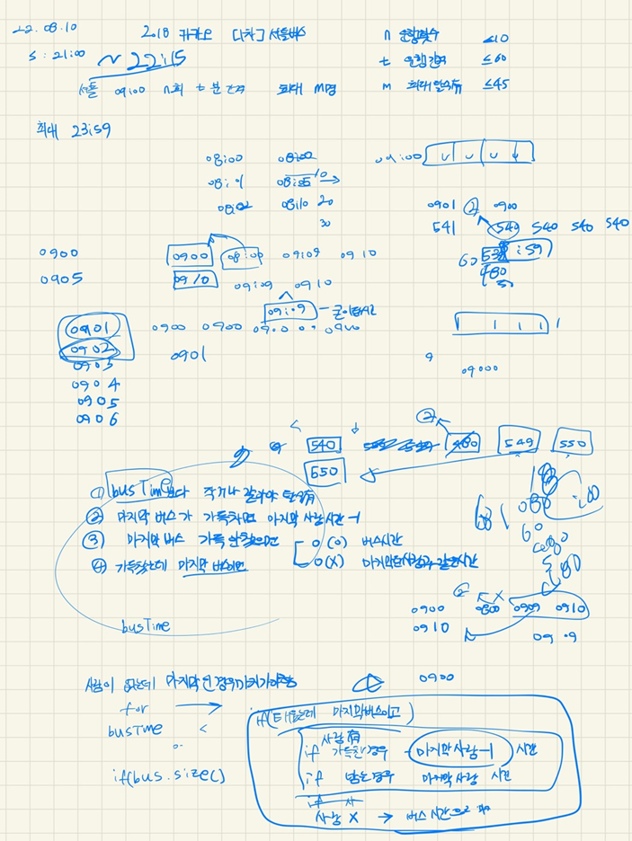
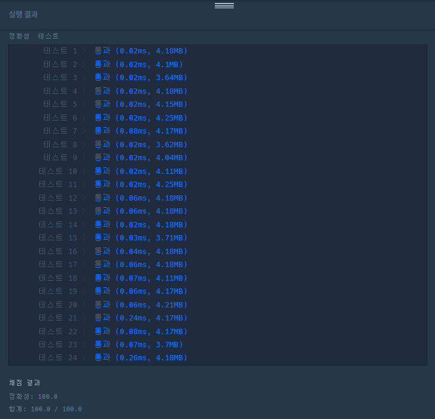

## 2022-08-10-카카오[1차]-셔틀버스

문제링크: [Click](https://school.programmers.co.kr/learn/courses/30/lessons/17678)

## 목차

>01.설계
>
>02.소스코드
>
>>  02.1 크루가 다 탄경우
>>>
>>  02.2 크루가 다 못탄 경우
>>>
>>  02.3 `분`으로되어 있는것 시간 형식으로 변경하기
>>>
>>  02.4 전체소스
>

## 01.설계



- 좀 설계 과정이 두서가 없지만 과정의 경우의 수를 말하면 이렇다.
  - 마지막 버스까지간 경우에서
    - **크루가 다 탄경우**
      - 마지막 버스에 가득차있다면 
        - 마지막 사람의 시간보다 -1이 적어야함
      - 마지막 버스에 공간이 있는 경우
        -  마지막 버스의 시간
    - **크루가 다 타지 못한 경우**
      - 마지막 버스에 가득차있다면 
        - 버스에 타있는 사람의 마지막 사람에 -1 값
      - 가득차있지 않은데 사람이 한명이라도 있으면
        - 그 마지막 사람의 시간
      - 가득차있지 않은데 사람이 한명도 없는 경우
        - 마지막 버스시간

## 02.소스코드

### 02.1 크루가 다 탄경우

```c++
if (crew.size() == 0) {
    if (busLine.size() == m) {
        answer1 = (busLine[busLine.size() - 1] - 1);
    }
    if (busLine.size() < m ) {
        answer1 = (busTime[i]);
    }
}
```

### 02.2 크루가 다 못탄 경우

```c++
if (busLine.size() == m) {
    answer1 = (busLine[busLine.size()-1] - 1);
}
if (busLine.size() < m && busLine.size() != 0) {
    answer1 = (busLine[busLine.size()]);
}
if (busLine.size() < m && busLine.size() == 0) {
    answer1 = (busTime[i]);///마지막 버스 시간 저장
}
```

### 02.3 `분`으로되어 있는것 시간 형식으로 변경하기

- 예를 들면 09:00 시의 경우 540분인데 이를 09:00으로 고치는 소스이다.

  ```c++
  int hour = answer1 / 60;
  int minute = answer1 % 60;
  
  
  if (hour < 10) {
      string hours = "0";
      hours += to_string(hour) + ":";
      answer += hours;
  }
  else answer += to_string(hour) + ":";
  if (minute < 10) {
      string minutes = "0";
      minutes += to_string(minute);
      answer += minutes;
  }
  else answer += to_string(minute);
  ```

### 02.4 전체소스

```c++
#include <string>
#include <vector>
#include <algorithm>
#include <iostream>
using namespace std;

string solution(int n, int t, int m, vector<string> timetable) {
	string answer = "";
	int answer1;

	vector<int>busTime;
	int startTime = 540;
	//버스 시간 저장
	for (int i = 0; i < n; i++)
	{
		busTime.push_back(startTime);
		startTime += t;
	}

	vector<int>crew;
	//크루시간 시간순 분단위 저장
	for (int i = 0; i < timetable.size(); i++)
	{
		int hour = stoi(timetable[i].substr(0, 2));
		int minute = stoi(timetable[i].substr(3, 2));
		int time = (hour * 60) + minute;

		crew.push_back(time);
	}
	sort(crew.begin(), crew.end());

	int mCnt = 0;
	vector<int> busLine;
	vector<int> busLine1;
	for (int i = 0; i < busTime.size(); i++)
	{
		if (crew.size() == 0)break;
		for (int j = 0; j < crew.size(); j++) {
			if (crew.size() == 0) break;
			if (busTime[i] >= crew[j]) {
				busLine.push_back(crew[j]);
				crew.erase(crew.begin() + j);
				j--;
			}
			if (busLine.size() == m) break;
		}
		if (i == busTime.size()-1) {// 태우고 난 후에 마지막 버스인 경우
			if (crew.size() == 0) {
				if (busLine.size() == m) {
					answer1 = (busLine[busLine.size() - 1] - 1);
				}
				if (busLine.size() < m ) {
					answer1 = (busTime[i]);
				}
			}
			else {
				if (busLine.size() == m) {
					answer1 = (busLine[busLine.size()-1] - 1);
				}
				if (busLine.size() < m && busLine.size() != 0) {
					answer1 = (busLine[busLine.size()]);
				}
				if (busLine.size() < m && busLine.size() == 0) {
					answer1 = (busTime[i]);///마지막 버스 시간 저장
				}
			}
		}
		busLine.clear();
	}
	
	int hour = answer1 / 60;
	int minute = answer1 % 60;

	
	if (hour < 10) {
		string hours = "0";
		hours += to_string(hour) + ":";
		answer += hours;
	}
	else answer += to_string(hour) + ":";
	if (minute < 10) {
		string minutes = "0";
		minutes += to_string(minute);
		answer += minutes;
	}
	else answer += to_string(minute);

	return answer;
}

int main(void)
{
	cout << solution(10, 25, 1, { "09:00", "09:10" ,"09:20" ,"09:30" ,"09:40" ,"09:50",
"10:00", "10:10" ,"10:20" ,"10:30" ,"10:40" ,"10:50" });
	//cout << solution(2, 1, 2, { "09:00", "09:00", "09:00", "09:00" });
	//
	return 0;
}
```

