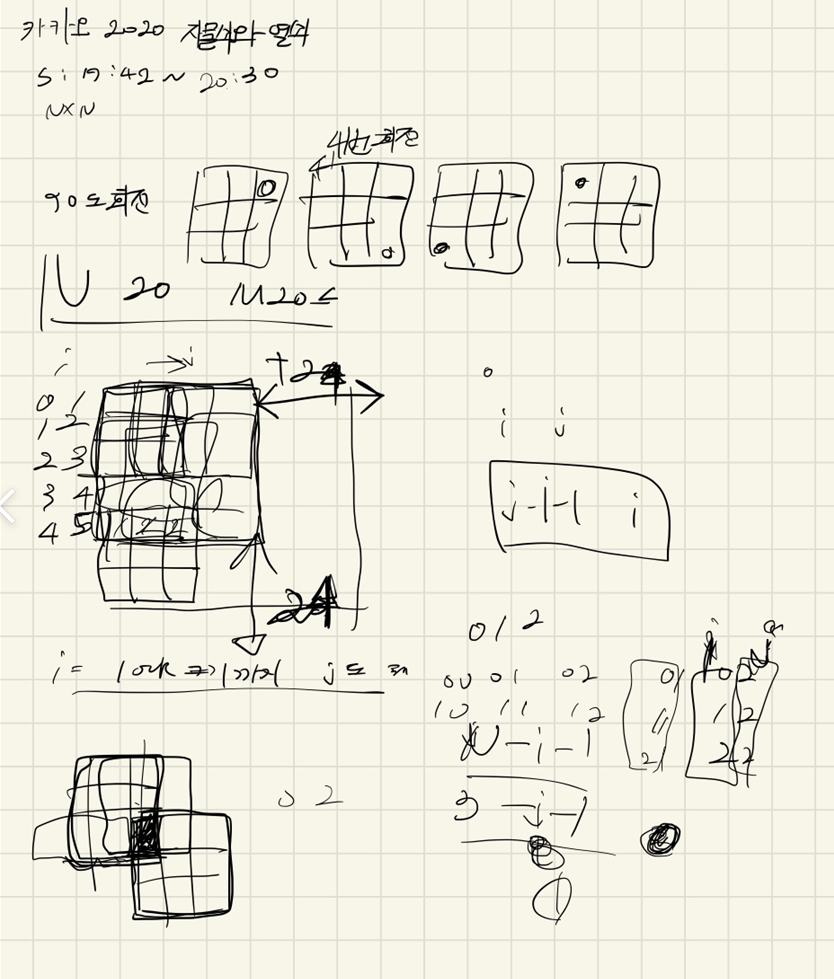
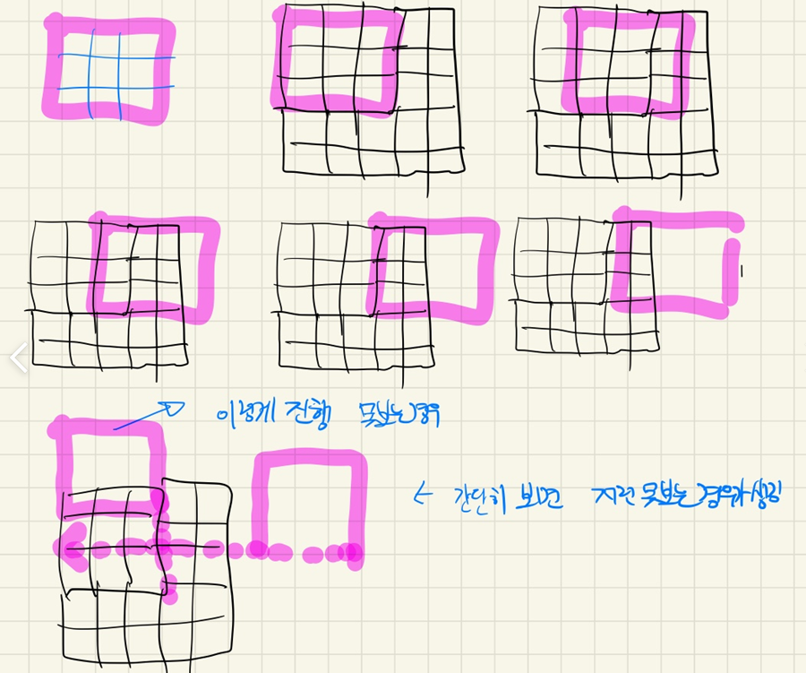
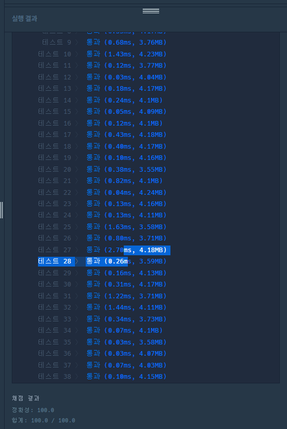

## 2022-08-11-카카오2020-자물쇠와-열쇠

- 문제링크: [Click](https://school.programmers.co.kr/learn/courses/30/lessons/60059)

## 목차

>01.설계
>
>02.소스코드
>
>>  02.1 배열 회전하는 소스
>>
>>  02.2 완전탐색하는 부분
>
>03.전체소스

## 01.설계





- 위의 문제를 다 풀어놓고 틀리게 나왔던 것은 못보는 경우까지 제대로 생각을 못했음
  - 사실 위의 문제는 배열을 회전을 하는 것이 포인트 인것 같다.
  - 그리고 나머지는 사실상 완전탐색을 진행하면됨

## 02.소스코드

### 02.1 배열 회전하는 소스

```c++
void rotation(vector<vector<int>> &arr) {
	vector<vector<int>>crr = arr;
	for (int i = 0; i < arr.size(); i++) {
		for (int j = 0; j < arr.size(); j++) {
			cc[i][j] = crr[i][j] = arr[j][arr.size() - i - 1];
		}
	}
	arr = crr;
}
```


### 02.2 완전탐색하는 부분

```c++
for (int y = 0; y < lock.size(); y++) {
    for (int x = 0; x < lock.size(); x++) {
        int chk[44][44] = { 0, };

        copyArr(lock);
        int flag = 0;
        for (int yy = 0; yy < key.size(); yy++) {
            for (int xx = 0; xx < key.size(); xx++) {
                chk[y + yy][x + xx] = 1;
                if (key[yy][xx] == 1) {
                    locks[y + yy][x + xx]++;
                    if (locks[y + yy][x + xx] == 2) {
                        flag = 1;
                        break;
                    }
                }
            }
            if (flag)break;
        }
        if (flag)continue;

        int result = (lock.size())* (lock.size());
        int count = 0;
        for (int y = 0; y < lock.size(); y++) {
            for (int x = 0; x < lock.size(); x++) {
                if (locks[y][x] == 1)
                    count++;
            }
        }
        if (result == count) return true;
    }
}
```

## 03.전체소스

```c++
#include <string>
#include <vector>
#include <iostream>
#include <string.h>

using namespace std;
int locks[64][64];
int cc[64][64];

void rotation(vector<vector<int>> &arr) {
	vector<vector<int>>crr = arr;
	for (int i = 0; i < arr.size(); i++) {
		for (int j = 0; j < arr.size(); j++) {
			cc[i][j] = crr[i][j] = arr[j][arr.size() - i - 1];
		}
	}

	arr = crr;
}

void copyArr(vector<vector<int>> &lock) {
	memset(locks, 0, sizeof(locks));
	for (int i = 0; i < lock.size(); i++) {
		for (int j = 0; j < lock.size(); j++) {
			locks[i][j] = lock[i][j];
		}
	}
}
bool solution(vector<vector<int>> key, vector<vector<int>> lock) {
	bool answer = true;

	vector<vector<int>> copy_lock = lock;
	for (int k = 0; k < 4; k++) {
		for (int i = 0; i <= 4; i++) {

			for (int y = 0; y < lock.size(); y++) {
				for (int x = 0; x < lock.size(); x++) {
					int chk[44][44] = { 0, };

					copyArr(lock);
					int flag = 0;
					for (int yy = 0; yy < key.size(); yy++) {
						for (int xx = 0; xx < key.size(); xx++) {
							chk[y + yy][x + xx] = 1;
							if (key[yy][xx] == 1) {
								locks[y + yy][x + xx]++;
								if (locks[y + yy][x + xx] == 2) {
									flag = 1;
									break;
								}
							}
						}
						if (flag)break;
					}
					if (flag)continue;

					int result = (lock.size())* (lock.size());
					int count = 0;
					for (int y = 0; y < lock.size(); y++) {
						for (int x = 0; x < lock.size(); x++) {
							if (locks[y][x] == 1)
								count++;
						}
					}
					if (result == count) return true;
				}
			}
			rotation(key);
		}
		rotation(lock);
	}
	return false;
}
int main(void)
{
	cout << solution({ {0, 0, 0}, {1, 0, 0}, {0, 1, 1} }, { {1, 1, 1} ,{1, 1, 0}, {1, 0,1} });
	return 0;
}
```




