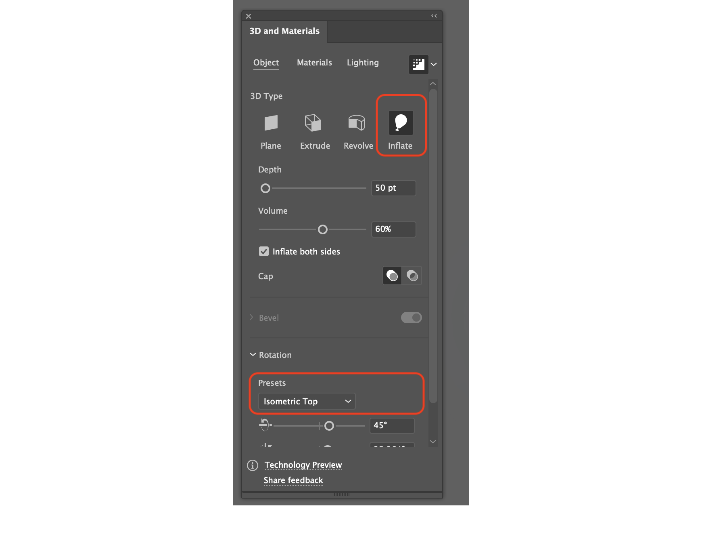

## 22-04-05-GitBlog-Icon변경

## 목차

> 01.icon 이미지 만들기
>
> 02.아이콘 변환하기, 크기 조절
>
> 03.적용 모습

## 01.icon 이미지 만들기

- 적당히 아래와 같은 과정으로 이미지가 완성됨

- 위와 같이 적당히 원하는 것 만들기

- 3D 아이콘으로 변경

  - 앞의 처음 이미지 전체를 그룹화한 상태에서

  

  - 이미지 클릭한 상태에서 Effect클릭 -> 3D and Materials클릭

  

  - Inflate 클릭 후 

    - Presets -> lsometirc Top 클릭하면 어느정도 된다.
      - 위의 설정과 그대로 하면된다.
      - 아이콘 크기 기준 400px X 400px이다.

    

- 위의 설정을 어느정도하면 거의 완벽에 가까워진다.

- 이렇게 까지 하면 최종을 볼 수 있음

-  완성된 모습이다.

## 02.아이콘 변환하기 | 크기 조절

https://www.favicon-generator.org/

- 위의 링크에 가서 이미지를 변환해주면됨

- 저기에 넣고 적절히 선택 후 Create Favicon클릭하면됨
  - Generate가 두개 있는데 하나씩 다 해서 아이콘 생성함

- 이부분에 적절히 대치해줬음
  - 그리고 나서 깃 푸시를 하면 된다.

- 근데 탭 부분의 아이콘만 안 바뀌는 경우가 있음
- 적용하는데 시간이 걸리니 기다려주면 바뀐다.

## 03.적용모습

