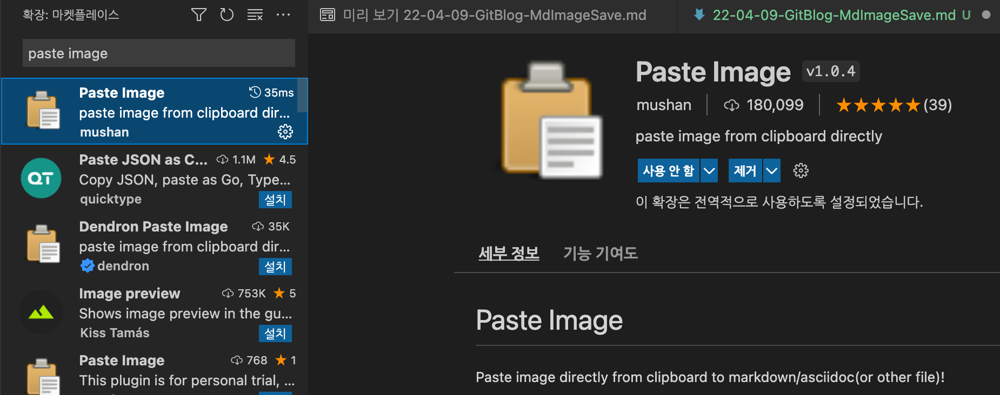
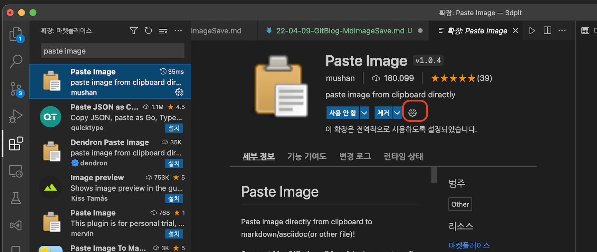
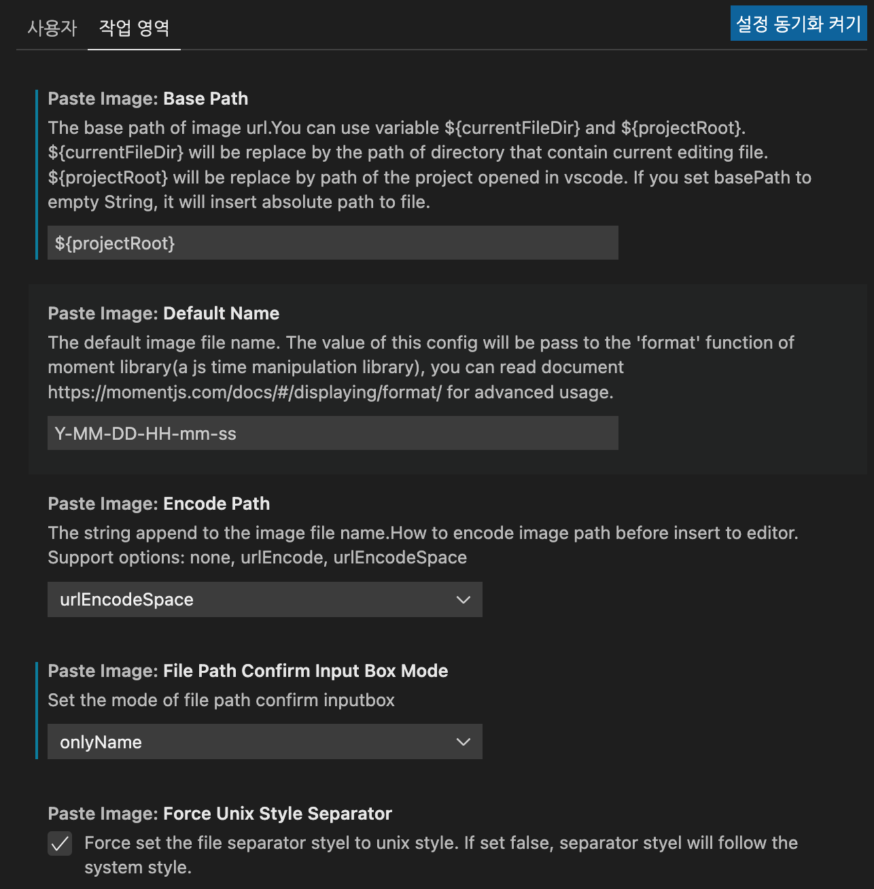
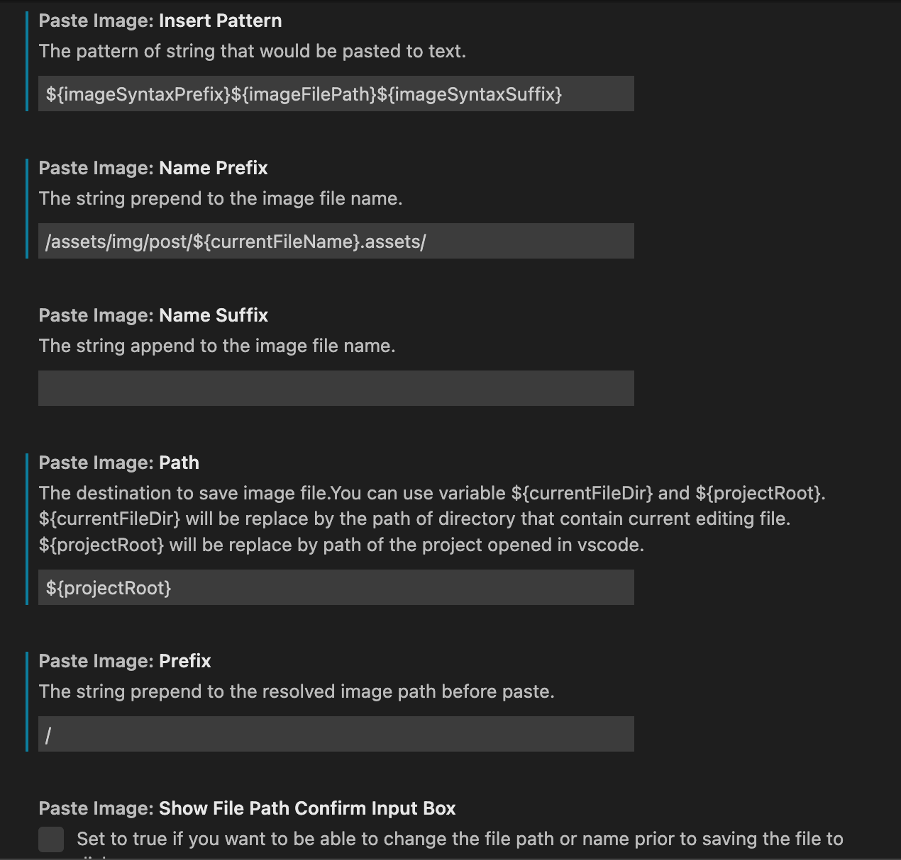
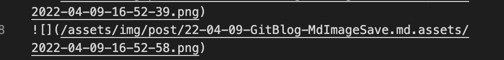

## 목차
> 01.불편사항
>
> 02.확장설치
>
>>02.1 아래와 같이 설정하기  
>
## 01.불편사항
- 이미지를 md로 이전에는 타이포라라는 앱을 이용해서 만들었음
  - 자동으로 이미지폴더를 생성을 해주는식 으로 사용
- 그러나, 블로그에 이미지를 올리는 방식 자체의 경로가 다름
  - 타이포라의 경우
    - ``
  - 블로그의 경우
    - ``
- 위와 같이 / 가 있는지 없는지 차이가 존재 그렇기 때문에 작업을 타이포라에서 하는 경우 경로 수정을 해야했음
  - vsCode에서 직접하는 경우에 이미지 생성을 확장프로그램을 사용하더라도 기본값은 해당 폴더 위치에 존재하는것
  - 이를 /assets/img/post/{파일이름}/
    - 위와 같이 고정하여 쓰기 위해 아래와 같은 설정을 진행
## 02.확장설치

- paste image 입력후 설치를 진행
- 설치를 하고 톱니바퀴 모양 클릭

### 02.1 아래와 같이 설정하기

- 위와 같이 설정하면 이렇게 경로로 알아서 만들어지고 들어감

- 좀더 편하게 블로그에 스크린샷 이미지를 적용할 수 있음