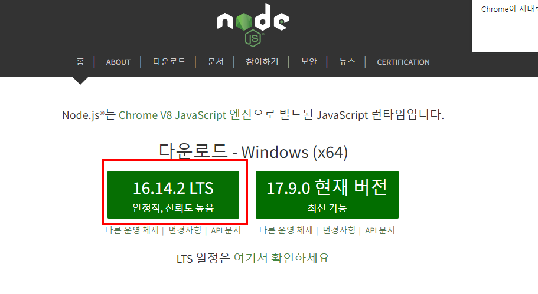
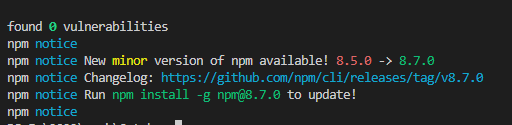
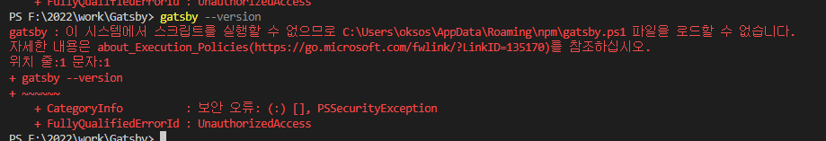
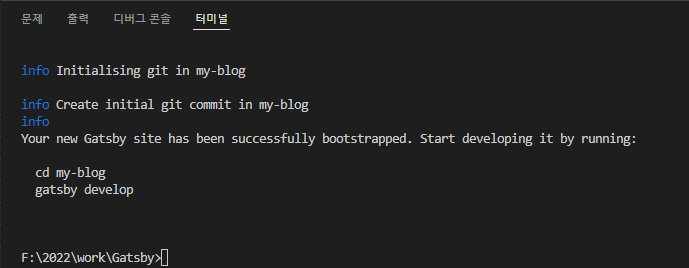
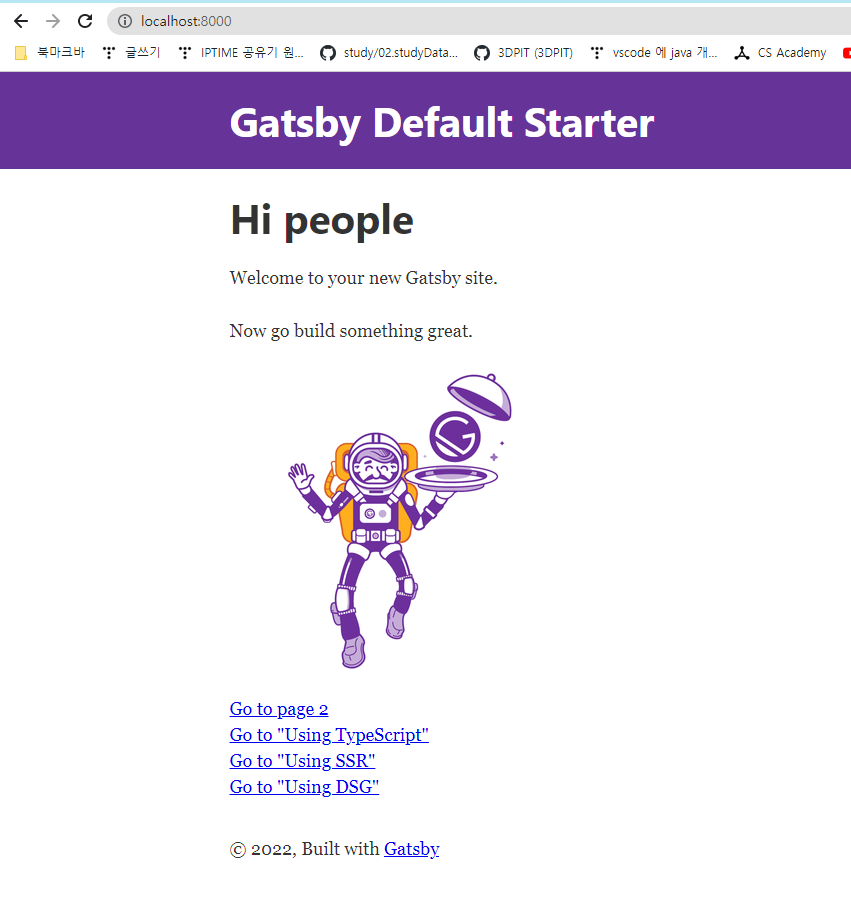
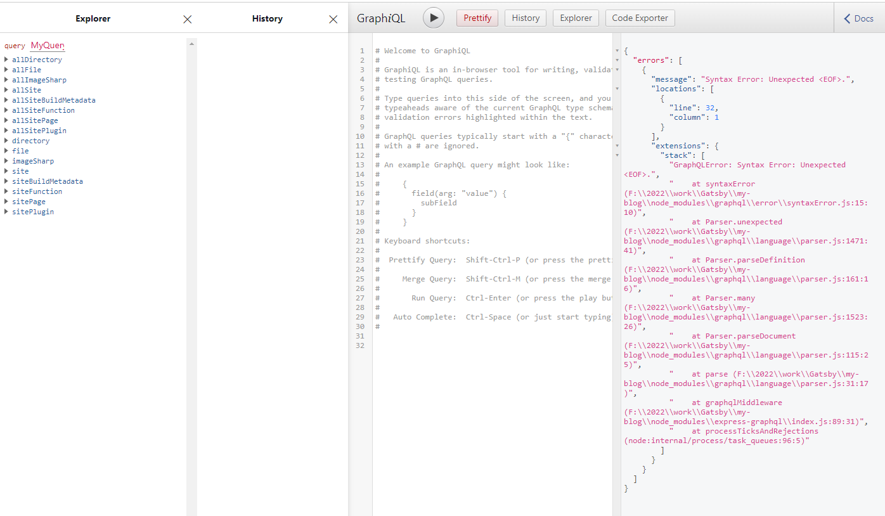

## 22-04-15-Gatsby도입기

## 목차

> 01.npm설치
>
> 02.Gatsby설치
>
> 03.Gatsby 프로젝트 설치
>
> 04.생성된 프로젝트로 경로 이동후 실해
>
> 05.GraphiQL 탐색화면

[Gatsby_Github](https://github.com/gatsbyjs/gatsby-starter-default)

## 01.npm설치

[npm설치사이트](https://nodejs.org/ko/)



- 16.14.2 LTS 버전을 설치진행
- 설치가 완료됬으면 재시작을 해준다.

## 02.Gatsby설치

```react
npm install -g gatsby-cli
```

- Gatsby는 npm으로 gatsby-cli를 설치하면됨



## 03.Gatsby 프로젝트 설치

```react
gatsby new my-blog
```



- 실행을 했는데 에러가 난다면 powershell말고 cmd에서 실행해보자

## 04.생성된 프로젝트로 경로 이동후 실행

```react
cd my-blog
gatsby develop
```

- 위의 명령어를 통해서 로컬에서 서비스를 실행할수 있음
- gatsby build를 통해 빌드 결과물만 생성할 수 도 있음



- 완료 되면 위와 같이 진행해보자
- http://localhost:8000



- 위와 같이 나오면 설치를 완료된것

## 05.GraphiQL 탐색화면

- http://localhost:8000/___graphql
  - 위를 입력하면 개발할때 쉽게 데이터 탐색을 할 수 있음



- 다음장에서는 테마를 적용한 모습으로 찾아올게요