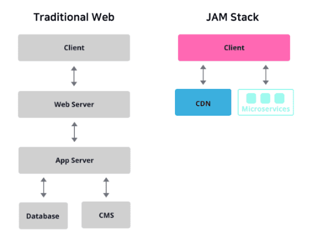
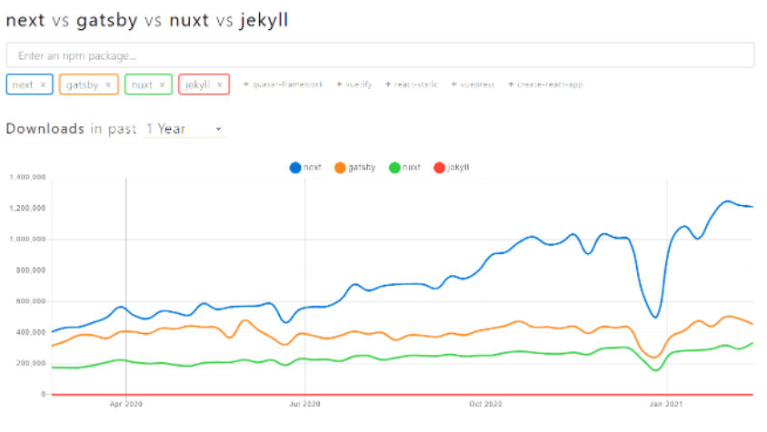

## 22-04-15-Gatsby란무엇일까?

## 01.JAM Stack이란?

- 공식 설명에 의하면 JAM Stack은 더 빠르고 안전하며, 스케일링하기 쉬운 웹을 만들기 위해 디자인 된 아키텍처
- JAM Stack은
  - Java Script, API, MarkUp Stack의 약자
    - 자바스크립트와 API, HTML이나 CSS등을 칭하는 MarkUP으로 이루어진 웹 구성 방법
  - 즉, 세 가지의 기술을 통해 홈페이지 만드는 것

- 기존 웹사이트의 경우
  - 대부분 서버에서 DB 또는 CMS(Content Management System)로 부터 추출한 데이터를 프론트엔드에 뿌려주는 방식
  - 위와 같이 많은 절차를 거쳐야만 하기 때문에 구조가 복잡
- JAM Stack을 사용한 방식
  - 기존 웹 사이트와는 다르게 절차가 매우 간단
  - 각종 마크업 요소와 다양한 API를 통해 만든 정적 웹 사이트를 Pre-Render한 것을 CDM(Content Delivery Network)을 통해 웹 사이트를 열람 할 수 있음

### 01.1 그래서 ? 왜 뭐가 좋은데?

- **1.기존 방식에 비해 더 빠르게 웹 사이트를 제공할 수 있음**
  - 대부분 웹사이트는 처음 접속 시, 서버를 통해 데이터를 받아와 이를 렌더링하는 과정 필요
  - 하지만 JAM Stack은 렌더링할 화면들을 모두 `Pre-Render`하여 제공되어 
    - 그만큼 사용자에게 화면을 보여주기 위해 준비하는 시간을 단축할 수 있음
  - 이에 더불어 브라우저에서 첫 응답을 받기까지 걸리는 시간인 TTFB(Time to First Byte)를 최소화하 데에는 미리 빌드 된 파일을 CDN을 통해 제공하는 것보다 나은 방법은 없다고함
- **2.안전한 웹 사이트를 제공할 수 있음**
  - JAM Stack은 API를 통해 정적 사이트를 생성
    - 여기서 사용되는 API는 JAM Stack을 활용한 각 프레임워크에서의 마이크로 서비스로서
      - 사이트 생성을 위한 프로세스가 추상화 되어 있기 때문에 **공격 노출 범위과 감소**
  - 따라서, 개발자는 웹 개발 중 발생할 수 있는 취약점에 대해 보다 덜 신경쓸 수 있음
- **3.스케일링하기 쉬운 웹 사이트를 제공할 수 있음**
  - 정적 웹사이트에서의 스케링일은 더 많은 지역에서 홈페이지를 제공할 수 있게 하는 의미
  - 그래서 미리 빌드 된 파일 제공을 담당하는 CDN이 그 역할을 충분히 수행해 낼 수 있음

## 02.왜? 많은 프레임워크 중에서 Gatsby인가?

- 다운로드 횟수가 저렇게 되는데
  - Next.js와 Gatsby는 모두 React기반 프레임 워크
  - 그렇다면 Next.js를 하면되는데 왜?
- 두 프레임워크의 사용 용도가 다르기 때문
  - Next.js는
    - 정적 사이트 생성의 기능도 있지만
    - **서버 사이드 랜더링**을 위해 사용하는 프레임 워크
    - 즉, 서버와 통신을 하며 요청을 받을 때 마다 동적으로 웹사이틀 생성
  - Gatsby는 
    - 서버 없이, 오로지 **정적 사이트 생성**를 위해 사용하는 프레임워크
    - 그래서, 서비스 및 기업 소개 페이지, 블로그, 포트폴리오 등에 사용

