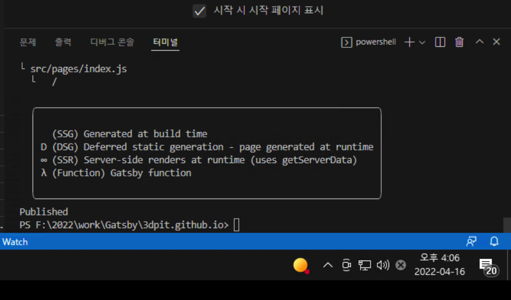

## 22-04-16-Gatsby테마적용후배포해보기

## 01.Theme 적용

https://github.com/gatsbyjs/gatsby-starter-blog.git

- 테마사용하기

### 01.1 Gatsby 설치

- npm install -g gatsby-cli
  - gatsby 를 설치 후

### 01.2 Gatsby 프로젝트 만들기

- 프로젝트 생성시 테마 설치가 가능

```sh
gatsby new [프로젝트 이름] [적용할 테마의 주소]

gatsby new gatsby https://github.com/gatsbyjs/gatsby-starter-blog.git
```

- 설정한 프로젝트이름의 폴더가 생김

## 02.Gatsby Blog 커스텀하기

- package.json, gatsby-meta-config.js를 자신의 정보에 맞게 수정해주면됨
  - 특히 gatsby-meta-config.js는
    - 테마마다 다를 수 있지만 사이트 제목, 썸네일 주소, 깃허브 주소, 이메일 주소, 포트폴리오 등등 적절하게 쓰면됨

## 02.1 package.json

- before


- after


## 02.2 gatsby-meta-config.js


## 03로컬에서 실행해보기


- gatsby develop로 실행해보자

## 04.Blog 배포 준비하기

- 위의 테마를 Github에 올리기 위해서는 gh-pages라는 패키지 설치해야함

`npm install gh-pages --save-dev`

- **package.json**

  ```json
  {
    "scripts": {
      "deploy": "gatsby build && gh-pages -d public" // 추가
    }
  }
  ```

  - 위를 입력해준다.

## 05.배포하기

```react
npm run deploy
```



- 아래와 같이 published되면 성공


- gh-pasges가 생성됨이 보임

  - 이것을 연결해야함

  

  - settings에 Pasges의 Branch를 gh-pasges로하고 저장한다

## 06.실제로 켜보기

- 실제로 제대로 동작하는지 주소를 입력해보자

https://3dpit.github.io/