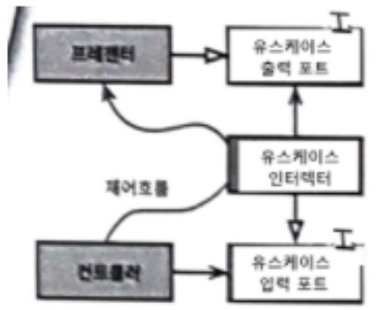
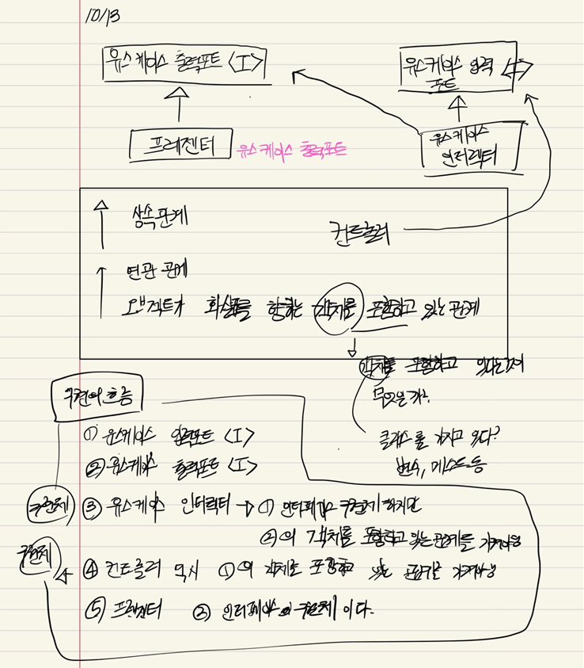
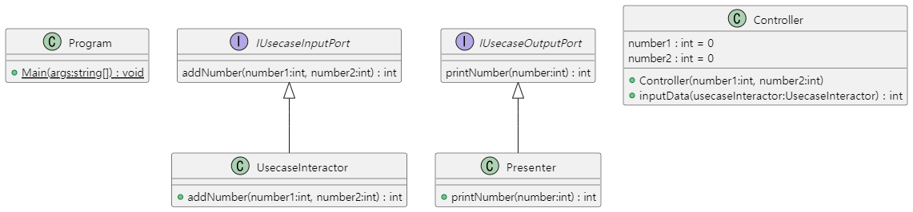
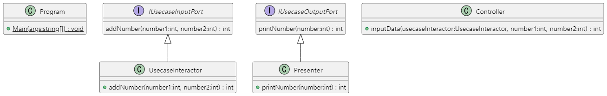
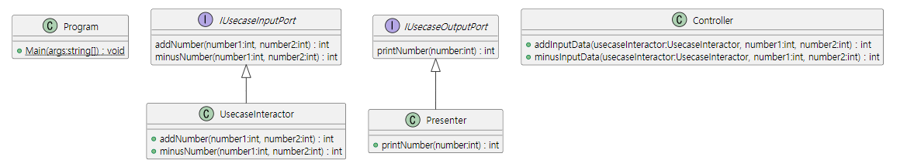
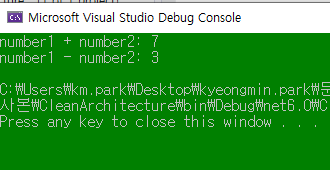
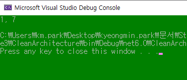
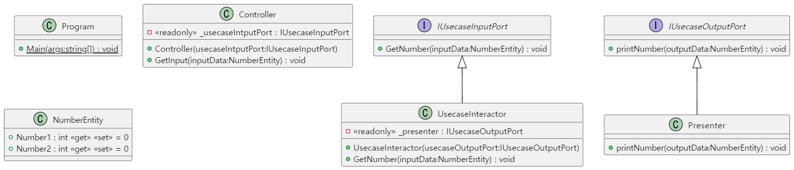
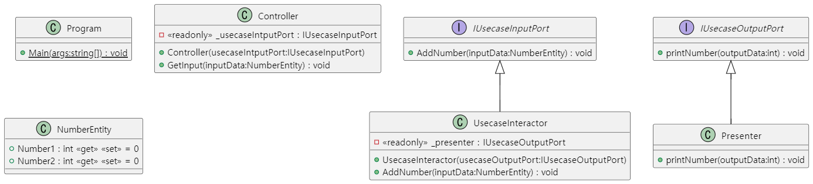
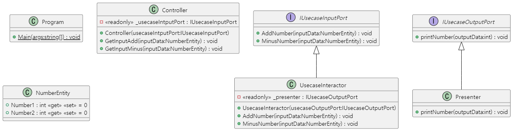

## 2022-10-11-클린아키텍처-적용해보기

## 목차

>00.적용시 어려웠던점
>
>01.그림으로 코드 설명하기
>
>02.직접 위의 그림의 흐름 구현하기
>
>> 02.1 구현할것
>>
>> 02.2 구현 순서
>>
>> 02.3 소스 코드
>>
>> > 02.3.1 CleanArchitecture1
>> >
>> > 02.3.2 CleanArchitecture2
>> >
>> > 02.3.3 CleanArchitecture3
>> >
>> > 02.3.4 CleanArchitecture4
>> >
>> > 02.3.5 CleanArchitecture5
>> >
>> > 02.3.6 CleanArchitecture6
>> >
>> > 02.3.7 input port에 추가된 경우 
>> > 
## 00.적용시 어려웠던점

- 우선 UML자체가 익숙하지 않았기때문에 처음에 01.~~ 의 그림을 글로 해석을 했음
  - 그리고 각 필요한 조건에 맞추어 코드를 구현함
- 여기서 어려웠던 점 
  - [ ] 유스케이스 출력포트의 객체를 포함
    - 유스케이스 입력포트의 객체를 포함 한다는 부분이 이해가 되지 않았음
    - 참고한 곳 DDD책의 클린아키텍처 부분과 일부 사이트에서 참고
  - [ ] 컨트롤러 부터 인터렉터 그리고 프레젠터 순으로 제어가된다고 한 부분에서도 의문이 있었음
    - 우선 생성자를 가진 클래스로 구성을 했는데 그러는 경우에 각 인터페이스를 구현한 구현체를 받게 된다. 
      - 마지막 구현한 코드로 예를 들면,
        - 컨트롤은 인터렉터의 구현체가 필요하고
        - 인터렉터는 프레젠터의 구현제가 필요했는데,
          - 사실상 핵심이 컨트롤러가 프레젠터를 사용하려고 하지만, 
            - [ ] 컨트롤러는 프레젠터를 모르면 되는건데 그것이 제대로 반영된건지 의문
    - [ ]  소스코드를 구현하다보니 각 클래스 구현체를 보니 프레젠터를 클래스로 나누었지만 사실상 출력하는 부분인데 따로 구현할 필요가 있는지?
      - 인터렉터에서 마지막에 리턴한 값을 표현하면 되는게 아닌가 하는 의문이 생김
        - 아래 그림에서는 따로 인터페이스를 구현한 구현체인데 상황마다 다른가하는 의문
  - [ ] 완성이 된 소스에서 의존성이 개입이 안된다. 또는 서로 모른다 독립적으로 되어 있다를 확인할 수 있는 방법론에 대해서 알고 싶음

## 01.그림으로 코드 설명하기



- 유스케이스 인터렉터

  - ActorPaths.cs

- 유스케이스 출력 포트(인터페이스)

  - ISendMessageService.cs
  - IRemoteProcessKillService.cs

- 유스케이스 입력 포트(인터페이스)

  - ISendMessageService.cs
  - IRemoteProcessKillService.cs

- 프레젠터

  - SendMessageToLogstashService 
    - SendMessageToLogstashService -> EndAsync
  - RemoteProcessKillWinRmService 
    - RemoteProcessKillWinRmService -> ExecuteAsync

- 컨트롤러

  - SendMessageToLogstashService 

    - SendMessageToLogstashService -> BeginAsync
  - RemoteProcessKillWinRmService 
  
    - RemoteProcessKillWinRmService -> CreateArguments
  

## 02.직접 위의 그림의 흐름 구현하기

- 원의 경계 횡단
  - 컨트롤러와 프레젠터가 다음 계층에 속한 유스케이스와 통신하는 모습
- 제어흐름에 주목해서 본다면
  - 제어흐름은 컨트롤러에서 시작해서,
  - 유스케이스를 지난 후,
  - 프레젠터에서 실행되면서 마무리
- 의존성의 경우 유스케이스 안쪽을 가리킴
- 직접 호출하면 안됨
- 외부원에 있는 어떤 이름도 언급해서는 안됨
  - 따라서, 유스케이스가 내부 원의 인터페이스를 호출(유스케이스 출력 포트)하도록하고
  - 외부원의 프레젠터가 그 인터페이스를 구현하도록 만듦

### 02.1 구현할것

- 컨트롤러
- 유스케이스 입력 포트
- 유스케이스 인터렉터
- 프레젠터
- 유스케이스 출력 포트

### 02.2 구현 순서



### 02.3 소스 코드

#### 02.3.1 CleanArchitecture1

#### 1차시도



##### 유스케이스 입력포트 <I>

```cs
using System;
using System.Collections.Generic;
using System.Linq;
using System.Text;
using System.Threading.Tasks;

namespace CleanArchitecture.ApplicationBusinessRules
{
    interface IUsecaseInputPort{
        int addNumber(int number1, int number2);
    }
}
```

##### 유스케이스 출력포트 <I>

```cs
using System;
using System.Collections.Generic;
using System.Linq;
using System.Text;
using System.Threading.Tasks;

namespace CleanArchitecture.ApplicationBusinessRules{
    interface IUsecaseOutputPort{
        int printNumber(int number);
    }
}
```

##### 유스케이스 인터렉터 <유스케이스 입력포트의 구현체>

- 유스케이스 출력포트의 객체를 포함

```cs
using CleanArchitecture.InterfaceAdapter;
using System;
using System.Collections.Generic;
using System.Linq;
using System.Text;
using System.Threading.Tasks;

namespace CleanArchitecture.ApplicationBusinessRules
{
    public class UsecaseInteractor : IUsecaseInputPort
    {

        public int addNumber(int number1, int number2)
        {
            int sumNumber = number1 + number2;
            return sumNumber;
        }
    }
}
```

##### 컨트롤러

- 유스케이스 입력포트의 객체를 포함

```cs
using CleanArchitecture.ApplicationBusinessRules;
using System;
using System.Collections.Generic;
using System.Linq;
using System.Text;
using System.Threading.Tasks;

namespace CleanArchitecture.InterfaceAdapter
{
    public class Controller
    {
        int number1 = 0;
        int number2 = 0;
        public Controller(int number1,int number2)
        {
            this.number1 = number1;
            this.number2 = number2;
        }
        public int inputData(UsecaseInteractor usecaseInteractor)
        {
            return usecaseInteractor.addNumber(this.number1, this.number2);
        }
    }
}
```

##### 프레젠터 <유스케이스 출력포트의 구현체>

- 최종 실행되는 부분

```cs
using CleanArchitecture.ApplicationBusinessRules;
using System;
using System.Collections.Generic;
using System.Linq;
using System.Text;
using System.Threading.Tasks;

namespace CleanArchitecture.InterfaceAdapter
{
    public class Presenter : IUsecaseOutputPort
    {
        public int printNumber(int number)
        {
            return number;
        }
    }
}
```

##### Program.cs

```cs
using CleanArchitecture.ApplicationBusinessRules;
using CleanArchitecture.InterfaceAdapter;

namespace CleanArchitecture
{
    public class Program
    {
        public static void Main(string[] args)
        {
            Controller controller = new Controller(1, 2);
            UsecaseInteractor usecaseInterator = new UsecaseInteractor();
            Presenter presenter = new Presenter();

            var inputData = controller.inputData(usecaseInterator);
            var result = presenter.printNumber(inputData);
            Console.WriteLine(result);
        }
    }
}
```

#### 02.3.2 CleanArchitecture2

#### 1차시도-1

- Controller 부분 생성자 제외



#### 컨트롤러

```cs
using CleanArchitecture.ApplicationBusinessRules;
using System;
using System.Collections.Generic;
using System.Linq;
using System.Text;
using System.Threading.Tasks;

namespace CleanArchitecture.InterfaceAdapter
{
    public class Controller
    {
        public int inputData(UsecaseInteractor usecaseInteractor,int number1,int number2)
        {
            return usecaseInteractor.addNumber(number1, number2);
        }
    }
}
```

#### Program.cs

```cs
using CleanArchitecture.ApplicationBusinessRules;
using CleanArchitecture.InterfaceAdapter;

namespace CleanArchitecture
{
    public class Program
    {
        public static void Main(string[] args)
        {
            Controller controller = new Controller();
            UsecaseInteractor usecaseInterator = new UsecaseInteractor();
            Presenter presenter = new Presenter();

            var inputData = controller.inputData(usecaseInterator,5,2);
            var result = presenter.printNumber(inputData);
            Console.WriteLine(result);
        }
    }
}
```

#### 02.3.3 CleanArchitecture3

#### 2차시도

  

- inputPort에 기능이 추가된 상황
  - 더하기만 있었던 것이 빼기도 추가된다면?

#####  IUsecaseInputPort.cs

```cs
using System;
using System.Collections.Generic;
using System.Linq;
using System.Text;
using System.Threading.Tasks;

namespace CleanArchitecture.ApplicationBusinessRules
{
    interface IUsecaseInputPort{
        int addNumber(int number1, int number2);
        int minusNumber(int number1, int number2); //추가된 부분
    }
}
```

#####  UsecaseInteractor.cs

```cs
using CleanArchitecture.InterfaceAdapter;
using System;
using System.Collections.Generic;
using System.Linq;
using System.Text;
using System.Threading.Tasks;

namespace CleanArchitecture.ApplicationBusinessRules
{
    public class UsecaseInteractor : IUsecaseInputPort
    {

        public int addNumber(int number1, int number2)
        {
            return number1 + number2;
        }

        public int minusNumber(int number1, int number2) //추가된 부분
        {
            return number1 - number2;
        }
    }
}
```

##### Controller.cs

```cs
using CleanArchitecture.ApplicationBusinessRules;
using System;
using System.Collections.Generic;
using System.Linq;
using System.Text;
using System.Threading.Tasks;

namespace CleanArchitecture.InterfaceAdapter
{
    public class Controller
    {
        
        public int addInputData(UsecaseInteractor usecaseInteractor, int number1, int number2)
        {
            return usecaseInteractor.addNumber(number1, number2);
        }
        
        public int minusInputData(UsecaseInteractor usecaseInteractor, int number1, int number2)// 추가된 부분
        {
            return usecaseInteractor.minusNumber(number1, number2);
        }
    }
}
```

##### Program.cs

```cs
using CleanArchitecture.ApplicationBusinessRules;
using CleanArchitecture.InterfaceAdapter;

namespace CleanArchitecture
{
    public class Program
    {
        public static void Main(string[] args)
        {
            Controller controller = new Controller();
            UsecaseInteractor usecaseInterator = new UsecaseInteractor();
            Presenter presenter = new Presenter();

            var inputData = controller.addInputData(usecaseInterator, 5, 2);
            Console.WriteLine($"number1 + number2: {presenter.printNumber(inputData)}");

            var inputData1 = controller.minusInputData(usecaseInterator, 5, 2);
            Console.WriteLine($"number1 - number2: {presenter.printNumber(inputData1)}");
        }
    }
}
```



- 아직은 수정할 부분이 많지만 
  - 유스케이스 출력포트의 객체를 포함
  - 유스케이스 입력포트의 객체를 포함
    - 이를 포함한다는 의미를 잘 모르겠음
  - 현재는 Controller 부분에
    - ` public int addInputData(UsecaseInteractor usecaseInteractor, int number1, int number2)`
    - `public int minusInputData(UsecaseInteractor usecaseInteractor, int number1, int number2)`
      - 위에처럼 Controller 클래스의 메소드에 UsecaseInteractor의 구현체를 받게 해놨는데 이렇게 하면 객체를 포함하는 건지
      - 사실상 의존성이 개입이 되는게 아닌지 의문임

#### 02.3.4 CleanArchitecture4

#### DDD 클린아키텍처 보기 전 소스

#### 3차시도

##### /ApplicationBusinessRules

```cs
## IUsecaseInputPort

namespace CleanArchitecture.ApplicationBusinessRules
{
    public interface IUsecaseInputPort{
        NumberEntity GetNumber(int number1, int number2);
    }
}

## IUsecaseOutputPort

namespace CleanArchitecture.ApplicationBusinessRules
{
    public interface IUsecaseOutputPort{
        NumberEntity printNumber(int number1, int number2);
    }
}

## UsecaseInteractor

namespace CleanArchitecture.ApplicationBusinessRules
{
    public class UsecaseInteractor : IUsecaseInputPort
    {
        private readonly IUsecaseOutputPort _usecaseOutputPort;
        private readonly NumberEntity _numberEntity = new NumberEntity();
        public NumberEntity GetNumber(int number1, int number2)
        {
            _numberEntity.Number1 = 1;
            _numberEntity.Number2 = number1 + number2;

            return _numberEntity;
        }
    }
}
```

#### /InterfaceAdapter

```cs
## Controller

namespace CleanArchitecture.InterfaceAdapter
{
    public class Controller
    {
        private readonly IUsecaseInputPort _usecaseIntputPort = new UsecaseInteractor();
        public NumberEntity GetHandle(int number1, int number2) 
        {
            return _usecaseIntputPort.GetNumber(number1, number2);
        }
    }
}

## Presenter

namespace CleanArchitecture.InterfaceAdapter
{
    public class Presenter : IUsecaseOutputPort
    {
        private readonly NumberEntity _numberEntity = new NumberEntity();
        public NumberEntity printNumber(int number1, int number2)
        {
            if (number1 != 0)
            {
                _numberEntity.Number1 = number1;
                _numberEntity.Number2 = number2;
            }

            return _numberEntity;
        }
    }
}
```

#### /UseCases

```cs
## NumberEnitiy

namespace CleanArchitecture.UseCases
{
    public class NumberEntity
    {
        public int Number1 { get; set; } = 0;
        public int Number2 { get; set; } = 0;
    }
}
```

####  Program.cs

```cs
using CleanArchitecture.ApplicationBusinessRules;
using CleanArchitecture.InterfaceAdapter;
using CleanArchitecture.UseCases;

namespace CleanArchitecture
{
    public class Program
    {
        public static void Main(string[] args)
        {
            Controller controller = new Controller();
            IUsecaseInputPort usecaseInteractor = new UsecaseInteractor();
            var result = controller.GetHandle(2, 5);

            Presenter presenter = new Presenter();
            var finalResult = presenter.printNumber(result.Number1, result.Number2);
            Console.WriteLine($"{finalResult.Number1}, {finalResult.Number2}");
        }
    }
}
```



#### 02.3.5 CleanArchitecture5

#### DDD 클린아키텍처 본 후 소스



```cs
// ApplicationBusinessRules
/// IUsecaseInputPort.cs
namespace CleanArchitecture.ApplicationBusinessRules
{
    public interface IUsecaseInputPort{
        public void GetNumber(NumberEntity inputData);
    }
}
/// IUsecaseOutputPort.cs
namespace CleanArchitecture.ApplicationBusinessRules
{
    public interface IUsecaseOutputPort{
       public void printNumber(NumberEntity outputData);
    }
}
/// UsecaseInteractor.cs
namespace CleanArchitecture.ApplicationBusinessRules
{
    public class UsecaseInteractor : IUsecaseInputPort
    {
        private readonly IUsecaseOutputPort _presenter;
        public UsecaseInteractor( IUsecaseOutputPort usecaseOutputPort)
        {
            this._presenter = usecaseOutputPort;
        }

        public void GetNumber(NumberEntity inputData)
        {
            _presenter.printNumber(inputData);
        }
    }
}

// InterfaceAdapter
/// Controller.cs
namespace CleanArchitecture.InterfaceAdapter
{
    public class Controller
    {
        private readonly IUsecaseInputPort _usecaseIntputPort;
        public Controller(IUsecaseInputPort usecaseIntputPort)
        {
            this._usecaseIntputPort = usecaseIntputPort;
        }
        public void GetInput(NumberEntity inputData) 
        {
            _usecaseIntputPort.GetNumber(inputData);
        }
    }
}
/// Presenter.cs
namespace CleanArchitecture.InterfaceAdapter
{
    public class Presenter : IUsecaseOutputPort
    {
        public void printNumber(NumberEntity outputData)
        {
            Console.WriteLine($"Number1:{outputData.Number1}, Number2:{outputData.Number2}");
        }
    }
}

// UseCases
/// NumberEntity.cs
namespace CleanArchitecture.UseCases
{
    public class NumberEntity
    {
        public int Number1 { get; set; } = 0;
        public int Number2 { get; set; } = 0;
    }
}
```

- 실행 소스

  ```cs
  // Program.cs
  namespace CleanArchitecture
  {
      public class Program
      {
          public static void Main(string[] args)
          {
              Presenter presenter = new Presenter();
              IUsecaseInputPort usecaseInteractor = new UsecaseInteractor(presenter);
              Controller controller = new Controller(usecaseInteractor);
  
              NumberEntity inputNumberEntity = new NumberEntity() { Number1 = 3, Number2 = 2 };
  
              controller.GetInput(inputNumberEntity);
          }
      }
  }
  ```

#### 02.3.6 CleanArchitecture6



- 두개의 숫자를 입력 받고 더하는 결과를 만드는 경우

- CleanArchitecture5번에서 변경된 부분

  ```cs
  # public interface IUsecaseInputPort
  // before    
      public void GetNumber(NumberEntity inputData);
  // after
  	public void AddNumber(NumberEntity inputData);
  ---
      
  # public interface IUsecaseOutputPort
  // before
      public void printNumber(NumberEntity outputData);
  // after
      public void printNumber(int outputData);
  ---
      
  # public class UsecaseInteractor : IUsecaseInputPort
  // before
  public void GetNumber(NumberEntity inputData)
  {
      _presenter.printNumber(inputData);
  }
  // after
  public void AddNumber(NumberEntity inputData)
  {
      int sumNumber = inputData.Number1 + inputData.Number2;
      _presenter.printNumber(sumNumber);
  }
  ---
      
  #  public class Controller
  // before
  public void GetInput(NumberEntity inputData)
  {
      _usecaseIntputPort.GetNumber(inputData);
  }
  // after
  public void GetInput(NumberEntity inputData)
  {
      _usecaseIntputPort.AddNumber(inputData);
  }
  ---
      
  # public class Presenter : IUsecaseOutputPort
  // before
  public void printNumber(NumberEntity outputData)
  {
      Console.WriteLine($"Number1: {outputData.Number1}, Number2: {outputData.Number2}");
  }
  // after
  public void printNumber(int outputData)
  {
      Console.WriteLine($"sumNumber: {outputData} ");
  }
  ```


####  02.3.7 input port에 추가된 경우



