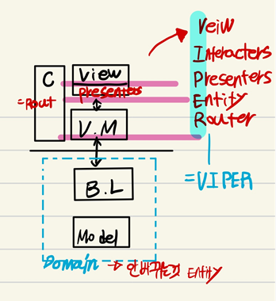
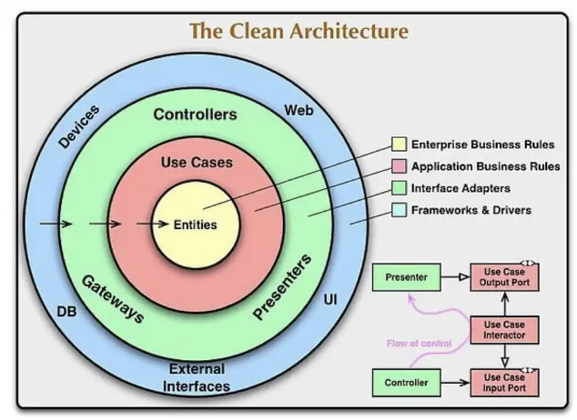
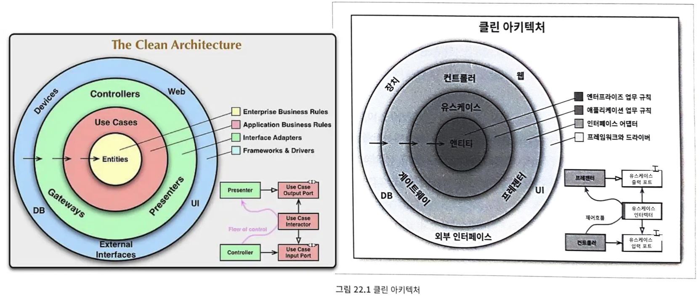
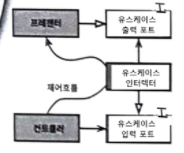
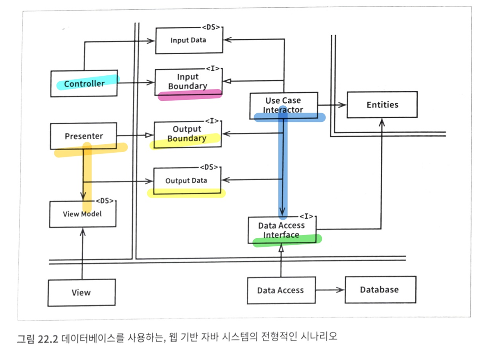
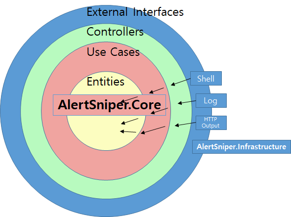

## 2022-10-04-클린아키텍쳐-부분-코드-리뷰

## 목차

>01.클린 아키텍처_자료내용 정리 1
>
>> 01.1 대략적인 개념
>>
>> 01.2 구성도 그려보기
>
>02.클린 아키텍처_자료내용 정리 2
>
>> 02.1 목표점
>>
>> 02.2 아키텍처 특징
>>
>> 02.3 의존성 규칙
>>
>> 02.4 전형적인 시나리오
>>
>> 02.5 결론
>
>03.클린 아키텍처_자료내용 정리 3
>
>>03.1 클린 아키텍처란?
>
>04.코드 분석
>
>05.질문
>
>05.참고자료

## 01.클린 아키텍처_자료내용 정리 1

### 01.1 대략적인 개념

- 도메인 또는 Entity
  - Bussines Logic
  - Model
  - 메뉴가 바뀔 수 있지만, VAT같은 것 회사 사업이 바뀌지 않는 이상 바뀌지 않는 것은 바뀌지 않는 것 같은 걸 도메인이라고함
- View Model
  - 화면에 보여지는 것 처리하는 부분
  - 대개 이를 인터랙터라고 함
- View 
  - 화면에 보여주는 곳
  - 인터랙터하나가 View를 여러개 감당할때
    - 특정 화면 마다 다른 것이 나오는 경우
      - 특정 부분만 가공하는 것을 Presenters

- 코디네이터
  - 이는 라우터라고도 함
  - View들을 네비게이션 하는 부분

### 01.2 구성도 그려보기

- Entity
  - 절대 바뀌지 않는 부분
- 위를 보면 변경 요소 마다 층층이 나눠져 있음
  - 즉, 제한되고 나뉘어짐
  - 그말은 변경이나 추가되는 상황에서도 일부만 바꾸면 되는 것
- 변화에 유연하게 대처하는것이 클린하다고 해서 클린 아키텍쳐라고 함

#### 기본 클린아키텍처 그림

- 핵심은 바깥쪽에 대한것은 바깥쪽에서 처리해야하고 안에 영향을 주면 안된다가 핵심

## 02.클린 아키텍처_자료내용 정리 2

### 02.1 목표점

- 즉, 지향하는 부분
  - 관심사의 분리

- SW를 계층으로 분리함으로써 관심사의 분리라는 목표를 달성할 수 있었음
  - 각 아키텍처는
    - 최소한 업무 규칙을 위한 계층하나와,
    - 사용자와 시스템 인터페이스를 위한 또 다른 계층 하나를 반드시 포함

### 02.2 아키텍처 특징

- **프레임워크 독립성**
  - 아키텍처는 다양한 기능의 라이브러리르 제공하는 SW
  - 즉, 프레임워크의 존재 여부에 의존하지 않음
- **테스트 용이성**
  - 업무규칙은 UI, 데이터베이스, 웹 서버, 또는 여타 외부 요소가 없이도 테스트 가능
- **UI 독립성**
  - 시스템의 나머지 부분을 변경하지 않고도UI를 쉽게 변경할 수 있음
    - 예를 들어, 업무규칙 변경 하지 않고, 웹 UI를 콘솔 UI로 대체 가능
- **데이터 베이스 독립성**
  - 다른 DB로 교체 할 수 있음
  - 업무 규칙은 데이터베이스에 결합되지 않음
- **모든 외부 에이전시에 대한 독립성**
  - 실제로 업무 규칙은 외부 세계와의 인터페이스에 대해 전혀 알지 못함

### 02.3 의존성 규칙

- 각각의 동심원은 SW의 다른 영역 표현
- 안으로 들어갈수록 고수준의 SW가 됨
  - 바깥쪽은 `메커니즘`
  - 안쪽 원은 `정책`
    - 여기서 가장 중요한 규칙은 의존성 규칙임
- 소스코드의 의존성의 경우
  - 반드시 안쪽으로, 고수준의 정책을 향해야 함

#### 포인트

- 내부의 원에 속한 요소는 외부의 원에 속한 어떤 것도 알지 못함이 포인트
  - 특히 내부의 원에 속한 코드는
    - 외부의 원에 선언된 어떤 것도 이름 언급하면 안됨 (함수, 클래스, 변수 그리고 SW 엔티티로 명명되는 그 모든 것)
- 같은 이유에서 외부의 원에 선언된 데이터 형식 내부에서 사용 안됨

#### 엔티티

- 전사적인 핵심 업무 규칙을 캡슐화
  - 메서드를 가지는 객체이거나 일련의 데이터 구조와 함수의 집합일 수 있음
  - 엔티티가 재사용할 수만 있다면, 그 형태는 중요한 것이 아님

#### 유스케이스

- 해당 계층의 SW는 애플리케이션에 특화된 업무 규칙을 포함
- 시스템의 모든 유스케이스를 캡슐화 하고 구현
- 엔티티로 들어오고 나가는 데이터 흐름을 조정하며,
  -  엔티티가 자신의 핵심 업무 규칙을 사용해서 유스케이스의 목적을 달성하도록 이끔
     - 그렇다고 해서 이 계층에서 발생한 변경이 엔티티에 영향 줘서는 안됨
     - 또한, DB, UI 또는 여타 공통프레임워크와 같은 외부 요소에서 발생한 변경이 이 계층에 영향을 줘서도 안됨
- 단, 운영관점에서 애플리케이션이 변경된다면 유스케이스가 영향을 받음

#### 인터페이스 어댑터

- 일련의 어댑터들로 구성
- 데이터를 유스케이스와 엔티티에게 가장 편리한 형식에서 
  - DB나 웹 같은 것에 가장 편리한 형식으로 변환
- GUI나 MVC 아키텍처를 모두 포괄
  - 프레젠터, 뷰, 컨트롤러는 모두 인터페이스 어댑터 계층에 속함

#### 프레임워크와 드라이버

- 가장 바깥쪽 계층의 경우 일반적으로 DB나 웹 프레임워크 같은 프레임 워크나 도구들로 구성
  - 안쪽 원과 통신하기 위한 접합 코드 외에는 작성할 코드가 많지 않음
- 모든 세부사항이 위치하는 곳에 위치
  - 웹이나 DB는 세부사항이다. 이것들을 외부에 위치시켜서 피해를 최소화 하는것

#### 원은 네개여야하나?

- 예시일 뿐 네 개보다 많은 원이 필요할 수도 있음
  - 하지만 중요한 포인트는 어떤 경우에도 의존성규칙은 적용되어야함
  - 소스코드 의존성은 항상 안쪽을 향함
    - 안쪽으로 이동할수록 추상화와 정책의 수준은 높아짐
    - 따라서, 가장 안쪽 원은 가장 범용적이며 높은 수준을 가짐

#### 경계 횡단하기

- 그림의 우측하단 부분

  

  - 원의 경계를 횡단하는 방법을 보여줌
  - 컨트롤러와 프레젠터가 다음 계층에 속한 유스케이스와 통신하는 모습을 확인할 수 있음

- 제어흐름

  - 컨트롤러에서 시작하여 유스케이스를 지난 후, 프레젠터에서 실행되면서 마무리
  - 소스의 의존성은 각 의존성은 유스케이스 안쪽을 가리킴

- 제어흐름과 의존성의 방향이 명백히 반대여야 하는 경우

  - 의존성 역전 원칙을 사용하여 해결하면됨

- 유스케이스가 내부 원의 인터페이스(유스케이스 출력포트)를 호출하도록 하고,

  - 외부원의 프레젠터가 그 인터페이스를 구현하도록 만듦

##### 경계 횡단하는 데이터

- 데이터는 흔히 간단한 데이터 구조로 이루어져 있음
  - 기본적인 구조체나 간단한 데이터 전송 객체등 
  - 또는 함수를 호출할 때 간단한 인자를 사용해서 데이터로 전달할 수 있음
- 중요한 점은
  - 격리되어 있는 간단한 데이터 구조가 경계를 가로질러 전달 된다는 사실
- 예를들어서
  - DB프레임 워크는 쿼리에 대한 응답으로 사용하기 편리한 데이터 포맷 사용
    - 포맷은 행 구조인 경우가 많은데 이 행 구조가 경계를 넘어 내부로 그대로 전달되는 것 원치 않음
    - 이렇게 되면 의존성 규칙을 위배함
      - 내부의 원에서 외부 원의 무언가를 알아야하기 때문
  - 즉, 경계를 가로질러 데이터를 전달시
    - 데이터는 항상 내부의 원에서 사용하기에 가장 편리한 형태를 가져야만 함

### 02.4 전형적인 시나리오

- 웹서버에서 사용자로부터 입력 데이터 모아서 
  - 좌측 상단 Controller로 전달
    - 데이터를 평범한 객체로 묶은 후
  - Input Boundary인터페이스를 통해 UseCase로 전달
  - UseCaseInteractor는 이 데이터를 해석해서 Entities가 어떻게 춤출지 제어하는데 사용
    - 또한 UseCaseInteractor는 Data Access를 사용하여 Entities가 사용할 데이터를 DB에서 불러와서 메모리로 로드
  - Entities가 완성되면, UseCaseInteractor는 Entities로 부터 데이터를 모아서 또다른 평범한 객체인 Output Data 구성
    - 그리고 나서 Output Data는 OutputBoundary 인터페이스를 통해서 Presenter로 전달
  - Presenter가 맡은 역할은 OutputData를 ViewModel가 같이 화면에 출력할 수 있는 형식으로 재구성하는 일
- 중요한 것은 의존성의 방향에 주목하라. 
  - 모든 의존성은 경계선을 안쪽으로 가로지르며, 따라서 의존성 규칙을 준수함

### 02.5 결론

- SW를 계층으로 분리하고 의존성 규칙을 준수한다면 본질적으로 테스트하기 쉬운 시스템을 만들게 될 것이며,
  - 그에 따른 이점을 누릴 수 있음

[참고 책(클린 아키텍처 22장 부분)](yes24.com/Product/Goods/77283734)

## 03.클린 아키텍처_자료내용 정리 3

- 소프트웨어 아키텍처는 선을 긋는 기술이며,
  - 이러한 선을 경계(boundary)라고 부른다.
- 경계는 소프트웨어 요소를 서로 분리하고, 
  - 경계 한편에 있는 요소가 반대편에 있는 요소를 알지 못하도록 막는다.

### 03.1 클린 아키텍처란?

- 어플리케이션 내에 경계를 나눠 여러 부분에 걸쳐 관심사를 분리

- 어플리케이션의 기능, 구성요소 분리, 데이터 관리를 달성할 수 있음

- 변경에 유연하고, 이해하기 쉽고, 재사용성 높은 코드를 작성하는 것이 목표

  - 핵심은 계층별 관심사 분리

- Flutter로 보는 Architecture Diagram

  - Presenter Layer
    - Framework 계층, Controller 계층으로 구성
    - UI관리와 어플리케이션의 구동을 담당하는 계층 
  - Domain Layer
    - Business Logic 포함
    - Data Repository의 abstract class를 선언
      - Use Case: Application의 Business Logic
      - Entity: Application의 핵심 데이터로서 Business Logic을 구현하는데 필요
      - Data Transfer Object: Business Logic을 수행하는데 필요한 정보가 포함 
  - Data Layer
    - Data source와 Data Repository로 구성
    - abstract class의 구현체
    - 단순한 구조일 경우 Data Repository와 Data source를 구분없이 사용할 수 있음

- Clean Architecture의 특징

  - 특정 기능 혹은 특정 대상 변경에 쉽게 대응 가능

    - 구체적 대상보다 추상적 대상에 의존적이라서 구체적인 대사의 변화에 쉽게 대응할 수 있음

      - IDevice = `GetDevice(Type.A)` or `GetDevice(Type.B)`
        -  이렇게 하면 A에서 B를 사용할때 변경만 해주면됨

      | before                                                       | after                                                        |
      | ------------------------------------------------------------ | ------------------------------------------------------------ |
      | TotalPrice = 150 * Quantity; TotalPrice = 150 * Quantity; TotalPrice = 150 * Quantity; TotalPrice = 150 * Quantity; | double Get_TotalPrice(int Quantity){  return 150 * Quantity }  TotalPrice = Get_TotalPrice(Quantity) |

      - 150을 160으로 변화할때 before의 경우 그것의 수만큼 변경해야함
      - 하지만 after같이 해놓으면 한개만 수정해도 여러개를 수정하는 것과 같음 DRY를 원칙을 지키는 것

  - 코드의 이해 및 버그의 수정이 용이

    - SRP(Single Responsibility Principle)을 따르기 때문에 기능별 혹은 관심사 별로 구분이 잘 되어 있어서 
    - ISP(Interface Segregation Principle)을 따르고,
      - Encapsulation이 잘되어 있어 특정기능이 딱 필요한 정보만 입력받기 때문에
      - 해당 기능을 이해하기 용이
    - LSP(Liskov Substitution Principle)을 따르기 떄문에 코드의 구현방식이 일상생활의 언어와 동일한 로직으로 구현되어 있어서
      - 코드만 읽어도 기능이 쉽게 예측 가능

  - 기능 확장 시 버그 발생율이 낮다.

    - OCP(Open Closed Principle)을 따라 기존의 모듈을 수정하기 보다는 확장하는 방식을 통해 기능을 추가하기 때문에
      - 버그 발생률을 최소화 

## 04.코드 분석

- 폴더 및 프로젝트 구성

  - **AlertSniper** -> Swagger 실행하는 부분 - Web Api

    - Program.cs

  - **AlertSniper.Core**
    - /DomainServices

      - /Http
        - ISendMessageService.cs
      - /RemoteShell
        - IRemoteProcessKillService.cs
        - RemoteShellResult.cs

    - /UseCase

      - /RemoteServiceMangment
        - ProcessKillMessage.cs
        - RemoteProcessManagmentActor.cs

      - ActorPath.cs

  - **AlertSniper.Infrastructure**

    - /Http
      - /Messages
        - AlertHost.cs
        - AlertOperation.cs
        - AlertResult.cs
        - AlertSniper.cs
        - BeginMessage.cs
        - EndMessage.cs
      - FakeSendMessageService.cs
      - OperationName.cs
      - OperationResultType.cs
      - SendMessageToLogstashService.cs
      - /RemoteShell
        - RemoteProcessKillWinRmService.cs
      - /Xml
        - AlertSniperMessageExtrator.cs
        - AlertSniperRootNode.cs
        - Host.cs
        - Process.cs
      - DependencyInjection.cs

  - **AlertSniper.SharedKernel**
    - ActorMetaData.cs
    - Enumeration.cs
    - ErrorCode.cs

- 구현체 직접 호출하지 않고, 코어에 인터페이스 정의되어 있음

## 05.질문

1. 이전에 MVVM 패턴을 적용할때 Model, Veiw, View Model로 폴더 구조를 나눈적이 있었습니다. 그때 비지니스적이 않다고, 기능적으로 나누면 안된다고 했었습니다. 현재 AlertSniper 폴더 구조를 보면 각각이 프로젝트 별로 나누어져 있지만, Core안에 UseCases,Domain Services이 있고, Infrastructure,  SharedKernel로 구분되어 있는데 이것도 이전에 기능적으로 나눈것과 비슷한것이 아닌지? 궁금합니다.
2. AlertSniper.SharedKernel부분이 공동으로 쓰이는 데이터를 넣은것 같은데 위의 부분은 클린아키텍처에서 어디 부분에 가까운지?
3. Http과 RemoteShell의 경우 Core부분에 인터페이스들이 존재하는데 Xml의 경우 존재하지 않는 이유가 따로 있는지? 그렇게 되면 xml이 아닌 json으로 바뀌는 경우 문제가 되는 부분이 없는지?
4. DependencyInjection.cs의 경우 static으로 되어 있는데 static으로 한 이유가 있는지?

## 05.참고자료

[Clean Architecture를 왜 배워야 하는가 [코드 유지보수 방법론 ep.03]](https://youtube.com/watch?v=Ygd_po_hVhA&feature=share)

[[Flutter Festival GDG Songdo] Flutter에 Clean Architecture를 얹어보자 - 양수장](https://youtube.com/watch?v=3umGteY3rdU&feature=share)

[Clean Architecture 에 대해서 알아봅시다.](https://youtube.com/watch?v=jVyA5DV6r8w&feature=share)

