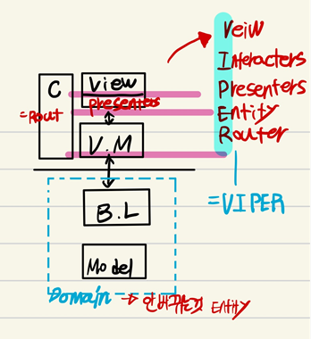

## 2022-10-04-클린아키텍쳐-부분-코드-리뷰

## 목차

## 01.클린 아키텍쳐 개요

### 01.1 대략적인 개념

- 도메인 또는 Entity
  - Bussines Logic
  - Model
  - 메뉴가 바뀔 수 있지만, VAT같은 것 회사 사업이 바뀌지 않는 이상 바뀌지 않는 것은 바뀌지 않는 것 같은 걸 도메인이라고함
- View Model
  - 화면에 보여지는 것 처리하는 부분
  - 대개 이를 인터랙터라고 함
- View 
  - 화면에 보여주는 곳
  - 인터랙터하나가 View를 여러개 감당할때
    - 특정 화면 마다 다른 것이 나오는 경우
      - 특정 부분만 가공하는 것을 Presenters

- 코디네이터
  - 이는 라우터라고도 함
  - View들을 네비게이션 하는 부분

### 01.2 구성도 그려보기

- Entity
  - 절대 바뀌지 않는 부분
- 위를 보면 변경 요소 마다 층층이 나눠져 있음
  - 즉, 제한되고 나뉘어짐
  - 그말은 변경이나 추가되는 상황에서도 일부만 바꾸면 되는 것
- 변화에 유연하게 대처하는것이 클린하다고 해서 클린 아키텍쳐라고 함

#### 기본 클린아키텍쳐 그림

- 핵심은 바깥쪽에 대한것은 바깥쪽에서 처리해야하고 안에 영향을 주면 안된다가 핵심