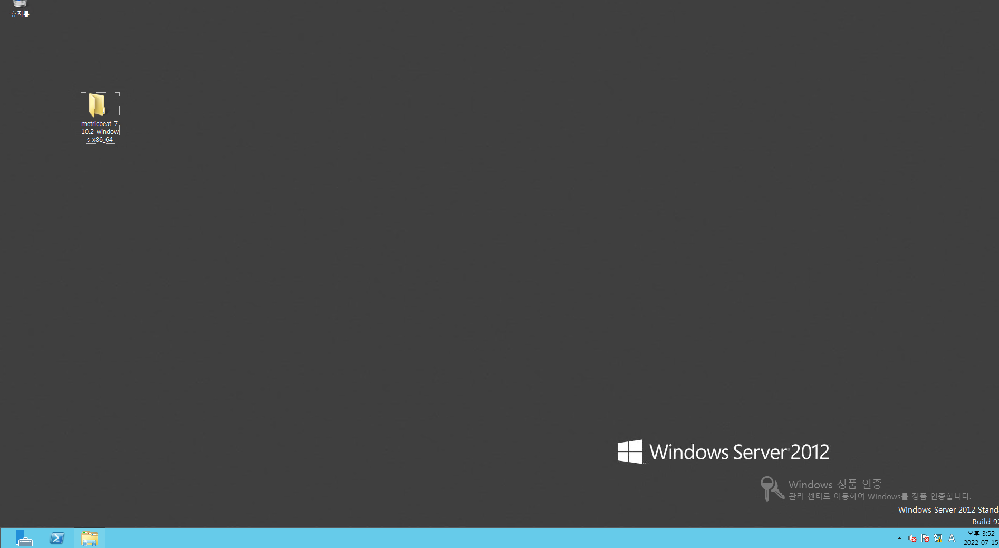
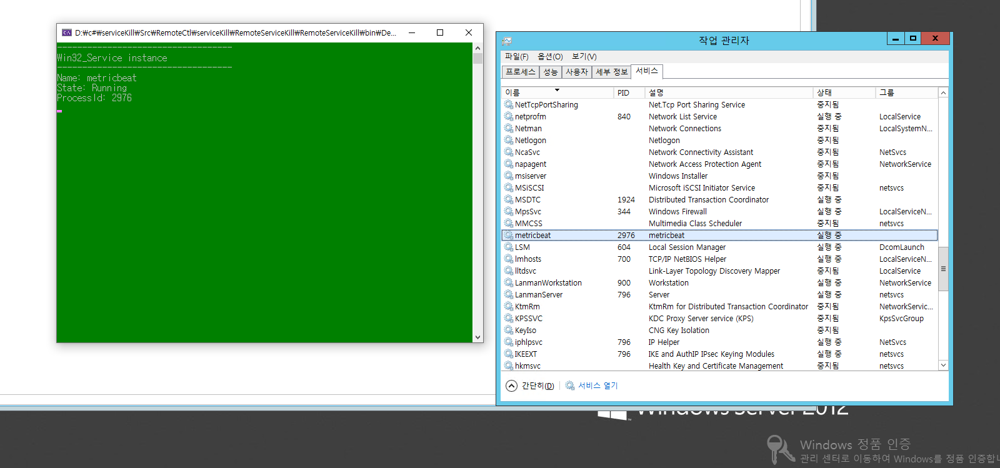

## 2022-07-15-원격지 프로세스와 서비스 종료 개발

## 목차

>01.프로세스 킬 프로그램
>
>02.서비스 킬 프로그램
>
>>02.1 서비스 조회하기
>>
>>02.2 서비스 Process ID 조회
>>
>>02.3 서비스 종료 시키기
>
>03.참고자료		

## 01.프로세스 킬 프로그램

```csharp
using System;
using System.Text;
using System.Threading;
using System.Management;
using System.Security;

namespace RemoteProgramKill
{
    class Program
    {
        static void Main(string[] args)
        {

            string computer;
            string domain = "";
            string username = "Administrator";
            string password;

            Console.WriteLine("Enter PC IP Address:");
            computer = Console.ReadLine();
            Console.Clear();

            Console.WriteLine("Enter Password:");
            password = Console.ReadLine();
            Console.Clear();

            try
            {
                ConnectionOptions connection = new ConnectionOptions();
                connection.Username = username;
                connection.Password = password;
                connection.Authority = "ntlmdomain:" + domain;

                ManagementScope scope = new ManagementScope("\\\\" + computer + "\\root\\cimv2", connection);
                scope.Connect();

                //ObjectQuery query = new ObjectQuery(
                //    "Select * from Win32_Process");
                ObjectQuery query = new ObjectQuery("select * from Win32_Process where Name = '" + "notepad" + ".exe'");
                ManagementObjectSearcher searcher =
                    new ManagementObjectSearcher(scope, query);

                // Get object
                ManagementObjectCollection objCollection = searcher.Get();
                foreach (ManagementObject obj in objCollection)
                {
                    obj.InvokeMethod("Terminate", null);
                }
            }
            catch (Exception ex)
            {
                Console.WriteLine(ex.ToString());
            }
        }

    }
}
```

- 프로그램 시작 전

  

- 프로그램 시작 후

  

## 02.서비스 킬 프로그램

- 이전 로컬의 경우

  ```csharp
  public static void StopService(string serviceName, int timeoutMilliseconds)
  { 
      ServiceController service = new ServiceController(serviceName); 
      try { TimeSpan timeout = TimeSpan.FromMilliseconds(timeoutMilliseconds);
           service.Stop(); service.WaitForStatus(ServiceControllerStatus.Stopped, timeout); 
          } catch { }
  }
  ```

- 원격지 경우

### 02.1 서비스 조회하기

```csharp
using System;
using System.Text;
using System.Threading;
using System.Management;
using System.Security;

namespace WMITest
{
    class Program
    {
        static void Main(string[] args)
        {
            string computer;
            string domain = "";
            string username = "Administrator";
            string password;

            Console.WriteLine("Enter PC IP Address:");
            computer = Console.ReadLine();
            Console.Clear();

            Console.WriteLine("Enter Password:");
            password = Console.ReadLine();
            Console.Clear();

            try
            {
                ConnectionOptions connection = new ConnectionOptions();
                connection.Username = username;
                connection.Password = password;
                connection.Authority = "ntlmdomain:" + domain;

                ManagementScope scope = new ManagementScope(
                    "\\\\" + computer + "\\root\\cimv2", connection);
                scope.Connect();

                ObjectQuery query = new ObjectQuery(
                    "Select * from Win32_Service where Name = 'metricbeat'");

                ManagementObjectSearcher searcher =
                    new ManagementObjectSearcher(scope, query);

                foreach (ManagementObject queryObj in searcher.Get())
                {
                    Console.WriteLine("-----------------------------------");
                    Console.WriteLine("Win32_Service instance");
                    Console.WriteLine("-----------------------------------");
                    Console.WriteLine("Name: {0}", queryObj["Name"]);
                }
                Console.ReadLine();
            }
            catch (ManagementException err)
            {
                Console.WriteLine("An error occurred while querying for WMI data: " + err.Message);
            }
            catch (System.UnauthorizedAccessException unauthorizedErr)
            {
                Console.WriteLine("Connection error (user name or password might be incorrect): " + unauthorizedErr.Message);
            }
        }

    }
}
```

### 02.2 서비스 Process ID 조회

```csharp
using System;
using System.Text;
using System.Threading;
using System.Management;
using System.Security;

namespace WMITest
{
    class Program
    {
        static void Main(string[] args)
        {

            string computer;
            string domain = "";
            string username = "Administrator";
            string password;

            Console.WriteLine("Enter PC IP Address:");
            computer = Console.ReadLine();
            Console.Clear();

            Console.WriteLine("Enter Password:");
            password = Console.ReadLine();
            Console.Clear();

            try
            {
                ConnectionOptions connection = new ConnectionOptions();
                connection.Username = username;
                connection.Password = password;
                connection.Authority = "ntlmdomain:" + domain;

                ManagementScope scope = new ManagementScope(
                    "\\\\" + computer + "\\root\\cimv2", connection);
                scope.Connect();

                ObjectQuery query = new ObjectQuery(
                    "Select * from Win32_Service where Name = 'metricbeat'");

                ManagementObjectSearcher searcher =
                    new ManagementObjectSearcher(scope, query);

                foreach (ManagementObject queryObj in searcher.Get())
                {
                    Console.WriteLine("-----------------------------------");
                    Console.WriteLine("Win32_Service instance");
                    Console.WriteLine("-----------------------------------");
                    Console.WriteLine("Name: {0}", queryObj["Name"]);
                    Console.WriteLine("State: {0}", queryObj["State"]);
                    Console.WriteLine("ProcessId: {0}", queryObj["ProcessId"]);
                }
                Console.ReadLine();
            }
            catch (ManagementException err)
            {
                Console.WriteLine("An error occurred while querying for WMI data: " + err.Message);
            }
            catch (System.UnauthorizedAccessException unauthorizedErr)
            {
                Console.WriteLine("Connection error (user name or password might be incorrect): " + unauthorizedErr.Message);
            }
        }

    }
}
```

```csharp
[Dynamic, Provider("CIMWin32"), SupportsUpdate, UUID("{8502C4D9-5FBB-11D2-AAC1-006008C78BC7}"), DisplayName("Services"), AMENDMENT]
class Win32_Service : Win32_BaseService
{
  boolean  AcceptPause;
  boolean  AcceptStop;
  string   Caption;
  uint32   CheckPoint;
  string   CreationClassName;
  boolean  DelayedAutoStart;
  string   Description;
  boolean  DesktopInteract;
  string   DisplayName;
  string   ErrorControl;
  uint32   ExitCode;
  datetime InstallDate;
  string   Name;
  string   PathName;
  uint32   ProcessId;
  uint32   ServiceSpecificExitCode;
  string   ServiceType;
  boolean  Started;
  string   StartMode;
  string   StartName;
  string   State;
  string   Status;
  string   SystemCreationClassName;
  string   SystemName;
  uint32   TagId;
  uint32   WaitHint;
};
```

```csharp
Console.WriteLine("Name: {0}", queryObj["Name"]);
Console.WriteLine("State: {0}", queryObj["State"]);
Console.WriteLine("ProcessId: {0}", queryObj["ProcessId"]);
```

- 이부분에 대해서 원하는 부분을 선택해서 볼 수 있음
  - 위의 경우 Name, State, ProcessId를 확인하기 위해 지정
  - 아래 그림을 보면 알듯이 원격지의 metricbeat의 PID와 일치함을 알 수 있음



### 02.3 서비스 종료 시키기

```csharp
using System;
using System.Text;
using System.Threading;
using System.Management;
using System.Security;

namespace WMITest
{
    class Program
    {
        static void Main(string[] args)
        {

            string computer;
            string domain = "";
            string username = "Administrator";
            string password;

            Console.WriteLine("Enter PC IP Address:");
            computer = Console.ReadLine();
            Console.Clear();

            Console.WriteLine("Enter Password:");
            password = Console.ReadLine();
            Console.Clear();

            try
            {
                ConnectionOptions connection = new ConnectionOptions();
                connection.Username = username;
                connection.Password = password;
                connection.Authority = "ntlmdomain:" + domain;

                ManagementScope scope = new ManagementScope(
                    "\\\\" + computer + "\\root\\cimv2", connection);
                scope.Connect();

                ObjectQuery query = new ObjectQuery(
                    "Select * from Win32_Service where Name = 'metricbeat'");

                ManagementObjectSearcher searcher =
                    new ManagementObjectSearcher(scope, query);

                // Get object
                ManagementObjectCollection objCollection = searcher.Get();
                foreach (ManagementObject obj in objCollection)
                {
                    obj.InvokeMethod("StopService", null);
                }
            }
            catch (Exception ex)
            {
                Console.WriteLine(ex.ToString());
            }
        }
    }
}
```

| 방법                                                         | Description                                                  |
| :----------------------------------------------------------- | :----------------------------------------------------------- |
| [**Update**](https://docs.microsoft.com/ko-kr/windows/win32/cimwin32prov/change-method-in-class-win32-service) | 서비스를 수정합니다.                                         |
| [**ChangeStartMode**](https://docs.microsoft.com/ko-kr/windows/win32/cimwin32prov/changestartmode-method-in-class-win32-service) | 서비스의 시작 모드를 수정합니다.                             |
| [**Create**](https://docs.microsoft.com/ko-kr/windows/win32/cimwin32prov/create-method-in-class-win32-service) | 새 서비스를 만듭니다.                                        |
| [**Delete**](https://docs.microsoft.com/ko-kr/windows/win32/cimwin32prov/delete-method-in-class-win32-service) | 기존 서비스를 삭제합니다.                                    |
| [**GetSecurityDescriptor**](https://docs.microsoft.com/ko-kr/windows/win32/cimwin32prov/getsecuritydescriptor-method-in-class-win32-service) | 서비스에 대한 액세스를 제어하는 보안 설명자를 반환합니다.    |
| [**InterrogateService**](https://docs.microsoft.com/ko-kr/windows/win32/cimwin32prov/interrogateservice-method-in-class-win32-service) | 서비스가 서비스 관리자에게 상태를 업데이트하도록 요청합니다. |
| [**PauseService**](https://docs.microsoft.com/ko-kr/windows/win32/cimwin32prov/pauseservice-method-in-class-win32-service) | 일시 중지된 상태로 서비스를 배치하려고 시도합니다.           |
| [**ResumeService**](https://docs.microsoft.com/ko-kr/windows/win32/cimwin32prov/resumeservice-method-in-class-win32-service) | 서비스를 다시 시작된 상태로 배치하려고 시도합니다.           |
| [**SetSecurityDescriptor**](https://docs.microsoft.com/ko-kr/windows/win32/cimwin32prov/setsecuritydescriptor-method-in-class-win32-service) | 서비스에 대한 액세스를 제어하는 업데이트된 버전의 보안 설명자를 씁니다. |
| [**StartService**](https://docs.microsoft.com/ko-kr/windows/win32/cimwin32prov/startservice-method-in-class-win32-service) | 서비스를 시작 상태로 전환하려고 시도합니다.                  |
| [**StopService**](https://docs.microsoft.com/ko-kr/windows/win32/cimwin32prov/stopservice-method-in-class-win32-service) | 서비스를 중지된 상태로 배치합니다.                           |
| [**UserControlService**](https://docs.microsoft.com/ko-kr/windows/win32/cimwin32prov/usercontrolservice-method-in-class-win32-service) | 사용자 정의 제어 코드를 서비스에 보내려고 시도합니다.        |

- InvokeMethod에 대한 메소드 명령이라고 생각하면됨 현재는 정지시켜야하므로 StopService로 원격지 서비스를 종료하는 식으로 구현됨

## 03.참고자료		

- [Win32_Service 클래스 참고](https://docs.microsoft.com/ko-kr/windows/win32/cimwin32prov/win32-service)
- [WMI Query Language (WQL) – Data Queries: SELECT, FROM, and WHERE](https://ravichaganti.com/blog/wmi-query-language-wql-data-queries-select-from-and-where/)

