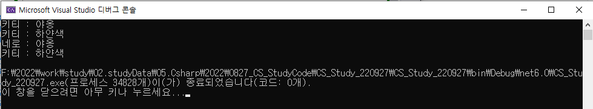

## 2022-08-27-클래스-복습

## 목차

>01.클래스 기본 생성
>
>02.정적필드와 메소드
>
>>  02.1 깊은 복사
>
>03.this()생성자
>
>04.상속으로 코드 재활용
>
>>  04.1 기반클래스와 파생클래스 사이의 형식 변환
>
>>  04.2 is와 as 연산자
>
>05.오버라이딩과 다형성
>
>>  05.1 메소드 숨기기 [x]
>
>>  05.2 메소드 봉인 [x]
>
>06.확장 메소드

## 01.클래스 기본 생성

```cs
//cat
using System;
using System.Collections.Generic;
using System.Linq;
using System.Text;
using System.Threading.Tasks;

namespace CS_Study_220927
{
    public class Cat
    {
        public string Name;
        public string Color;

        public void Meow()
        {
            Console.WriteLine("{0} : 야옹", Name);
        }
    }
}
// program
using CS_Study_220927;

namespace main;
class Program
{ 
    public static void Main(string[] args)
    {
        Cat kitty = new Cat();
        kitty.Color = "하얀색";
        kitty.Name = "키티";
        kitty.Meow();
        Console.WriteLine("{0} : {1}", kitty.Name, kitty.Color);

        Cat nero = new Cat();
        nero.Color = "검은색";
        nero.Name = "네로";
        nero.Meow();
        Console.WriteLine("{0} : {1}", kitty.Name, kitty.Color);
    }
}
```

- 결과

  

  - 생성자를 생성해보고 클래스를 간단히 불러와서 사용하는법

## 02.정적필드와 메소드

```cs
// Program
using CS_Study_220927;

namespace main;
class Program
{ 
    class MyClass
    {
        public int a;
        public int b;
    }

    class MyClass2
    {
        public static int a;
        public static int b;   
    }

    public static void Main(string[] args)
    {

        MyClass obj1 = new MyClass();
        obj1.a = 1; 
        obj1.b = 2;

        MyClass2.a = 1;
        MyClass2.b = 2;

        MyClass source = new MyClass();
        source.a = 10; 
        source.b = 20;

        MyClass target = source;
        source.b = 30;

        Console.WriteLine("{0} {1}", source.a, source.b);
        Console.WriteLine("{0} {1}", target.a, target.b);
    }
}
```

- static으로 쓰는 경우와 아닌경우의 차이와

  - 참조되는 경우 얇은 복사인 경우를 예시로 하는 소스

  

### 02.1 깊은 복사

- target이 힙에 보관되어 있는 내용을 source로 부터 복사해서 받아 별도의 힙 공간에 보관하는 방법

  

  ```cs
  //MyClass
  using System;
  using System.Collections.Generic;
  using System.Linq;
  using System.Text;
  using System.Threading.Tasks;
  
  namespace CS_Study_220927;
      class MyClass
      {
          public int MyField1;
          public int MyField2;
  
          //객체를 힙에 할당해서 그곳에 자신의 멤버를 일일이 복사해서 넣음
          public MyClass DeepCopy()
          {
              MyClass newCopy = new MyClass();
              newCopy.MyField1 = MyField1;
              newCopy.MyField2 = MyField2;
              return newCopy;
          }
      }
  
  //Program
  using CS_Study_220927;
  
  namespace CS_Study_220927;
  class Program
  { 
      public static void Main(string[] args)
      {
          MyClass source = new MyClass();
          source.MyField1 = 10;
          source.MyField2 = 20;  
  
          MyClass target = source.DeepCopy();
          target.MyField2 = 30;
  
          Console.WriteLine($"{source.MyField1} {source.MyField2}");
          Console.WriteLine($"{target.MyField1} {target.MyField2}");
      }
  }
  ```

## 03.this()생성자

```cs
using System;
using System.Collections.Generic;
using System.Linq;
using System.Text;
using System.Threading.Tasks;

namespace main4;
class MyClass
{
    int a, b, c;

    public MyClass()
    {
        this.a = 5425;
    }

    public MyClass(int b)
    {
        this.a = 5425;
        this.b = b;
    }
    public MyClass(int b, int c)
    {
        this.a = 5425;
        this.b = b;
        this.c = c;
    }

}

class MyClass1
{
    int a, b, c;

    public MyClass1()
    {
        this.a = 5425;
    }

    public MyClass1(int b): this()
    {
        this.b = b;
    }
    public MyClass1(int b, int c) : this()
    {
        this.c = c;
    }

}
```

- 일일이 생성자를 또 선언할 필요 없이 this()를 이용하면 됨

## 04.상속으로 코드 재활용

```cs
using System;
using System.Collections.Generic;
using System.Linq;
using System.Text;
using System.Threading.Tasks;

namespace main4
{
    class Base
    {
        protected string Name;
        public Base(string Name)
        {
            this.Name = Name;
        }
    }

    class Derived : Base
    { 
        public Derived (string Name) : base(Name)
        {
            Console.WriteLine("{this.Name}.Derived()");
        }
    }

}
```

- this() 와 동일한 기능
  - base()라고 쓰고 매개변수 넘겨서 호출하면 우리가 원했던 것처럼 Name필드 초기화 할 수 있음

### 04.1 기반클래스와 파생클래스 사이의 형식 변환

```cs
namespace main6;
class Program
{
    public static void Main(string[] args)
    {
        //기본적 코드
        Mammal mammal = new Mammal();
        mammal.Nurse();

        Dog dog = new Dog();
        dog.Nurse();   
        dog.Bark();

        Cat cat = new Cat();    
        cat.Nurse();
        cat.Meow();

        //좀더 개선된 코드
        Mammal mammal1 = new Mammal();
        mammal1.Nurse();

        mammal1 = new Dog();
        mammal1.Nurse();

        Dog dog1 = (Dog)mammal1;
        dog1.Nurse();
        dog1.Bark();

        mammal1 = new Cat();
        mammal1.Nurse();

        Cat cat1 = (Cat)mammal1;
        cat1.Nurse();
        cat1.Meow();

    }
}
```

- 위처럼 하면 코드의 생산성이 높아짐

  - 개선 전

    ```cs
    class ZooKeeper
    {
        public void Wash(Dog dog){}
        public void Wash(Cat cat){}
        public void Wash(Lion lion){}
        ...//300개인 경우 300개 써야함
    }
    ```

  - 개선 후 

    ```cs
    class ZooKeeper
    {
        public void Wash(Mammal mammal){}
    }//위에처럼 한개만 씀
    ```

### 04.2 is와 as 연산자

- is
  - 객체가 맞는지 여부 판별
- as
  - 형식 형변환 역할
    - 중요 포인트
      - `다른 형식 변환 연산자가 반환에 실패시 예외를 던지는데`
      - `as의 경우 객체 참조를 null로 만드는것이 다름`

- 예시

  ```cs
  // is, as 연산자
  Mammal mammal2 = new Dog();
  Dog dog2;
  if (mammal2 is Dog)
  {
      dog2 = (Dog) mammal2;
      dog2.Bark();
  }
  
  Mammal mammal3 = new Cat();
  Cat cat2 = mammal3 as Cat;
  if(cat2 != null)
  {
      cat2.Meow();
  }
  ```

## 05.오버라이딩과 다형성

```cs
//ArmorSuite
using System;
using System.Collections.Generic;
using System.Linq;
using System.Text;
using System.Threading.Tasks;

namespace main7
{
    public class ArmorSuite
    {
        public virtual void Initialize() 
        {
            Console.WriteLine("Armored");
        }
    }

    public class IronMan : ArmorSuite
    {
        public override void Initialize()
        {
            base.Initialize();
            Console.WriteLine("Repulsor Rays Armed");
        }
    }

    public class WarMachine : ArmorSuite 
    {
        public override void Initialize()
        {
            base.Initialize();
            Console.WriteLine("Double-Barrel Cannons Armed");
            Console.WriteLine("Micro-Rocket Launcher Armed");
        }
    }
}

//Program

namespace main7;
class Program
{
    public static void Main(string[] args)
    {
        ArmorSuite armorSuite = new ArmorSuite();
        armorSuite.Initialize();

        Console.WriteLine();
        armorSuite = new IronMan();
        armorSuite.Initialize();

        Console.WriteLine();
        armorSuite = new WarMachine();
        armorSuite.Initialize();

    }
}
```

- 다형성은 객체가 여러 형태를 가질 수 있음
  - 즉, 자신으로 부터 상속 받아 만들어진 파생 클래스를 통해 다형성 실현 한다는것

### 05.1 메소드 숨기기 [x]

```cs
// Base
using System;
using System.Collections.Generic;
using System.Linq;
using System.Text;
using System.Threading.Tasks;

namespace main8
{
    public class Base
    {
        public virtual void MyMethod() 
        {
            Console.WriteLine("Base.MyMethod()");
        }
    }

    public class Derived : Base
    {
        public new void MyMethod()
        {
            Console.WriteLine("Derived.MyMethod()");
        }
    }
}

//Program

namespace main8;
class Program
{
    public static void Main(string[] args)
    {
        Base base1 = new Derived();
        base1.MyMethod();
    }
}
```

### 05.2 메소드 봉인 [x]

```cs
//Base
using System;
using System.Collections.Generic;
using System.Linq;
using System.Text;
using System.Threading.Tasks;

namespace main8
{
    public class Base
    {
        public virtual void MyMethod() 
        {
            Console.WriteLine("Base.MyMethod()");
        }
    }

    public class Derived : Base
    {
        public sealed override void MyMethod()
        {
            Console.WriteLine("Derived.MyMethod()");
        }
    }
}

//Program

namespace main8;
class Program
{
    public static void Main(string[] args)
    {
        Base base1 = new Derived();
        base1.MyMethod();
    }
}
```

## 06.확장 메소드

- 기존 클래스 기능을 확장하는 기법

```cs
namespace main9;
public static class IntegerExtension
{
    public static int Power(this int myInt, int exponent)
    {
        int result = myInt;
        for (int i = 1; i < exponent; i++)
            result = result * myInt;

        return result;
    }

    public static int TwoPower(this string myInt, int exponent)
    {
        int result = 2;
        for (int i = 1; i < exponent; i++)
            result = result * 2;

        return result;
    }
}
class Program
{
    public static void Main(string[] args)
    {
        //정수형 기능 추가
        int a = 2;
        Console.WriteLine(a.Power(3));
        Console.WriteLine(10.Power(4));

        //문자열 기능 추가
        Console.WriteLine("dd".TwoPower(3));
    }
}
```

