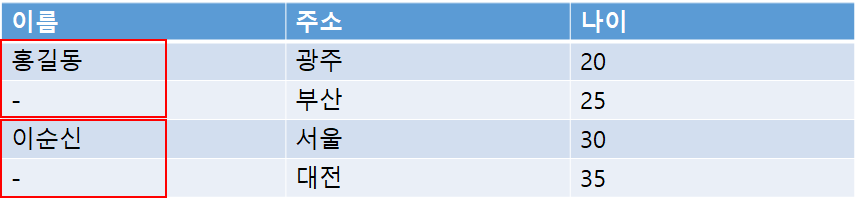

## 2022-07-06-grafana-table-merge

## 목차

>01.table merge 적용
>
>>01.1 merge부분 조사 결과
>>>
>>01.2 ROW_NUMBER() OVER() 적용
>

## 01. table merge 적용

### 01.1 merge부분 조사 결과

- merge에 대한 기능을 다른 사용자 역시 찾았지만 그라파나 자체에서 지원하는 기능은 없음

- 해결책

  - 우선 각 열데이터를 partiion by를 이용하여 각 분류를 1부터 뒤에 숫자를 부여

    - 예시

    

    - 결과적으로 아래와 같이 표현

      

### 01.2 ROW_NUMBER() OVER() 적용

- 각 위에서는 이름별로 적용 한다면

  ```sql
   ROW_NUMBER() OVER(partition by 이름)
  ```

  - 위 와같이 적용하면 1 ~ N개까지 적용이됨

- 실제 적용

  - before

    

  - after

  - regex로 1인것만 찾기

  

  - 위와 같이 하면 1인것만 찾는다고 해도 저렇게 11, 101도 포함됨

- regex로 1이아닌것만 찾기

  

  - 경민 1만 블록지정 안되어있어야하는데
    - 경민11, 경민101까지 블록지정이 안됨

- 경민1만 적용하기 위한 해결책

  - `경민_1`로 만들어 `경민_1`만 찾기

    

          

  - 이름_1만 제외하고 나머지 .으로 변경

  ```sql
   REGEXP_REPLACE(담당자 ||'_'|| ROW_NUMBER() OVER(partition by 담당자),'^((?!(.*_1$)).)*$', '.')as 담당자
  ```

  - 이름_1 -> 이름으로 변경

    ```sql
    REGEXP_REPLACE(REGEXP_REPLACE(담당자 ||'_'|| ROW_NUMBER() OVER(partition by 담당자),'^((?!(.*_1$)).)*$', '.'),'(.*_1$)',담당자)as 담당자
    ```

    