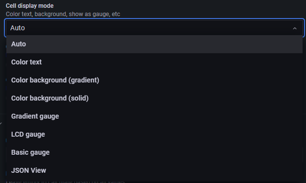

## 2022-07-08-grafana-postgreSQL-교육-Table

## 목차

>01.쿼리를 이용한 Table 생성하기
>
>>01.1 Table 옵션 지정하기
>>>
>>> 각 범위 별 색상 지정
>>>>>
>>> 링크 걸어서 연결하는 테이블
>
>02.실제 구현된 대시보드 확인해보기
>
>03.개인대시보드에 테이블 적용해보기

## 01.쿼리를 이용한 Table 생성하기

```sql
create table table_notime (
	url text,
	name text,
	people int
)

insert into table_notime values
('https://www.naver.com','네이버',1999),
('https://www.kakaocorp.com/page/','카카오',12000);

create table table_time (
    dates timestamp,
	url text,
	name text,
	people int
)

insert into table_time values
('2022-08-14','https://www.naver.com','네이버',1999),
('2022-08-15','https://www.kakaocorp.com/page/','카카오',12000);
```

### 01.1 Table 옵션 지정하기

- Cell display mode

  

  - Color text의 경우 텍스트에 컬러가 지정됨

    

  - Color background의 경우 전체 바탕에 색을 지정

    - gradient

      

    - solid

      

  - Gradient gauge 그라디언트 색상이 적용되는 게이지가 나옴

    

  - LCD gauage LCD모양의 게이지가 나옴

    

  - Basic gauge 기본 게이지가 나옴

    

- data links

  - 이부분 하려면 url 담긴 table 생성 필요함
  - ${__data.fields[0]}

- Value mappings
  - 각 원하는 부분에 색지정하거나

- Thresholds이용해서 색지정하는것 까지 해보기

#### 각 범위 별 색상 지정


- 위와 같이 가능하다	

  

#### 링크 걸어서 연결하는 테이블


- 위와 같이 해당 링크를 name에 연결시켜서 서핑이라는 단어를 누르면 링크가 열리는 형식으로 구현할 것


- Add link 클릭


- 클릭시 테이블에서 링크로 연결이 된다.

- 그리고 필요 없는 부분인 url를 숨겨준다.

  

- 그렇게 되면 아래와 같은 결과를 가진 테이블을 생성 할 수 있음

  

## 02.실제 구현된 대시보드 확인해보기

- 프로젝트 운영 대시보드
  - 마일스톤 요약
  - 마일스톤 (기간 있는 경우 , 없는 경우)

- 리소스 대시보드
  - Home
  - PM별 리소스
  - 팀별 리소스
  - 프로젝트코드 월별 리소스
  - 프로젝트코드 리소스
  - 영업담당자별 리소스

## 03.개인대시보드에 테이블 적용해보기


- 위의 대시보드 cell 색상 지정 과 두개의 테이블을 한 화면에서 전환해서 볼 수 있음


- 운동 관련된 영상을 데이터 링크를 걸어서 연결해놓은 테이블
