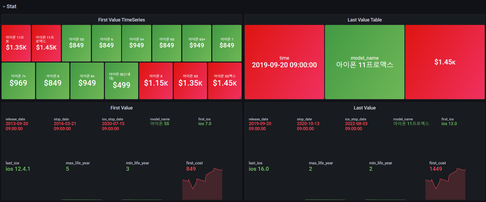
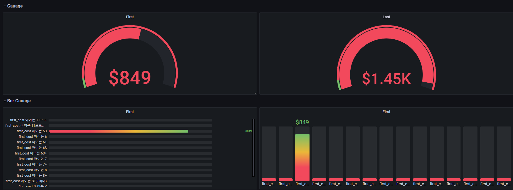
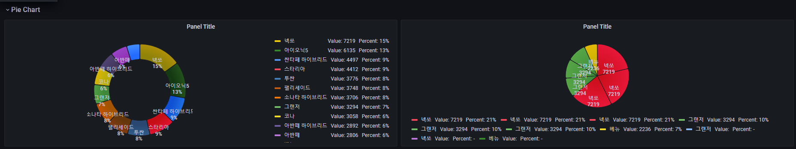
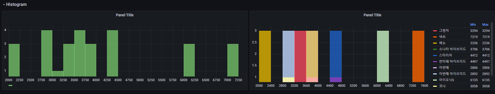
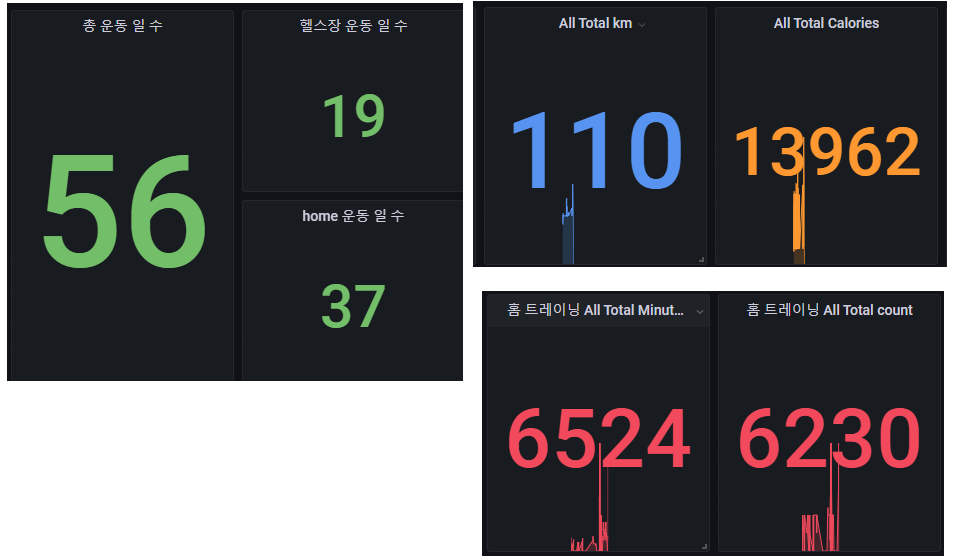
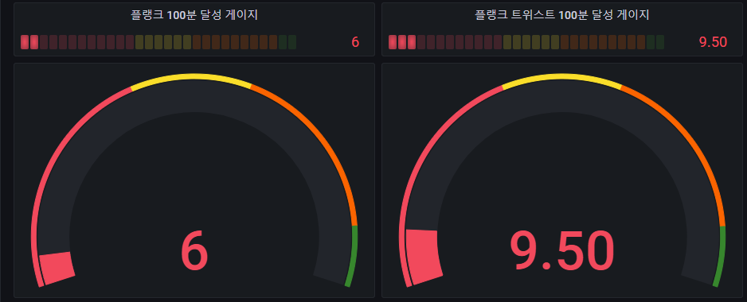
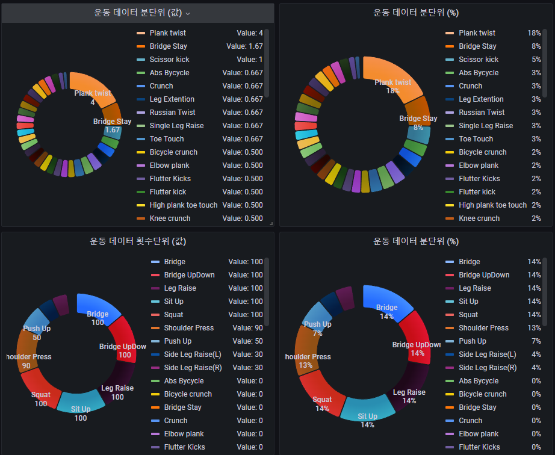
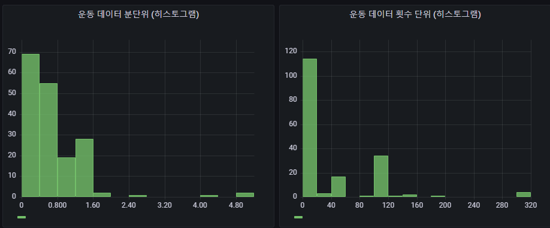

## 2022-08-04-grafana-postgreSQL-교육-Etc-Graph

## 목차

>01.그래프 설명 | 쓰임새
>
>>01.1 Stat
>>
>>01.2 Gauage
>>
>>> 일반 Gauage
>>>
>>> 바 Gauage
>>
>>01.3 Pie Chart
>>
>>01.4 Histogram
>
>02.개인대시보드 적용

## 01.그래프 설명 | 쓰임새

### 01.1 Stat

- **설명**

  - 그래프 자체가 First, Last, Min, Max, Avg 등을 표현할 수 있음
    - 선그래프와 값이 표현되는 점이 있어서 한눈에 지금까지 그래프의 모습을 파악할 수 있음

  - Background Color를 지정할 수 있어서 다른 그래프의 선의 색깔과 맞추어 범례로써의 역할로 사용할 수 있음
    - 현재 last값이 매번 바뀌는 경우라면 그 값별로 색깔을 지정하여 위험도 같은 것 표시하는 용도로도 사용가능

### 01.2 Gauage

#### 일반 Gauage

- **설명**
  - 흔히 차에서 볼 수 있는 속도 Gauage 같은 것이라고 생각하면 쉽다.
  - Gauage역시 값별로 색깔을 지정할 수 있기때문에 MAX 값을 지정해놓고 MAX값이 가까워졌을때 확인하는 용도로 사용할 수 있음

#### 바 Gauage

- **설명**
  - 일반 게이지와 모양만 다르고 기능은 비슷하다고 보면 좋다.
  - 프로그래스 바 같은 것으로 진행률이나 달성률에 대한 데이터를 표현하는데 좋음
  - 바 게이지의 경우 가로로 표현이 되는것이 기본이고 세로로 표현되는 경우도 사용할 수 있음

### 01.3 Pie Chart

- **설명** 
  - 파이차트는 주로 전체 데이터에서 지분률? 전체에서 어느정도 최대 비율을 가지고 있는 것과 최소 비율을 가지고 있는 데이터를 구분하기 좋은 그래프 
    - 퍼센트로도 몇 퍼센트 비율을 가지고 있는지에 대해서 나오기 때문에 비율 파악이 쉽고, 직관적임

### 01.4 Histogram

- **설명**

  - 히스토그램은 분포도를 확인할 수 있는 그래프이다.

  - 예를 들면 가격별 몇개의 분포를 가지고 있는지 확인하다던지

## 02.개인대시보드 적용

- Stat

  

- Gauage

  

  

- Pie Chart

  

- Histogram

  