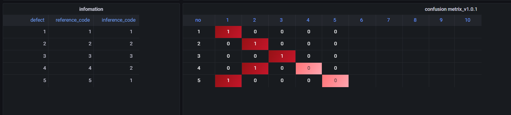

## 2022-08-07-Confusion-Metrix-구현과정

[Confusion-Metrix 대시보드](http://kyeongmin.iptime.org:3000/d/qiUgHrzVk/confusion-metrix?orgId=1)

## 목차

>01.C++로 구현해보기
>
>>  01.1 5개가 고정된 경우
>>
>>  01.2 갯수에 맞게 나오는 경우
>
>02.코드 sql 함수화
>
>03.이전 코드와 같이 만들어보기
>
>04.갯수에 유동적인 소스

## 01.C++로 구현해보기

### 01.1 5개가 고정된 경우

```c++
#include <iostream>
#include <sstream>
#include <vector>
using namespace std;
int main(void)
{
	int driLen = 5;
	int rr[] = { 1,2,3,4,5 };
	int ii[] = { 1,2,4,4,5, };
	string s;

	vector<string>vs;

	for (int i = 0; i < driLen; i++) {
		if (rr[i] == ii[i]) {
			for (int j = 0; j < driLen; j++) {
				if (j+1 == rr[i]) s += "1,";
				else s += "0,";
			}
		}
		else if (rr[i] != ii[i]) {
			for (int j = 0; j < driLen; j++) {
				if (j+1 == rr[i]) s += "2,";
				else if (j == rr[i]) s += "1,";
				else s += "0,";
			}
		}
		vs.push_back(s);
		s.clear();
	}

	for (int i = 0; i < driLen; i++) {
			cout << vs[i]<<endl;
	}
	
	return 0;
}
```


### 01.2 갯수에 맞게 나오는 경우

```c++
#include <iostream>
#include <sstream>
#include <vector>
using namespace std;
int main(void)
{
	int rr[] = { 1,2,3,4,5,6,7,8,9,10 };
	int ii[] = { 1,2,4,4,5,6,7,8,9,10};
	int idx = 0;
	while (rr[idx++] >0);
	string s;
	int driLen = idx-1;

	vector<string>vs;

	for (int i = 0; i < driLen; i++) {
		if (rr[i] == ii[i]) {
			for (int j = 0; j < driLen; j++) {
				if (j+1 == rr[i]) s += "1,";
				else s += "0,";
			}
		}
		else if (rr[i] != ii[i]) {
			for (int j = 0; j < driLen; j++) {
				if (j+1 == rr[i]) s += "2,";
				else if (j == rr[i]) s += "1,";
				else s += "0,";
			}
		}
		vs.push_back(s);
		s.clear();
	}

	for (int i = 0; i < driLen; i++) {
			cout << vs[i]<<endl;
	}
	
	return 0;
}
```


## 02.코드 sql 함수화

- [1,1], [2.2], [3,3] 이 0으로 나오는 경우

  ```c++
  drop table test1;	
  create table public.test1(
      no          integer       not null 
    , title       varchar(300)  not null
    , create_date timestamp(0)  not null
  );
  
  -- 테스트 테이블 조회
  select * from public.test1;
  
  
  create or replace function public.fn_test_table_insert()
  returns integer AS
  $$
      declare
  		idx integer;
  		v_no	integer:=1;
  		v_i integer:=1;
  		v_number integer[];
  		r_i integer;
  		i_i integer;
  		v_idx integer:=1;
  		v_string text:=',';
  BEGIN
  	delete from test1;
      -- 제목의 필수사항을 확인
  	for v_i in 1..10 
  		loop
  		select inference_code, reference_code into r_i, i_i from dri where defect in (v_i);	
  			for v_idx in 1..10
  				loop
  						if r_i = v_idx then v_string := v_string||'1'||',';
  						else  v_string:= v_string||'0'||',';
  						end if;
  				end loop;
  	    insert into public.test1
      		values
        		(i_i,v_string, current_timestamp);
  			v_string:=',';
  		    end loop;
      	return v_no;	
      -- primary key : no 채번
  --    select coalesce(max(no), 0) + 1 into v_no
  --      from public.test1;
  END;
  $$
  LANGUAGE plpgsql
  
  select fn_test_table_insert();
  
  select * from public.test1;
  ```

  

- [1,1], [2.2], [3,3] 이 2로 나오는 경우

  ```c++
  create or replace function fn_test_table_insert()
  returns integer AS
  $$
      declare
  		idx integer;
  		v_no	integer:=1;
  		v_i integer:=1;
  		v_number integer[];
  		r_i integer;
  		i_i integer;
  		v_idx integer:=1;
  		v_string text:=',';
  BEGIN
  	delete from test1;
      -- 제목의 필수사항을 확인
  	for v_i in 1..10 
  		loop
  		select inference_code, reference_code into r_i, i_i from dri where defect in (v_i);	
  			for v_idx in 1..10
  				loop	
  						if r_i = i_i and r_i=v_idx then v_string := v_string||'1'||',';
  						elseif r_i != i_i and i_i=v_idx then  v_string := v_string||'2'||',';
  						elseif r_i != i_i and r_i=v_idx then  v_string := v_string||'1'||',';
  						else v_string:= v_string||'0'||',';
  						end if;
  				end loop;
  	    insert into public.test1
      		values
        		(i_i,v_string, current_timestamp);
  			v_string:=',';
  		    end loop;
  		
  		drop table test2;
  	
      	create table test2 (
      		no int,
      		nums text[10]
      	);
  --    	v_idx := 1;
  --    	v_string := null;
  --    	for v_idx in 1..10
  --    		loop
  --    			select no, title into r_i, v_string from test1 where r_i in (v_idx);
  --    			
  --    		end loop
  --       
      return v_no;	
      -- primary key : no 채번
  --    select coalesce(max(no), 0) + 1 into v_no
  --      from public.test1;
  END;
  $$
  LANGUAGE plpgsql
  
  
  select fn_test_table_insert();
  
  select * from public.test1;
  
  select * from public.test2;
  
  select * from dri;
  select * from dri;
  ```

  

## 03.이전 코드와 같이 만들어보기

- before

  ```sql
  
  with cm as(
  select 
  	case when reference_code = 1 and  inference_code =1 then '1,0,0,0,0,0,0,0,0,0' 
  		 when reference_code = 1 and  inference_code =2 then '2,1,0,0,0,0,0,0,0,0' 
  		 when reference_code = 1 and  inference_code =3 then '2,0,1,0,0,0,0,0,0,0' 
  		 when reference_code = 1 and  inference_code =4 then '2,0,0,1,0,0,0,0,0,0' 
  		 when reference_code = 1 and  inference_code =5 then '2,0,0,0,1,0,0,0,0,0' 
  		 when reference_code = 1 and  inference_code =6 then '2,0,0,0,0,1,0,0,0,0' 
  		 when reference_code = 1 and  inference_code =7 then '2,0,0,0,0,0,1,0,0,0' 
  		 when reference_code = 1 and  inference_code =8 then '2,0,0,0,0,0,0,1,0,0' 
  		 when reference_code = 1 and  inference_code =9 then '2,0,0,0,0,0,0,0,1,0' 
  		when reference_code = 1 and  inference_code =10 then '2,0,0,0,0,0,0,0,0,1'
  	     when reference_code = 2 and  inference_code =1 then '1,2,0,0,0,0,0,0,0,0' 
  		 when reference_code = 2 and  inference_code =2 then '0,1,0,0,0,0,0,0,0,0' 
  		 when reference_code = 2 and  inference_code =3 then '0,2,1,0,0,0,0,0,0,0' 
  		 when reference_code = 2 and  inference_code =4 then '0,2,0,1,0,0,0,0,0,0' 
  		 when reference_code = 2 and  inference_code =5 then '0,2,0,0,1,0,0,0,0,0' 
  		 when reference_code = 2 and  inference_code =6 then '0,2,0,0,0,1,0,0,0,0' 
  		 when reference_code = 2 and  inference_code =7 then '0,2,0,0,0,0,1,0,0,0' 
  		 when reference_code = 2 and  inference_code =8 then '0,2,0,0,0,0,0,1,0,0' 
  		 when reference_code = 2 and  inference_code =9 then '0,2,0,0,0,0,0,0,1,0' 
  		when reference_code = 2 and  inference_code =10 then '0,2,0,0,0,0,0,0,0,1'
  	     when reference_code = 3 and  inference_code =1 then '1,0,2,0,0,0,0,0,0,0' 
  		 when reference_code = 3 and  inference_code =2 then '0,1,2,0,0,0,0,0,0,0' 
  		 when reference_code = 3 and  inference_code =3 then '0,0,1,0,0,0,0,0,0,0' 
  		 when reference_code = 3 and  inference_code =4 then '0,0,2,1,0,0,0,0,0,0' 
  		 when reference_code = 3 and  inference_code =5 then '0,0,2,0,1,0,0,0,0,0' 
  		 when reference_code = 3 and  inference_code =6 then '0,0,2,0,0,1,0,0,0,0' 
  		 when reference_code = 3 and  inference_code =7 then '0,0,2,0,0,0,1,0,0,0' 
  		 when reference_code = 3 and  inference_code =8 then '0,0,2,0,0,0,0,1,0,0' 
  		 when reference_code = 3 and  inference_code =9 then '0,0,2,0,0,0,0,0,1,0' 
  		when reference_code = 3 and  inference_code =10 then '0,0,2,0,0,0,0,0,0,1'
  	     when reference_code = 4 and  inference_code =1 then '1,0,0,2,0,0,0,0,0,0' 
  		 when reference_code = 4 and  inference_code =2 then '0,1,0,2,0,0,0,0,0,0' 
  		 when reference_code = 4 and  inference_code =3 then '0,0,1,2,0,0,0,0,0,0' 
  		 when reference_code = 4 and  inference_code =4 then '0,0,0,1,0,0,0,0,0,0' 
  		 when reference_code = 4 and  inference_code =5 then '0,0,0,2,1,0,0,0,0,0' 
  		 when reference_code = 4 and  inference_code =6 then '0,0,0,2,0,1,0,0,0,0' 
  		 when reference_code = 4 and  inference_code =7 then '0,0,0,2,0,0,1,0,0,0' 
  		 when reference_code = 4 and  inference_code =8 then '0,0,0,2,0,0,0,1,0,0' 
  		 when reference_code = 4 and  inference_code =9 then '0,0,0,2,0,0,0,0,1,0' 
  		when reference_code = 4 and  inference_code =10 then '0,0,0,2,0,0,0,0,0,1'
           when reference_code = 5 and  inference_code =1 then '1,0,0,0,2,0,0,0,0,0' 
  		 when reference_code = 5 and  inference_code =2 then '0,1,0,0,2,0,0,0,0,0' 
  		 when reference_code = 5 and  inference_code =3 then '0,0,1,0,2,0,0,0,0,0' 
  		 when reference_code = 5 and  inference_code =4 then '0,0,0,1,2,0,0,0,0,0' 
  		 when reference_code = 5 and  inference_code =5 then '0,0,0,0,1,0,0,0,0,0' 
  		 when reference_code = 5 and  inference_code =6 then '0,0,0,0,2,1,0,0,0,0' 
  		 when reference_code = 5 and  inference_code =7 then '0,0,0,0,2,0,1,0,0,0' 
  		 when reference_code = 5 and  inference_code =8 then '0,0,0,0,2,0,0,1,0,0' 
  		 when reference_code = 5 and  inference_code =9 then '0,0,0,0,2,0,0,0,1,0' 
  		when reference_code = 5 and  inference_code =10 then '0,0,0,0,2,0,0,0,0,1'
           when reference_code = 6 and  inference_code =1 then '1,0,0,0,0,2,0,0,0,0' 
  		 when reference_code = 6 and  inference_code =2 then '0,1,0,0,0,2,0,0,0,0' 
  		 when reference_code = 6 and  inference_code =3 then '0,0,1,0,0,2,0,0,0,0' 
  		 when reference_code = 6 and  inference_code =4 then '0,0,0,1,0,2,0,0,0,0' 
  		 when reference_code = 6 and  inference_code =5 then '0,0,0,0,1,2,0,0,0,0' 
  		 when reference_code = 6 and  inference_code =6 then '0,0,0,0,0,1,0,0,0,0' 
  		 when reference_code = 6 and  inference_code =7 then '0,0,0,0,0,2,1,0,0,0' 
  		 when reference_code = 6 and  inference_code =8 then '0,0,0,0,0,2,0,1,0,0' 
  		 when reference_code = 6 and  inference_code =9 then '0,0,0,0,0,2,0,0,1,0' 
  		when reference_code = 6 and  inference_code =10 then '0,0,0,0,0,2,0,0,0,1'
  	     when reference_code = 7 and  inference_code =1 then '1,0,0,0,0,0,2,0,0,0' 
  		 when reference_code = 7 and  inference_code =2 then '0,1,0,0,0,0,2,0,0,0' 
  		 when reference_code = 7 and  inference_code =3 then '0,0,1,0,0,0,2,0,0,0' 
  		 when reference_code = 7 and  inference_code =4 then '0,0,0,1,0,0,2,0,0,0' 
  		 when reference_code = 7 and  inference_code =5 then '0,0,0,0,1,0,2,0,0,0' 
  		 when reference_code = 7 and  inference_code =6 then '0,0,0,0,0,1,2,0,0,0' 
  		 when reference_code = 7 and  inference_code =7 then '0,0,0,0,0,0,1,0,0,0' 
  		 when reference_code = 7 and  inference_code =8 then '0,0,0,0,0,0,2,1,0,0' 
  		 when reference_code = 7 and  inference_code =9 then '0,0,0,0,0,0,2,0,1,0' 
  	    when reference_code = 7 and  inference_code =10 then '0,0,0,0,0,0,2,0,0,1'
  	     when reference_code = 8 and  inference_code =1 then '1,0,0,0,0,0,0,2,0,0' 
  		 when reference_code = 8 and  inference_code =2 then '0,1,0,0,0,0,0,2,0,0' 
  		 when reference_code = 8 and  inference_code =3 then '0,0,1,0,0,0,0,2,0,0' 
  		 when reference_code = 8 and  inference_code =4 then '0,0,0,1,0,0,0,2,0,0' 
  		 when reference_code = 8 and  inference_code =5 then '0,0,0,0,1,0,0,2,0,0' 
  		 when reference_code = 8 and  inference_code =6 then '0,0,0,0,0,1,0,2,0,0' 
  		 when reference_code = 8 and  inference_code =7 then '0,0,0,0,0,0,1,2,0,0' 
  		 when reference_code = 8 and  inference_code =8 then '0,0,0,0,0,0,0,1,0,0' 
  		 when reference_code = 8 and  inference_code =9 then '0,0,0,0,0,0,0,2,1,0' 
  		when reference_code = 8 and  inference_code =10 then '0,0,0,0,0,0,0,2,0,1'
  	     when reference_code = 9  and  inference_code=1 then '1,0,0,0,0,0,0,0,2,0' 
  		 when reference_code = 9 and  inference_code =2 then '0,1,0,0,0,0,0,0,2,0' 
  		 when reference_code = 9 and  inference_code =3 then '0,0,1,0,0,0,0,0,2,0' 
  		 when reference_code = 9 and  inference_code =4 then '0,0,0,1,0,0,0,0,2,0' 
  		 when reference_code = 9 and  inference_code =5 then '0,0,0,0,1,0,0,0,2,0' 
  		 when reference_code = 9 and  inference_code =6 then '0,0,0,0,0,1,0,0,2,0' 
  		 when reference_code = 9 and  inference_code =7 then '0,0,0,0,0,0,1,0,2,0' 
  		 when reference_code = 9 and  inference_code =8 then '0,0,0,0,0,0,0,1,2,0' 
  		 when reference_code = 9 and  inference_code =9 then '0,0,0,0,0,0,0,0,1,0' 
  		when reference_code = 9 and  inference_code =10 then '0,0,0,0,0,0,0,0,2,1'
           when reference_code = 10 and  inference_code =1 then '1,0,0,0,0,0,0,0,0,2' 
  		 when reference_code = 10 and  inference_code =2 then '0,1,0,0,0,0,0,0,0,2' 
  		 when reference_code = 10 and  inference_code =3 then '0,0,1,0,0,0,0,0,0,2' 
  		 when reference_code = 10 and  inference_code =4 then '0,0,0,1,0,0,0,0,0,2' 
  		 when reference_code = 10 and  inference_code =5 then '0,0,0,0,1,0,0,0,0,2' 
  		 when reference_code = 10 and  inference_code =6 then '0,0,0,0,0,1,0,0,0,2' 
  		 when reference_code = 10 and  inference_code =7 then '0,0,0,0,0,0,1,0,0,2' 
  		 when reference_code = 10 and  inference_code =8 then '0,0,0,0,0,0,0,1,0,2' 
  		 when reference_code = 10 and  inference_code =9 then '0,0,0,0,0,0,0,0,1,2' 
  		when reference_code = 10 and  inference_code =10 then '0,0,0,0,0,0,0,0,0,1'
  	end as D1
  from dri
  )
  select 
  (ROW_NUMBER() OVER()) as " ",
  split_part(D1,',',1 )as "1"
  ,split_part(D1,',',2 )as "2"
  ,split_part(D1,',',3 )as "3"
  ,split_part(D1,',',4 )as "4" 
  ,split_part(D1,',',5 )as "5"
  ,split_part(D1,',',6 )as "6" 
  ,split_part(D1,',',7 )as "7" 
  ,split_part(D1,',',8 )as "8" 
  ,split_part(D1,',',9 )as "9" 
  ,split_part(D1,',',10 )as "10" 
  from cm;
  ```

- after

  ```sql
  create or replace function fn_test_table_insert()
  returns integer AS
  $$
      declare
  		idx integer;
  		v_no	integer:=1;
  		v_i integer:=1;
  		v_number integer[];
  		r_i integer;
  		i_i integer;
  		v_idx integer:=1;
  		v_string text:=',';
  BEGIN
  	delete from test1;
      -- 제목의 필수사항을 확인
  	for v_i in 1..10 
  		loop
  		select inference_code, reference_code into r_i, i_i from dri where defect in (v_i);	
  			for v_idx in 1..10
  				loop	
  						if r_i = i_i and r_i=v_idx then v_string := v_string||'1'||',';
  						elseif r_i != i_i and i_i=v_idx then  v_string := v_string||'2'||',';
  						elseif r_i != i_i and r_i=v_idx then  v_string := v_string||'1'||',';
  						else v_string:= v_string||'0'||',';
  						end if;
  				end loop;
  	    insert into public.test1
      		values
        		(i_i,v_string, current_timestamp);
  			v_string:=',';
  		    end loop;
  		
  		drop table test2;
  	
      	create table test2 (
      		no integer,
      		"a1" text,
      		"a2" text,
      		"a3" text,
      		"a4" text,
      		"a5" text,
      		"a6" text,
      		"a7" text,
      		"a8" text,
      		"a9" text,
        		"a10" text
      	);
      
      	insert into test2 (no,"a1","a2","a3","a4","a5","a6","a7","a8","a9","a10")select 
  			(ROW_NUMBER() OVER()) as " ",
  			split_part(title,',',2 )as "1"
  			,split_part(title,',',3 )as "2"
  			,split_part(title,',',4 )as "3"
  			,split_part(title,',',5 )as "4" 
  			,split_part(title,',',6 )as "5"
  			,split_part(title,',',7 )as "6" 
  			,split_part(title,',',8 )as "7" 
  			,split_part(title,',',9 )as "8" 
  			,split_part(title,',',10 )as "9" 
  			,split_part(title,',',11 )as "10" 
  		from test1;
  --    	v_idx := 1;
  --    	v_string := null;
  --    	for v_idx in 1..10
  --    		loop
  --    			select no, title into r_i, v_string from test1 where r_i in (v_idx);
  --    			
  --    		end loop
  --       
      return v_no;	
      -- primary key : no 채번
  --    select coalesce(max(no), 0) + 1 into v_no
  --      from public.test1;
  END;
  $$
  LANGUAGE plpgsql
  
  select fn_test_table_insert();
  
  select * from public.test1;
  
  select * from public.test2;
  ```

  

## 04.갯수에 유동적인 소스

- 전체소스

  ```sql
  create or replace function fn_test_table_insert()
  returns integer AS
  $$
      declare
  		idx integer;
  		v_no	integer:=1;
  		v_i integer:=1;
  		v_number integer[];
  		r_i integer;
  		i_i integer;
  		v_idx integer:=1;
  		v_string text:=',';
  BEGIN
  	delete from test1;
      -- 제목의 필수사항을 확인
  
  	select count(*) into v_no from dri1;
  	for v_i in 1..v_no
  		loop
  		select inference_code, reference_code into r_i, i_i from dri1 where defect in (v_i);	
  			for v_idx in 1..v_no
  				loop	
  					if i_i is not null then
  						if r_i = i_i and r_i=v_idx then v_string := v_string||'1'||',';
  						elseif r_i != i_i and i_i=v_idx then  v_string := v_string||'-1'||',';
  						elseif r_i != i_i and r_i=v_idx then  v_string := v_string||'1'||',';
  						else v_string:= v_string||'0'||',';
  						end if;
  					end if;
  				end loop;
  	    insert into public.test1
      		values
        		(i_i,v_string, current_timestamp);
  			v_string:=',';
  		    end loop;
  		
  		drop table test2;
  	
      	create table test2 (
      		no integer
      		,"1" text
      		,"2" text,
      		,"3" text,
      		,"4" text
      		,"5" text
      		,"6" text
      		,"7" text
      		,"8" text
      		,"9" text
        		,"10" text
        		
      	);
      
      	insert into test2 (no,"1","2","3","4","5","6","7","8","9","10")select 
  			(ROW_NUMBER() OVER()) as " ",
  			split_part(title,',',2 )as "1"
  			,split_part(title,',',3 )as "2"
  			,split_part(title,',',4 )as "3"
  			,split_part(title,',',5 )as "4" 
  			,split_part(title,',',6 )as "5"
  			,split_part(title,',',7 )as "6" 
  			,split_part(title,',',8 )as "7" 
  			,split_part(title,',',9 )as "8" 
  			,split_part(title,',',10 )as "9" 
  			,split_part(title,',',11 )as "10" 
  		from test1;
  --    	v_idx := 1;
  --    	v_string := null;
  --    	for v_idx in 1..10
  --    		loop
  --    			select no, title into r_i, v_string from test1 where r_i in (v_idx);
  --    			
  --    		end loop
  --       
      return v_no;	
      -- primary key : no 채번
  --    select coalesce(max(no), 0) + 1 into v_no
  --      from public.test1;
  END;
  $$
  LANGUAGE plpgsql
  
  
  select fn_test_table_insert();
  
  select * from public.test1;
  
  select * from public.test2;
  
  ```

  - dri의 테이블의 상태에 따라 다르게 나옴

    - 10개인 경우 

      

    - 5개인 경우

      

## 05.또다른 방법 1


```sql
create table ep (
	expected integer,
	predicted integer
);

INSERT INTO ep(Expected,predicted) VALUES
 (1,1)
,(1,1)
,(1,5)
,(2,2)
,(2,3)
,(2,2)
,(3,3)
,(4,4)
,(4,3)
,(5,1)
,(5,2)
,(5,3)
,(5,5);

select distinct Expected, predicted, count(predicted) over(partition by Expected,predicted) from ep order by expected, predicted ;
```


```sql
with eps as(
select distinct Expected, predicted, count(predicted) over(partition by Expected,predicted)as cnt  from ep order by expected, predicted 
)
select expected, predicted, cnt, round((cnt/sum(cnt) over(partition by Expected)),2) as percent from eps;
```


## 05.1  자동으로 만들기

```sql
create or replace function fn_test_table_insert1()
returns integer AS
$$
    declare
		idx integer;
		v_no integer:=1;
		v_i integer:=1;
		v_ii integer:=1;
		v_number integer[];
		r_i integer;
		i_i integer;
		p_i text;
		v_idx integer:=1;
		v_string text:=',';
BEGIN
	delete from test1;
    -- 제목의 필수사항을 확인

	select count(distinct expected) into v_no from ep;
	
	for v_i in 1..v_no
		loop
			for v_ii in 1..v_no
			loop
with eps as(
select distinct Expected, predicted, count(predicted) over(partition by Expected,predicted)as cnt  from ep order by expected, predicted 
), eps1 as(
select expected, predicted, round((cnt/sum(cnt) over(partition by Expected)),2)::text as percent from eps)
select * into r_i, i_i, p_i from eps1 where expected in (v_i) and predicted in (v_ii);
            
            if r_i is null then v_string := v_string||'0'||',';
            else  v_string := v_string||p_i||',';
            end if;
			end loop;		
	    insert into public.test1
    		values
      		(i_i,v_string, current_timestamp);
			v_string:=',';
		    end loop;
		
		drop table test2;
	
    	create table test2 (
    		no integer
    		,"1" text
    		,"2" text
    		,"3" text
    		,"4" text
    		,"5" text
    		,"6" text
    		,"7" text
    		,"8" text
    		,"9" text
      		,"10" text
      		
    	);
    
    	insert into test2 (no,"1","2","3","4","5","6","7","8","9","10")select 
			(ROW_NUMBER() OVER()) as " ",
			split_part(title,',',2 )as "1"
			,split_part(title,',',3 )as "2"
			,split_part(title,',',4 )as "3"
			,split_part(title,',',5 )as "4" 
			,split_part(title,',',6 )as "5"
			,split_part(title,',',7 )as "6" 
			,split_part(title,',',8 )as "7" 
			,split_part(title,',',9 )as "8" 
			,split_part(title,',',10 )as "9" 
			,split_part(title,',',11 )as "10" 
		from test1;
--    	v_idx := 1;
--    	v_string := null;
--    	for v_idx in 1..10
--    		loop
--    			select no, title into r_i, v_string from test1 where r_i in (v_idx);
--    			
--    		end loop
--       
    return v_no;	
    -- primary key : no 채번
--    select coalesce(max(no), 0) + 1 into v_no
--      from public.test1;
END;
$$
LANGUAGE plpgsql

select fn_test_table_insert1();

select * from public.test1;

select * from public.test2;
```


