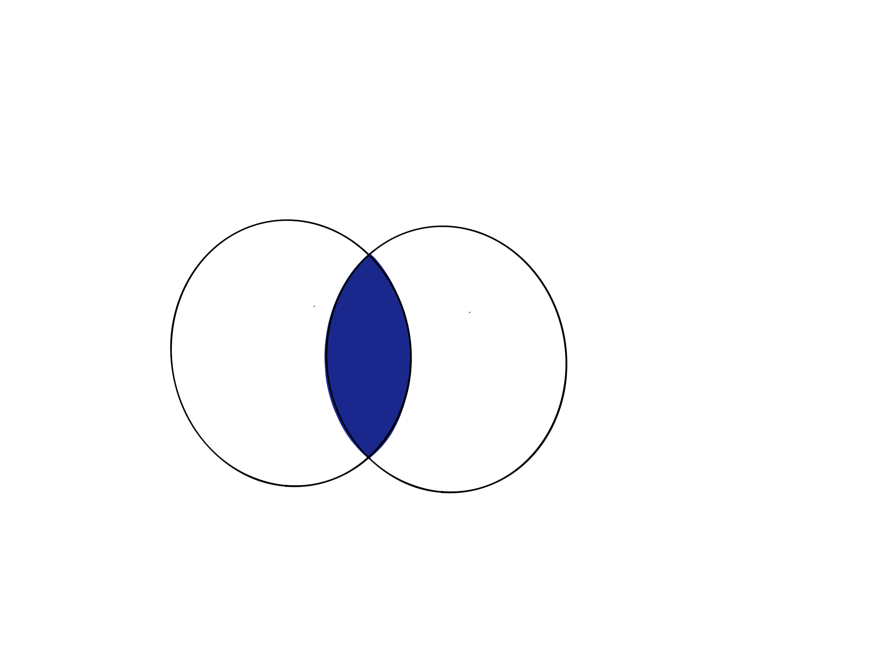
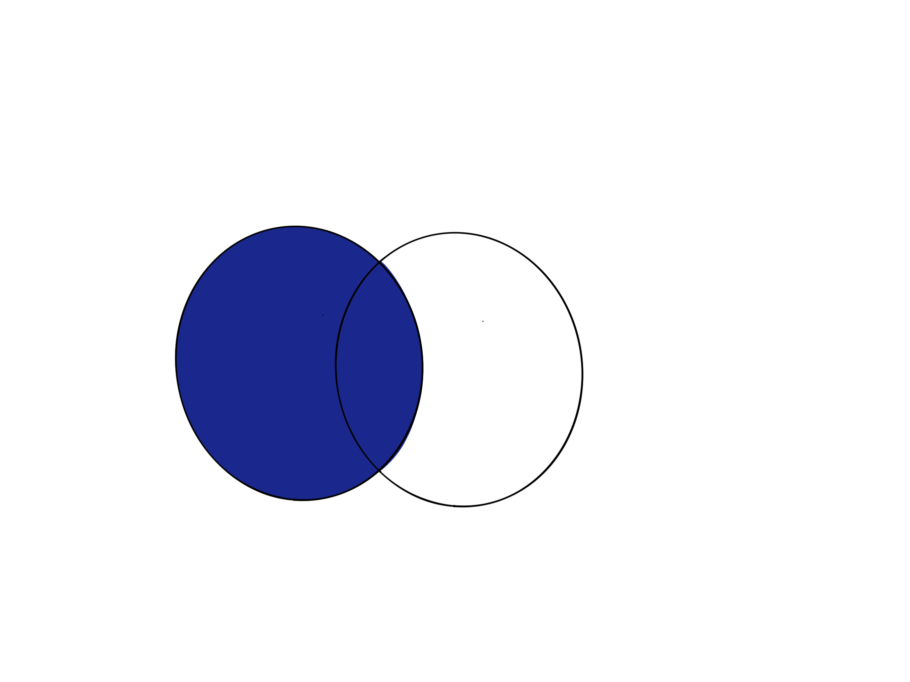
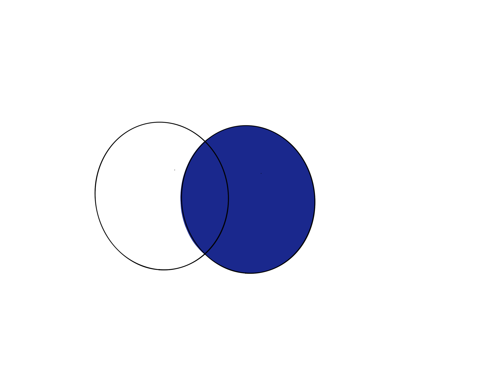
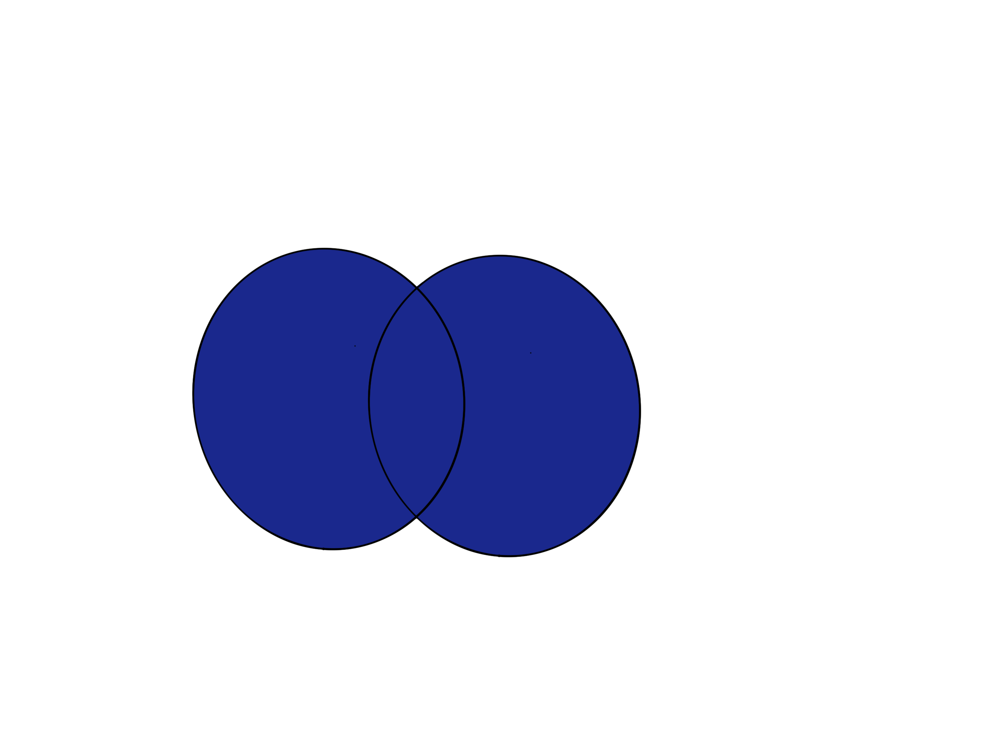

## 22-04-11-SQL-Join정리

## 목차

> 01.Join이란?
>
> > 01.1 Join 종류
> >
> > > (inner)Join
> > >
> > > Left(outer)Join
> > >
> > > Right(outer)Join
> > >
> > > Full(outer)Join
>
> 02.PostgreSQL Joins

## 01.Join이란?

- 두 개이상 테이블에서 테이블 사이 연관된 colum을 바탕으로 rows를 결합하는 것

### 01.1 Join 종류

#### (Inner) Join

- 두 테이블에 모두 매치되는 값을 가진  rows를 리턴
- 

#### Left(outer) Join

- 왼쪽 테이블의 모든 rows를 리턴하고, 오른쪽 테이블에서는 왼쪽 테이블에 매치되는 rows를 리턴함

  

#### Right(outer)Join

- 오른쪽 테이블의 모든 rows를 리턴하고, 왼쪽 테이블에서는 오른쪽 테이블에 매치되는 rows를 리턴함

  

#### Full(outer)Join

- 왼쪽 테이블 혹은 오른쪽 테이블에서 매치되는 모든 rows를 리턴함

  

## 02.PostgreSQL Joins


```sql
SELECT * FROM a INNER JOIN b ON a.key = b. key
```


```sql
SELECT * FROM a LEFT JOIN b ON a.key = b. key
```


```sql
SELECT * FROM a RIGHT JOIN b ON a.key = b. key
```


```sql
SELECT * FROM a INNER JOIN b ON a.key = b. key
WHERE b.key IS NULL
```


```sql
SELECT * FROM a INNER JOIN b ON a.key = b. key
WHERE a.key IS NULL
```


```sql
SELECT * FROM a FULL JOIN b ON a.key = b. key
```


```sql
SELECT * FROM a FULL JOIN b ON a.key = b. key
WHERE a.key IS NULL OR b.key IS NULL
```


