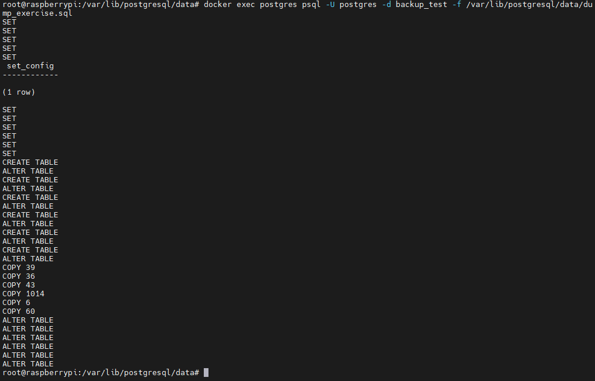
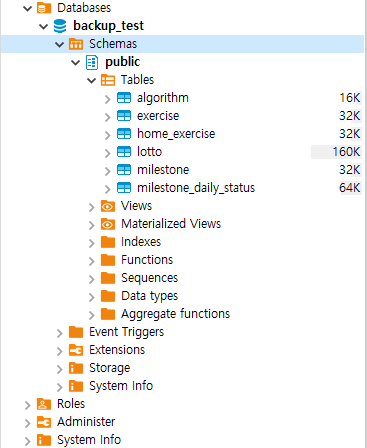
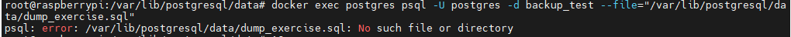
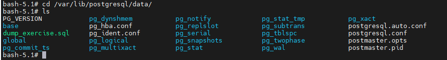

## 2022-05-23-postgreSQL-데이터옮기기

## 목차

>  01.DBeaver를 이용하여 export해서 데이터 옮기기
>
>  >  01.1 테이블 조회 하기
>  >
>  >  01.2 데이터 export하기
>
>  02.명령어를 이용하여 데이터 옮기기
>
>  >  02.1 pg_dump를 이용하여 Export하기
>  >
>  >  02.2 psql를 이용하여 Import하기 
>  >
>  >  02.3 문제 해결
>
>  03.전체진행 소스 정리

## 01.DBeaver를 이용하여 export해서 데이터 옮기기

### 01.1 테이블 조회 하기


- 전체쿼리를 조회 한다 그리고제일 아래 export 버튼을 클릭한다.

### 01.2 데이터 export하기


- SQL 클릭하고 다음 클릭


- 다음 클릭


- INSERT 로우 개수 설정후 다음 클릭


- 저장한 디렉토리 위치 설정 후 다음 클릭


- 진행 버튼 클릭을 하게 되면 알아서 자동으로 insert문으로 생성됨


- 위와 같이 자동으로 생성된다. 위를 원하는 디비에 옮겨서 실행하면됨

## 02.명령어를 이용하여 데이터 옮기기

### 02.1 pg_dump를 이용하여 Export하기

- 사용법

  ```sql
  docker exec {컨테이너_이름} pg_dump -U {DB_유저이름} -d {DB_이름} > {원하는_이름_설정}.sql
  ```

- 실제 사용 (container ID : superset_db)

  ```sql
  docker exec superset_db pg_dump -U superset -d superset > dump_superset.sql
  ```

  

  	- 아래와 같이 sql문 생성됨 

 - dump_postgresql.sql 문서 확인

   

### 02.2 psql를 이용하여 Import하기 

- 사용법

  ```sql
  docker exec {컨테이너_이름} psql -U {DB_유저이름} -d {DB_NAME} -f {컨테이너내 경로를 포함한 백업파일명}.sql
  ```

- 실제 사용 | 해당경로 위치에서 실행

  ```sql
  docker exec postgres psql -U postgres -d backup_test -f /var/lib/postgresql/data
  /dump_superset.sql
  ```
  
  - before
  
    
  
  - after
  
    
    
    
    
    - 위와 같이 테이블이 생성됨이 보인다. 

### 02.3 문제 해결



- 경로를 못찾는 상태 발견 

  - 이유를 잘 생각해보면 정말 원초적인 실수

  - 당연히 로컬에 파일이 있고 컨테이너에 파일이 없기때문에 파일을 못찾았던것

    ```docker
    docker cp ~/dump_exercise.sql postgres:/var/lib/postgresql/data/
    ```

    - 로컬 파일 복사

    - 파일위치는 /root에 있는 경우

      

      - 위와 같이 복사된것이 확인됨

- 그리고 명령어 다시 실행해주면 제대로 동작함

  ```dockser
  docker exec postgres psql -U postgres -d postgres -f /var/lib/postgresql/data
  /dump_superset.sql
  ```

## 03.전체진행 소스 정리

- 시작 시나리오

  

  - superset_db이름을 가진 postgres컨테이너의 superset 데이터베이스의 데이터 전체
    - postgres이름을 가진 postgres컨테이너의 backup_test데이터베이스로 데이터 이관하는 경우

```sh
# dump_superset.sql 파일생성 (백업파일)
docker exec superset_db pg_dump -U superset -d superset > dump_superset.sql

# 해당 dump_superset.sql root 위치로 이동시키기

# 로컬파일 컨테이너로 복사
docker cp ~/dump_superset.sql postgres:/var/lib/postgresql/data/

# 해당파일 실행하여 데이터 이관
docker exec postgres psql -U postgres -d postgres -f /var/lib/postgresql/data
/dump_superset.sql
```


