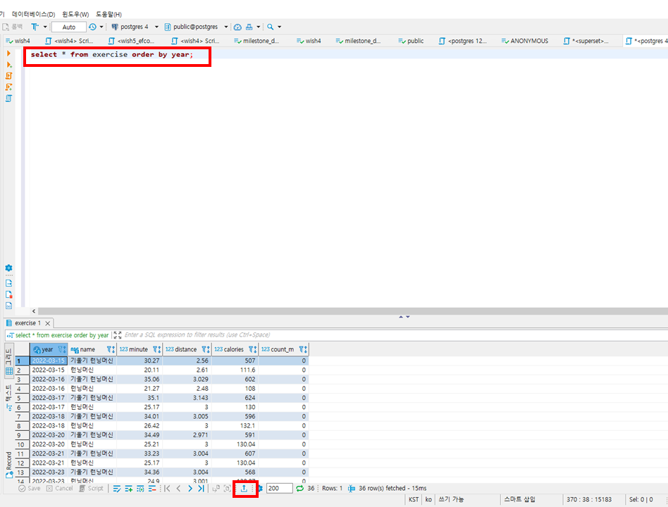
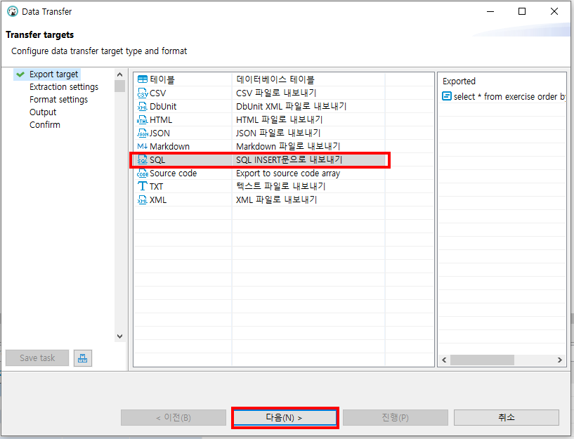
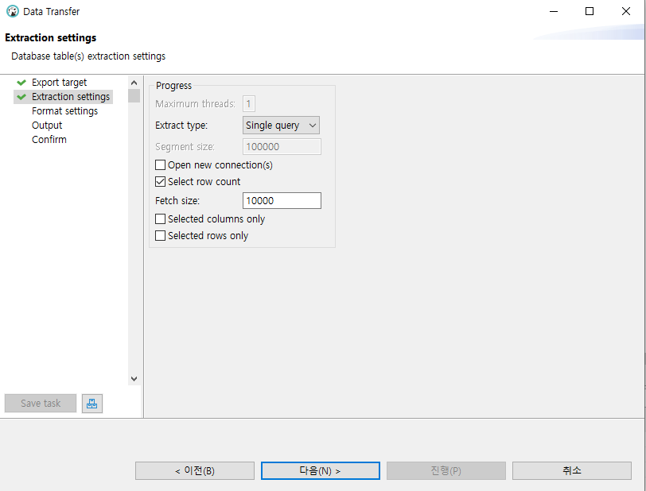
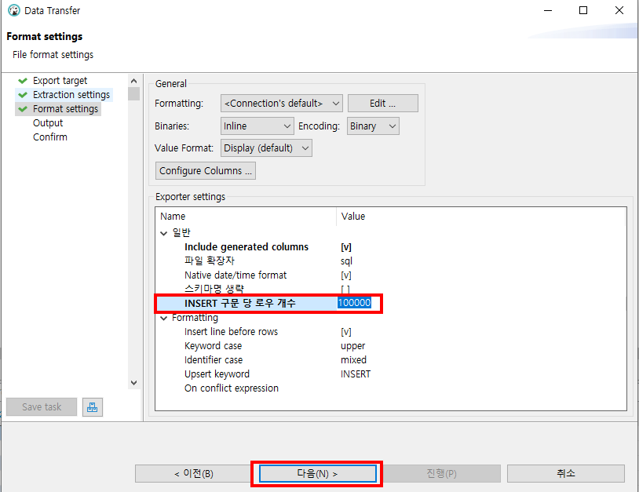
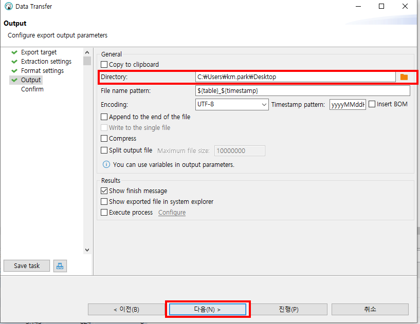
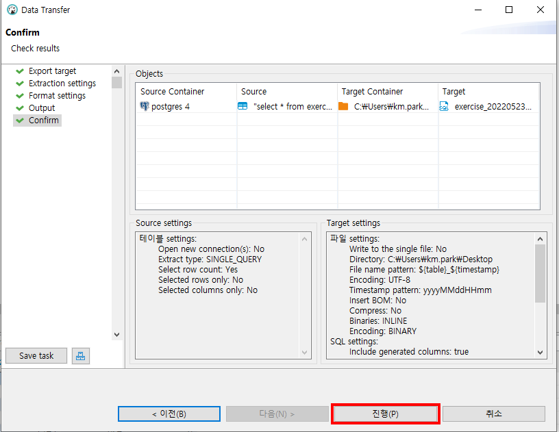
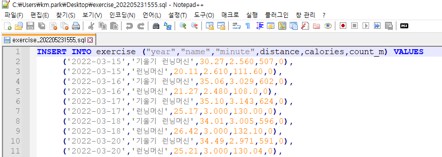
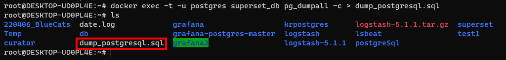
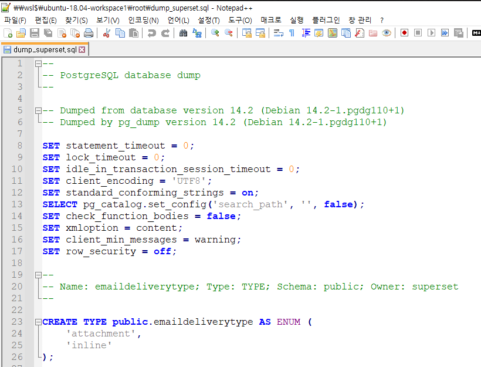
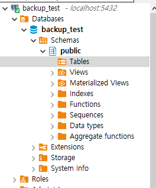

## 2022-05-23-postgreSQL-데이터옮기기

## 01.DBeaver를 이용하여 export해서 데이터 옮기기

## SQL INSERT문 내보내기

### 01.1 테이블 조회 하기



- 전체쿼리를 조회 한다 그리고제일 아래 export 버튼을 클릭한다.

### 01.2 데이터 export하기



- SQL 클릭하고 다음 클릭



- 다음 클릭



- INSERT 로우 개수 설정후 다음 클릭



- 저장한 디렉토리 위치 설정 후 다음 클릭



- 진행 버튼 클릭을 하게 되면 알아서 자동으로 insert문으로 생성됨



- 위와 같이 자동으로 생성된다. 위를 원하는 디비에 옮겨서 실행하면됨

## 02.명령어를 이용하여 데이터 옮기기

### 02.1 pg_dump를 이용하여 Export하기

- 사용법

  ```sql
  docker exec {컨테이너_이름} pg_dump -U {DB_유저이름} -d {DB_이름} > {원하는_이름_설정}.sql
  ```

- 실제 사용 (container ID : superset_db)

  ```sql
  docker exec superset_db pg_dump -U superset -d superset > dump_superset.sql
  ```

  

  	- 아래와 같이 sql문 생성됨 

 - dump_postgresql.sql 문서 확인

   

### 02.2 psql를 이용하여 Import하기 

- 사용법

  ```sql
  docker exec {컨테이너_이름} psql -U {DB_유저이름} -d {DB_NAME} -f {컨테이너내 경로를 포함한 백업파일명}.sql
  ```

- 실제 사용 | 해당경로 위치에서 실행

  ```sql
  docker exec postgres psql -U postgres -d postgres -f C:\Users\km.park\Desktop\dump_superset.sql
  ```

  - before

    

  - after

    

