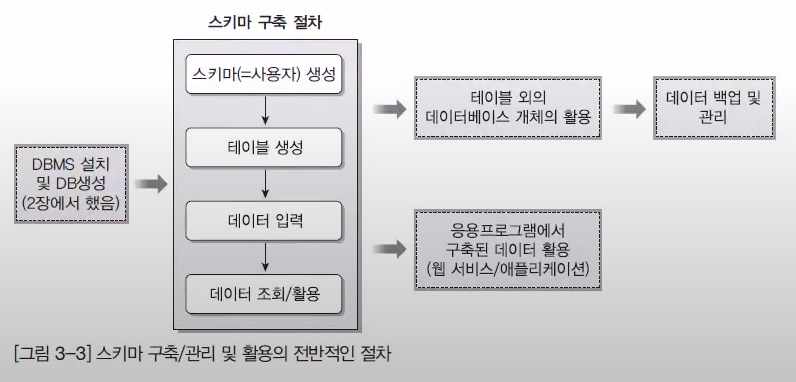

## 2022-05-26-오라클-스키마생성과-데이터베이스-생성-및-데이터-삽입

## 목차

> 01.테이블 구조와 관련 용어
>
> 02.스키마 구축 절차
>
> 03.스키마 생성
>
> 04.테이블 생성
>
> 05.데이블 삽입
>
> 06.데이터 조회

## 01.테이블 구조와 관련 용어


- 요구분석, 시스템 설계, 모델링이 중요하다.
  - 건축을 할 때 설계 먼저 하는 것과 같음
- XE는 생성된 데이터베이스 이다.
- 스키마는 원통 모양으로 다른 데이터베이스의 경우 스키마와 DB를 같은 것으로 본다.
- 오라클의 스키마
  - 스키마 안에 테이블, 뷰 등을 모아놓은 묶음
    - 한명의 사용자는 한명의 스키마를 가짐

## 02.스키마 구축 절차



- 스키마 생성 -> 테이블 생성  -> 데이터 입력 -> 데이터 조회/활용으로 이어진다.
  - 테이블 외의 뷰, 인덱스, 시그마등을 활용도하고 백업등도 한다.

## 03.스키마 생성

```sql
-- USER SQL
CREATE USER Shop IDENTIFIED BY "1234"
DEFAULT TABLESPACE "USERS"
TEMPORARY TABLESPACE "TEMP";

-- QUORAS
ALTER USER Shop QUOTA 10M ON USERS;

-- ROLES
GRANT "CONNECT" TO Shop;
GRANT "RESOURCE" TO Shop;

-- SYSTEM PRIVILEGES
```


- 이렇게 스키마를 생성 할 수 있음

## 04.테이블 생성

```sql
CREATE TABLE MEMBERTBL
(
	MEMBERID CHAR(8) NOT NULL
   ,MEMBERNAME NCHAR(5) NOT NULL
   ,MEMBERADDRESS NVARCHAR2(20) NOT NULL
   ,CONSTRAINT MEMBERTBL_PK PRIMARY KEY
	(
		MEMBERID
	)
	ENABLE
);

CREATE TABLE PRODUCTTBL
(
	PRODUCTNAME NCHAR(4) NOT NULL
	,COST number(7) NOT NULL
	,MAKEDATE DATE
	,COMPANY nchar(5)
	,AMOUNT number(3) NOT NULL
	,CONSTRAINT PRODUCTTBL_PK PRIMARY KEY
	(
		PRODUCTNAME
	)
	ENABLE
);
```

## 05.데이터 삽입

```sql
-- MEMBERTBL 데이터 삽입
INSERT INTO MEMBERTBL (MEMBERID, MEMBERNAME, MEMBERADDRESS) VALUES ('Dang', '당탕이', '경기도 부천시 중동');
INSERT INTO MEMBERTBL (MEMBERID, MEMBERNAME, MEMBERADDRESS) VALUES ('Jee', '지운이', '서울 은평구 중산동');

-- PRODUCTTBL 데이터 삽입
INSERT INTO PRODUCTTBL (PRODUCTNAME, COST, MAKEDATE, COMPANY, AMOUNT) VALUES ('컴퓨터', '10', '2022-08-17', '삼성', 17);
INSERT INTO PRODUCTTBL (PRODUCTNAME, COST, MAKEDATE, COMPANY, AMOUNT) VALUES ('세탁기', '5', '2021-5-16', 'LG', 5);
```

## 06.데이터 조회

```sql
SELECT * FROM MEMBERTBL;
```


```sql
SELECT * FROM PRODUCTTBL;
```

