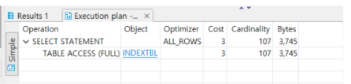
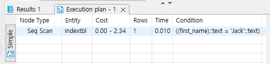
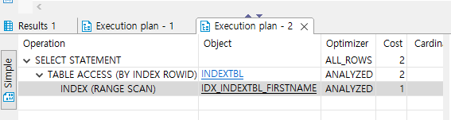
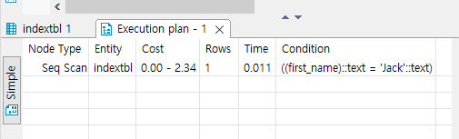
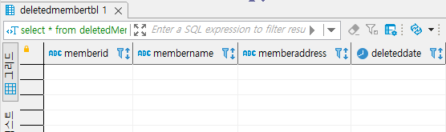
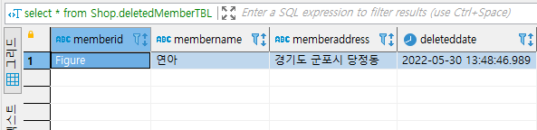

## 2022-05-30-oracle과-postgres-3일차비교

## 목차

 >
 >01.인덱스 실습전 준비
 >
 >02.인덱스 생성하기
 >
 >03.뷰 실습
 >
 >04.스토어드 프로시저 실습
 >
 >05.트리거 실습

## 01.인덱스 실습전 준비

- **Oracle**

  ```sql
  CREATE TABLE Shop.indexTBL
  	AS
  		SELECT first_name, last_name, hire_date
  			FROM HR.employees;
  		
  SELECT * FROM Shop.indexTBL;	
  
  SELECT * FROM Shop.indexTBL WHERE first_name = 'Jack';
  ```

  

- **Postgres**

  ```sql
  create table indexTBL
  	as
  		select first_name, last_name, hire_date
  			from employees;
  			
  select * from indexTBL;
  
  SELECT * FROM Shop.indexTBL WHERE first_name = 'Jack';
  ```

  

## 02.인덱스 생성하기

- **Oracle**

  ```sql
  -- 인덱스 생성 
  CREATE INDEX idx_indexTBL_firstname ON Shop.indexTBL(first_name);
  
  -- 인덱스 생성된 후 조회 결과
  SELECT * FROM Shop.indexTBL WHERE first_name = 'Jack';
  ```

  

- **Postgres**

  ```sql
  -- 인덱스 생성 
  CREATE INDEX idx_indexTBL_firstname ON Shop.indexTBL(first_name);
  
  -- 인덱스 생성된 후 조회 결과
  SELECT * FROM Shop.indexTBL(first_name);
  ```

  

## 03.뷰 실습

- **Oracle**

  ```sql
  SELECT * FROM Shop.memberTBL;
  
  CREATE VIEW Shop.memberTBL_view AS
  	SELECT memberName, memberADDRESS FROM Shop.memberTBL;
  	
  SELECT * FROM Shop.memberTBL_view;
  ```

- **Postgres**

  ```sql
  SELECT * FROM memberTBL;
  
  CREATE VIEW memberTBL_view AS
  	SELECT memberName, memberADDRESS FROM memberTBL;
  	
  SELECT * FROM memberTBL_view;
  ```

## 04.스토어드 프로시저 실습

- **Oracle**

  ```sql
  CREATE PROCEDURE Shop.myProc AS
  	var1 INT;
  	var2 INT;
  BEGIN
  	SELECT COUNT(*) INTO var1 FROM Shop.memberTBL;
  	SELECT COUNT(*) INTO var2 FROM Shop.PRODUCTTBL;
  	DBMS_OUTPUT.PUT_LINE(var1+var2);
  END ;
  ```

- **Postgres**

  ```sql
  CREATE PROCEDURE myProc1(out result1 int) AS $$
  declare 
  	var1 int;
  	var2 int;
  begin
  	SELECT COUNT(*) INTO var1 FROM memberTBL;
  	SELECT COUNT(*) INTO var2 from PRODUCTTBL;
      result1 = var1+var2;
  END;
  $$ LANGUAGE plpgsql;
  
  call myproc1 (0);
  ```

## 05.트리거 실습

- **Oracle**

  ```sql
  CREATE TRIGGER Shop.trg_deletedMemberTBL
  	AFTER DELETE 
  	ON Shop.memberTBL
  	FOR EACH ROW
  BEGIN 
  	INSERT INTO Shop.deletedMemberTBL
  		VALUES(:old.memberID, :old.memberName, :old.memberAddress, SYSDATE());
  END;
  ```

- **Postgres**

  ```sql
  CREATE FUNCTION trigger_function() 
     RETURNS TRIGGER 
     LANGUAGE PLPGSQL
  AS $$
  BEGIN
     INSERT INTO deletedMemberTBL (memberID, memberName, memberAddress,deletedDate) 
     VALUES(old.memberID, old.memberName, old.memberAddress,now());   
     RETURN NULL;
  END;
  $$
  
  create trigger trg_deletedMemberTBL
  	after delete
  	on memberTBL
  	for each row 
  EXECUTE PROCEDURE trigger_function();
  ```

  - 준비

    ```sql
    CREATE TABLE Shop.deletedMemberTBL( -- delete 되면 저장되는 테이블
    	memberID char(8),
    	memberName nchar(5),
    	memberAddress varchar(20),
    	deletedDate date
    );
    
    INSERT INTO Shop.memberTBL VALUES('Figure', '연아', '경기도 군포시 당정동');
    
    select * from Shop.deletedMemberTBL;-- 전 데이터확인
    DELETE FROM Shop.memberTBL WHERE memberName ='연아';
    select * from Shop.deletedMemberTBL;-- 후 데이터 확인
    ```

  - 트리거 동작 전 deletedMemberTBL 테이블

    

  - 트리거 동작 후 deltedMemberTBL 테이블

    

