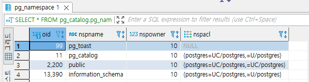
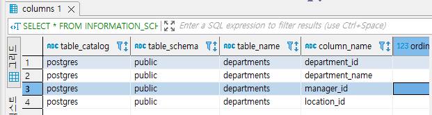
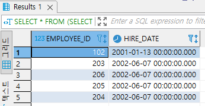

 
## 2022-05-30-oracle과-postgres-4일차비교

## 01.SELECT와 FROM

- **Oracle**

  ```sql
  SELECT * FROM employees;

  SELECT * FROM HR.employees; -- 원칙대로 하는법

  SELECT department_name FROM departments; -- 필요한 열만 출력

  SELECT department_id,department_name FROM departments; -- 여러개 열 출력
  ```

- **Postgres**

  ```sql
  SELECT * FROM employees;

  SELECT department_name FROM departments; -- 필요한 열만 출력

  SELECT department_id,department_name FROM departments; -- 여러개 열 출력
  ```

## 02.스키마이름과 철자 기억안나는 경우

- **Oracle**

  ```sql
  SELECT * FROM SYS.DBA_USERS;

  SELECT * FROM SYS.DBA_TABLES WHERE OWNER = 'HR'; -- 저장된 SYS 사용자의 테이블 조회

  SELECT * FROM SYS.DBA_TAB_COLUMNS WHERE OWNER = 'HR' AND TABLE_NAME = 'DEPARTMENTS'; -- 테이블의 컬럼 이름 형식 확인
  ```

- **Postgres**

  ```sql
  SELECT * FROM pg_catalog.pg_namespace;

  select tablename from pg_tables; -- 전체 테이블 조회

  SELECT * FROM INFORMATION_SCHEMA.COLUMNS WHERE TABLE_CATALOG = 'postgres' AND TABLE_NAME = 'departments' ORDER BY ORDINAL_POSITION;
  ```

  

  

## 03.sqlDB와 앞으로 사용한 테이블 생성

- **Oracle**

  ```sql
  CREATE USER sqlDB IDENTIFIED BY 1234
  	DEFAULT TABLESPACE USERS
  	TEMPORARY TABLESPACE TEMP;

  GRANT CONNECT, resource, dba TO sqlDB;

  CREATE TABLE userTBL -- 회원 테이블
  (
  userID CHAR(8) NOT NULL PRIMARY KEY, -- 사용자 아이디(PK)
  userName NVARCHAR2(10) NOT NULL, -- 이름
  birthYear NUMBER(4) NOT NULL, -- 출생년도
  addr NCHAR(2) NOT NULL, -- 지역(경기, 서울, 경남 식으로 2글자만 입력) 
  mobile1 CHAR(3),-- 휴대폰의 국번(010, 011, 016, 017, 018, 019 등)
  mobile2 CHAR(8),-- 휴대폰의 나머지 전화번호(하이픈 제외)
  height NUMBER(3),
  mDate DATE --회원가입일
  );

  CREATE TABLE buyTBL --회원 구매 테이블
  (
  idNum NUMBER(8) NOT NULL PRIMARY KEY, --순번(PK)
  userID CHAR(8) NOT NULL, --아이디(FK) 
  prodName NCHAR(6) NOT NULL, --물품명
  groupName NCHAR(4) , -- 분류
  price NUMBER(8) NOT NULL, --단가
  amount NUMBER(3) NOT NULL, --수량
  FOREIGN KEY (userID) REFERENCES userTBL(userID)
  );
  ```

- **Postsgres**

  ```sql
  create user sqlDB with password '1234';
  create database sqlDB with owner sqlDB;
  create schema sqlDB authorization sqlDB;
  set search_path to "$user", sqlDB;

  CREATE TABLE userTBL -- 회원 테이블
  (
  userID CHAR(8) NOT NULL PRIMARY KEY, --사용자 아이디(PK)
  userName varchar(10) NOT NULL, --이름
  birthYear numeric NOT NULL, --출생년도
  addr NCHAR(2) NOT NULL, --지역(경기, 서울, 경남 식으로 2글자만 입력) 
  mobile1 CHAR(3),-- 휴대폰의 국번(010, 011, 016, 017, 018, 019 등)
  mobile2 CHAR(8),-- 휴대폰의 나머지 전화번호(하이픈 제외)
  height numeric,
  mDate DATE --회원가입일
  );

  CREATE SEQUENCE seq_idNum START 1;

  CREATE TABLE buyTBL --회원 구매 테이블
  (
  idNum numeric NOT NULL PRIMARY KEY DEFAULT nextval('seq_idNum'), --순번(PK)
  userID CHAR(8) NOT NULL, --아이디(FK) 
  prodName NCHAR(6) NOT NULL, --물품명
  groupName NCHAR(4) , -- 분류
  price numeric NOT NULL, --단가
  amount numeric NOT NULL, --수량
  FOREIGN KEY (userID) REFERENCES userTBL(userID)
  );
  ```

## 04.테이블 데이터 입력

- **Oracle**

  ```sql
  -- userTBL
  INSERT INTO userTBL VALUES('LSG','이승기',1987,'서울','011','11111111',182,'2008-08-08');
  INSERT INTO userTBL VALUES('KBS','김범수',1979,'경남','011','22222222',173,'2012-04-04');
  INSERT INTO userTBL VALUES('KKH','김경호',1971,'전남','019','33333333',177,'2007-07-07');
  INSERT INTO userTBL VALUES('JYP','조용필',1950,'경기','011','44444444',166,'2009-04-04');
  INSERT INTO userTBL VALUES('SSK','성시경',1979,'서울',NULL,NULL,186,'2013-12-12');
  INSERT INTO userTBL VALUES('LJB','임재범',1963,'서울','016','66666666',182,'2009-09-09');
  INSERT INTO userTBL VALUES('YJS','윤종신',1969,'경남',NULL,NULL,170,'2005-05-05');
  INSERT INTO userTBL VALUES('EJW','은지원',1972,'경북','011','88888888',174,'2014-03-03');
  INSERT INTO userTBL VALUES('JKW','조관우',1965,'경기','018','99999999',172,'2010-10-10');
  INSERT INTO userTBL VALUES('BBK','바비킴',1973,'서울','010','00000000',176,'2013-05-05');
  
  -- buyTBL
  CREATE SEQUENCE idSEQ;
  INSERT INTO buyTBL VALUES(idSEQ.NEXTVAL,'KBS','운동화',NULL,30,2);
  INSERT INTO buyTBL VALUES(idSEQ.NEXTVAL,'KBS','노트북','전자',1000,1);
  INSERT INTO buyTBL VALUES(idSEQ.NEXTVAL,'JYP','모니터','전자',200,1);
  INSERT INTO buyTBL VALUES(idSEQ.NEXTVAL,'BBK','모니터','전자',200,5);
  INSERT INTO buyTBL VALUES(idSEQ.NEXTVAL,'KBS','청바지','의류',50,3);
  INSERT INTO buyTBL VALUES(idSEQ.NEXTVAL,'BBK','메모리','전자',80,10);
  INSERT INTO buyTBL VALUES(idSEQ.NEXTVAL,'SSK','책','서적',15,5);
  INSERT INTO buyTBL VALUES(idSEQ.NEXTVAL,'EJW','책','서적',15,2);
  INSERT INTO buyTBL VALUES(idSEQ.NEXTVAL,'EJW','청바지','의류',50,1);
  INSERT INTO buyTBL VALUES(idSEQ.NEXTVAL,'BBK','운동화',NULL,30,2);
  INSERT INTO buyTBL VALUES(idSEQ.NEXTVAL,'EJW','책','서적',15,1);
  INSERT INTO buyTBL VALUES(idSEQ.NEXTVAL,'BBK','운동화',NULL,30,2);
  ```

- **Postgres**

  ```sql
  -- userTBL
  INSERT INTO userTBL VALUES('LSG','이승기',1987,'서울','011','11111111',182,'2008-08-08')
  ,('KBS','김범수',1979,'경남','011','22222222',173,'2012-04-04')
  ,('KKH','김경호',1971,'전남','019','33333333',177,'2007-07-07')
  ,('JYP','조용필',1950,'경기','011','44444444',166,'2009-04-04')
  ,('SSK','성시경',1979,'서울',NULL,NULL,186,'2013-12-12')
  ,('LJB','임재범',1963,'서울','016','66666666',182,'2009-09-09')
  ,('YJS','윤종신',1969,'경남',NULL,NULL,170,'2005-05-05')
  ,('EJW','은지원',1972,'경북','011','88888888',174,'2014-03-03')
  ,('JKW','조관우',1965,'경기','018','99999999',172,'2010-10-10')
  ,('BBK','바비킴',1973,'서울','010','00000000',176,'2013-05-05');
  
  -- buyTBL
  INSERT INTO buyTBL VALUES(nextval('seq_idNum'),'KBS','운동화',NULL,30,2)
  ,(nextval('seq_idNum'),'KBS','노트북','전자',1000,1)
  ,(nextval('seq_idNum'),'JYP','모니터','전자',200,1)
  ,(nextval('seq_idNum'),'BBK','모니터','전자',200,5)
  ,(nextval('seq_idNum'),'KBS','청바지','의류',50,3)s
  ,(nextval('seq_idNum'),'BBK','메모리','전자',80,10)
  ,(nextval('seq_idNum'),'SSK','책','서적',15,5)
  ,(nextval('seq_idNum'),'EJW','책','서적',15,2)
  ,(nextval('seq_idNum'),'EJW','청바지','의류',50,1)
  ,(nextval('seq_idNum'),'BBK','운동화',NULL,30,2)
  ,(nextval('seq_idNum'),'EJW','책','서적',15,1)
  ,(nextval('seq_idNum'),'BBK','운동화',NULL,30,2);
  ```

## 05.WHERE 

- **Oracle, Postgres**

  ```sql
  SELECT * FROM userTBL;
  
  SELECT * FROM userTBL WHERE userName = '김경호';
  
  SELECT userID, userName FROM userTBL WHERE birthYear >= 1970 AND height >=182;
  
  SELECT userID, userName FROM userTBL WHERE birthYear >= 1970 OR height >=182;
  
  SELECT userName, height FROM userTBL WHERE height >= 180 AND height <=183;
  
  SELECT userName, height FROM userTBL WHERE height BETWEEN 180 AND 183;
  
  SELECT userName, addr FROM userTBL WHERE addr = '경남' OR addr='전남' OR addr='경북';
  
  SELECT userName, addr FROM userTBL WHERE addr IN ('경남', '전남', '경북');
  
  SELECT userName, height FROM userTBL WHERE userName LIKE '김%';
  
  SELECT userName, height FROM userTBL WHERE userName LIKE '_종신';
  
  SELECT userName, height FROM userTBL WHERE height > 177;
  
  SELECT userName, height FROM userTBL 
  	WHERE height > (SELECT height FROM userTBL WHERE userNAME = '김경호'); 
  
  SELECT userName, height FROM userTBL 
  	WHERE height >= (SELECT height FROM userTBL WHERE addr = '경남'); -- 에러가남
  	
  SELECT userName, height FROM userTBL 
  	WHERE height >= ANY(SELECT height FROM userTBL WHERE addr = '경남'); 
  	
  SELECT userName, height FROM userTBL 
  	WHERE height = ANY(SELECT height FROM userTBL WHERE addr = '경남'); 
  
  SELECT userName, height FROM userTBL 
  	WHERE height IN (SELECT height FROM userTBL WHERE addr = '경남'); 
  ```

## 06.Order by

- **Oracle, Postgres**

  ```sql
  SELECT userName, mDate FROM userTBL ORDER BY mDate;
  
  SELECT userName, mDate FROM userTBL ORDER BY mDate DESC;
  
  SELECT userName, height FROM userTBL ORDER BY height DESC, userName ASC;
  
  SELECT addr FROM userTBL;
  
  SELECT addr FROM userTBL ORDER BY addr;
  
  SELECT DISTINCT addr FROM userTBL;
  ```

## 07.ROWNUM

- **Oracle**

  ```sql
  SELECT employee_id, hire_date FROM EMPLOYEES
  	ORDER BY hire_date ASC;
  
  SELECT * FROM 
  	(SELECT employee_id, hire_date FROM EMPLOYEES ORDER BY hire_date ASC)
  WHERE ROWNUM <= 5;
  
  SELECT employee_id, hire_date FROM EMPLOYEES
  WHERE ROWNUM <= 5;
  
  SELECT employee_id, hire_date FROM EMPLOYEES SAMPLE(5);
  ```

  

  

- **Postgres**

  ```sql
  SELECT employee_id, hire_date FROM EMPLOYEES
  	ORDER BY hire_date ASC;
  
  SELECT * FROM 
  	(SELECT employee_id, hire_date FROM EMPLOYEES ORDER BY hire_date ASC) AS subTable
  LIMIT 5;
  
  SELECT employee_id, hire_date FROM EMPLOYEES
  LIMIT 5;
  
  SELECT employee_id, hire_date FROM EMPLOYEES order by random() limit ; -- sample이랑은 비슷하지 않음
  ```

## 08.테이블 복사

- **Oracle, Postgres**

  ```sql
  CREATE TABLE buyTBL2 AS (SELECT * FROM buyTBL); -- 전체테이블 복사
  
  SELECT * FROM buyTBL2;
  
  CREATE TABLE buyTBL3 AS (SELECT userID, prodName FROM buyTBL); -- 부분 컬럼 테이블 
  
  SELECT * FROM buyTBL3;
  ```

## 09.GROUP BY  및 HAVING 그리고 집계함수

- **Oracle**

  ```sql
  SELECT userID, SUM(amount) FROM buyTBL GROUP BY userID;
  
  SELECT userID AS "사용자 아이디", SUM(amount) AS "총 구매 개수" FROM buyTBL GROUP BY userID;
  
  SELECT userID AS "사용자 아이디", SUM(price*amount) AS "총 구매액" FROM buyTBL GROUP BY userID;
  
  
  SELECT userID, SUM(amount) FROM buyTBL GROUP BY userID;
  
  SELECT userID AS "사용자 아이디", SUM(amount) AS "총 구매 개수" FROM buyTBL GROUP BY userID;
  
  SELECT userID AS "사용자 아이디", SUM(price*amount) AS "총 구매액" FROM buyTBL GROUP BY userID 
  
  SELECT AVG(amount) AS "평균 구매 개수" FROM buyTBL;
  
  SELECT CAST(Avg(amount)AS number(5,3)) AS "평균 구매 개수" FROM buyTBL;
  
  SELECT userID, CAST(Avg(amount)AS number(5,3)) AS "평균 구매 개수" FROM buyTBL
  GROUP BY userID;
  
  SELECT USER, MAX(height), MIN(height) FROM userTBL GROUP BY userName;
  
  SELECT userName, height
  	FROM userTBL
  	WHERE height = (SELECT MAX(height) FROM userTBL)
  		OR height = (SELECT MIN(height) FROM userTBL);
  	
  SELECT COUNT(*) FROM userTBL;
  
  SELECT COUNT(mobile1) AS "휴대폰이 있는 사용자" FROM userTBL;
  
  SELECT userID AS "사용자", SUM(price*amount) AS "총 구매액"
  	FROM buyTBL
  	GROUP BY userID;
  
  SELECT userID AS "사용자", SUM(price*amount) AS "총 구매액" -- 안되는 경우
  	FROM buyTBL
  	WHERE SUM(price*amount)>1000
  	GROUP BY userID;
  
  SELECT userID AS "사용자", SUM(price*amount) AS "총 구매액" -- 안되는 경우
  	FROM buyTBL
  	GROUP BY userID
  	HAVING SUM(price*amount)>1000;
  
  SELECT userID AS "사용자", SUM(price*amount) AS "총 구매액" -- 안되는 경우
  	FROM buyTBL
  	GROUP BY userID
  	HAVING SUM(price*amount)>1000
  	ORDER BY SUM(price * amount);
  ```

- **Postgres**

  ```sql
  SELECT userID, SUM(amount) FROM buyTBL GROUP BY userID;
  
  SELECT userID AS "사용자 아이디", SUM(amount) AS "총 구매 개수" FROM buyTBL GROUP BY userID;
  
  SELECT userID AS "사용자 아이디", SUM(price*amount) AS "총 구매액" FROM buyTBL GROUP BY userID;
  
  
  SELECT userID, SUM(amount) FROM buyTBL GROUP BY userID;
  
  SELECT userID AS "사용자 아이디", SUM(amount) AS "총 구매 개수" FROM buyTBL GROUP BY userID;
  
  SELECT userID AS "사용자 아이디", SUM(price*amount) AS "총 구매액" FROM buyTBL GROUP BY userID 
  
  SELECT AVG(amount) AS "평균 구매 개수" FROM buyTBL;
  
  SELECT to_char(Avg(amount), '99999999.999') AS "평균 구매 개수" FROM buyTBL;
  
  SELECT userID, to_char(Avg(amount),'99999999.999') AS "평균 구매 개수" FROM buyTBL
  GROUP BY userID;
  
  SELECT USER, MAX(height), MIN(height) FROM userTBL GROUP BY userName;
  
  SELECT userName, height
  	FROM userTBL
  	WHERE height = (SELECT MAX(height) FROM userTBL)
  		OR height = (SELECT MIN(height) FROM userTBL);
  	
  SELECT COUNT(*) FROM userTBL;
  
  SELECT COUNT(mobile1) AS "휴대폰이 있는 사용자" FROM userTBL;
  
  SELECT userID AS "사용자", SUM(price*amount) AS "총 구매액"
  	FROM buyTBL
  	GROUP BY userID;
  
  SELECT userID AS "사용자", SUM(price*amount) AS "총 구매액" -- 안되는 경우
  	FROM buyTBL
  	WHERE SUM(price*amount)>1000
  	GROUP BY userID;
  
  SELECT userID AS "사용자", SUM(price*amount) AS "총 구매액" -- 안되는 경우
  	FROM buyTBL
  	GROUP BY userID
  	HAVING SUM(price*amount)>1000;
  
  SELECT userID AS "사용자", SUM(price*amount) AS "총 구매액" -- 안되는 경우
  	FROM buyTBL
  	GROUP BY userID
  	HAVING SUM(price*amount)>1000
  	ORDER BY SUM(price * amount);
  ```

## 10.ROOLUP(), GROUPING_ID(), CUBE() 함수

- **Oracle**

  ```sql
  SELECT idNum, groupName, SUM(price*amount) AS "비용"
  	FROM buyTBL
  	GROUP BY ROLLUP (groupName, idNum);
  
  SELECT groupName, SUM(price*amount) AS "비용"
  	FROM buyTBL
  	GROUP BY ROLLUP (groupName);
  
  SELECT groupName, SUM(price*amount) AS "비용"
  	, GROUPING_ID(groupName) AS "추가행 여부"
  	FROM BUYTBL 
  	GROUP BY ROLLUP(groupName);
  
  DROP TABLE cubeTBL;
  CREATE TABLE cubeTBL(prodName NCHAR(3), color NCHAR(2), amount INT);

  INSERT INTO cubeTBL VALUES('컴퓨터', '검정', 11);
  INSERT INTO cubeTBL VALUES('컴퓨터', '파랑', 22);
  INSERT INTO cubeTBL VALUES('모니터', '검정', 33);
  INSERT INTO cubeTBL VALUES('모니터', '파랑', 44);

  SELECT prodName, color, SUM(amount) AS "수량합계"
  	FROM cubeTBL
  	GROUP BY CUBE(color, prodName)
  	ORDER BY prodName, color;
  ```

- **Postgers**

  ```sql
  SELECT idNum, groupName, SUM(price*amount) AS "비용"
  	FROM buyTBL
  	GROUP BY ROLLUP (groupName, idNum);

  SELECT groupName, SUM(price*amount) AS "비용"
  	FROM buyTBL
  	GROUP BY ROLLUP (groupName);

  SELECT groupName, SUM(price*amount) AS "비용"
	  , GROUPING(groupName) AS "추가행 여부"
  	FROM BUYTBL
  	GROUP BY ROLLUP(groupName)
  order by groupName, 비용 ASC;

  CREATE TABLE cubeTBL(prodName NCHAR(3), color NCHAR(2), amount INT);

  INSERT INTO cubeTBL VALUES('컴퓨터', '검정', 11);
  INSERT INTO cubeTBL VALUES('컴퓨터', '파랑', 22);
  INSERT INTO cubeTBL VALUES('모니터', '검정', 33);
  INSERT INTO cubeTBL VALUES('모니터', '파랑', 44);

  SELECT prodName, color, SUM(amount) AS "수량합계"
  	FROM cubeTBL
  	GROUP BY CUBE(color, prodName)
  	ORDER BY prodName, color;
  ```
  - grouping_id -> grouping으로 비슷하게 구현가능
  

