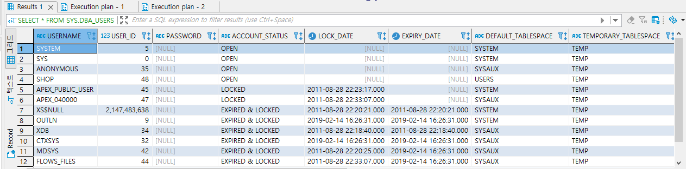
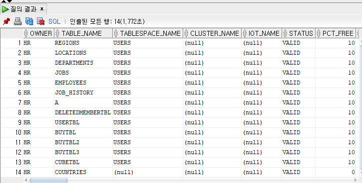
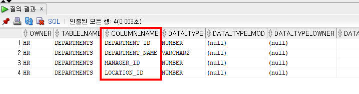
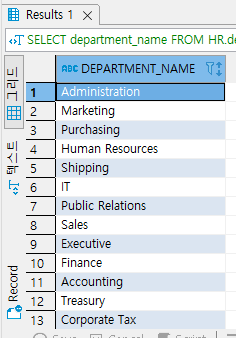
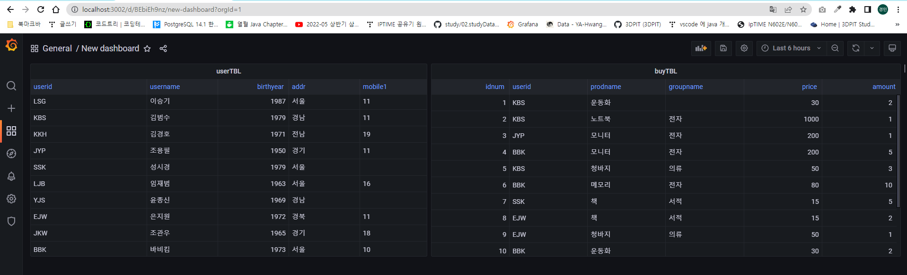

## 2022-05-31-오라클-SELECT문개요-sqlDB생성

## 목차

 >
 >01.SELECT형식
 >
 >02.스키마, 테이블, 필드 이름이 기억나지 않는 경우
 >
 >03.sqlDB스키마 생성 후 테이블 생성후 데이터 입력
 >
 >04.PostgreSQL로 변경하여 그라파나로 테이블 모니터링
 >
 >>04.1 Oracle -> PostgreSQL로 변환
 >>>
 >>04.2 그라파나 대시보드 
 >

## 01.SELECT형식

```sql
SELECT 열 이름
FROM 테이블 이름
WHERE 조건
```

- 실제 사용

  ```sql
  SELECT * FROM employees;
  
  SELECT * FROM HR.employees; -- 원칙대로 하는법
  
  SELECT department_name FROM departments; -- 필요한 열만 출력
  
  SELECT department_id,department_name FROM departments; -- 여러개 열 출력
  ```

  - 조회를 할때 명령문 실행과 스크립트 실행이 있는데 
    - 전체행을 조회할 생각이 아니라면 명령문 실행으로 진행하는것이 좋음
    - 스크립트 실행시 전체 행이 조회가 되기 때문에 데이터가 많은경우 느림

## 02.스키마, 테이블, 필드 이름이 기억나지 않는 경우

```sql\
SELECT * FROM SYS.DBA_USERS;
```



- 위는 SYS.DBA_USERS는 SYS 사용자 소유의 뷰이고

  - 오라클의 사용자의 이름, 아이디, 상태, 만료일, 기본 테이블스페이스, 임시 테이블스페이스, 사용자 생성일자등 확인 가능

- **HR 스키마의 테이블 정보 조회**

  ```sql
  SELECT * FROM SYS.DBA_USERS WHERE OWNER = 'HR'; -- 저장된 SYS 사용자의 테이블 조회
  ```

  

  - 위의 경우 DBeaver에서는 너무 오래걸림
  - SQL Developer에서는 위와 같이 바로 알 수 있음

- **HR.departments 테이블에 열(=컬럼) 확인**

  ```sql
  SELECT * FROM SYS.DBA_TAB_COLUMNS WHERE OWNER = 'HR' AND TABLE_NAME = 'DEPARTMENTS'; -- 테이블의 컬럼 이름 형식 확인
  ```

  

- **찾은 데이터 토대로 전체 조회**

  ```sql
  SELECT department_name FROM HR.departments;
  ```

  

## 03.sqlDB스키마 생성 후 테이블 생성후 데이터 입력

```sql
CREATE USER sqlDB IDENTIFIED BY 1234
	DEFAULT TABLESPACE USERS
	TEMPORARY TABLESPACE TEMP;
	
GRANT CONNECT, resource, dba TO sqlDB;

CREATE TABLE userTBL -- 회원 테이블
(
userID CHAR(8) NOT NULL PRIMARY KEY, -- 사용자 아이디(PK)
userName NVARCHAR2(10) NOT NULL, -- 이름
birthYear NUMBER(4) NOT NULL, -- 출생년도
addr NCHAR(2) NOT NULL, -- 지역(경기, 서울, 경남 식으로 2글자만 입력) 
mobile1 CHAR(3),-- 휴대폰의 국번(010, 011, 016, 017, 018, 019 등)
mobile2 CHAR(8),-- 휴대폰의 나머지 전화번호(하이픈 제외)
height NUMBER(3),
mDate DATE --회원가입일
);

CREATE TABLE buyTBL --회원 구매 테이블
(
idNum NUMBER(8) NOT NULL PRIMARY KEY, --순번(PK)
userID CHAR(8) NOT NULL, --아이디(FK) 
prodName NCHAR(6) NOT NULL, --물품명
groupName NCHAR(4) , -- 분류
price NUMBER(8) NOT NULL, --단가
amount NUMBER(3) NOT NULL, --수량
FOREIGN KEY (userID) REFERENCES userTBL(userID)
);

-- userTBL
INSERT INTO userTBL VALUES('LSG','이승기',1987,'서울','011','11111111',182,'2008-08-08');
INSERT INTO userTBL VALUES('KBS','김범수',1979,'경남','011','22222222',173,'2012-04-04');
INSERT INTO userTBL VALUES('KKH','김경호',1971,'전남','019','33333333',177,'2007-07-07');
INSERT INTO userTBL VALUES('JYP','조용필',1950,'경기','011','44444444',166,'2009-04-04');
INSERT INTO userTBL VALUES('SSK','성시경',1979,'서울',NULL,NULL,186,'2013-12-12');
INSERT INTO userTBL VALUES('LJB','임재범',1963,'서울','016','66666666',182,'2009-09-09');
INSERT INTO userTBL VALUES('YJS','윤종신',1969,'경남',NULL,NULL,170,'2005-05-05');
INSERT INTO userTBL VALUES('EJW','은지원',1972,'경북','011','88888888',174,'2014-03-03');
INSERT INTO userTBL VALUES('JKW','조관우',1965,'경기','018','99999999',172,'2010-10-10');
INSERT INTO userTBL VALUES('BBK','바비킴',1973,'서울','010','00000000',176,'2013-05-05');

-- buyTBL
CREATE SEQUENCE idSEQ;
INSERT INTO buyTBL VALUES(idSEQ.NEXTVAL,'KBS','운동화',NULL,30,2);
INSERT INTO buyTBL VALUES(idSEQ.NEXTVAL,'KBS','노트북','전자',1000,1);
INSERT INTO buyTBL VALUES(idSEQ.NEXTVAL,'JYP','모니터','전자',200,1);
INSERT INTO buyTBL VALUES(idSEQ.NEXTVAL,'BBK','모니터','전자',200,5);
INSERT INTO buyTBL VALUES(idSEQ.NEXTVAL,'KBS','청바지','의류',50,3);
INSERT INTO buyTBL VALUES(idSEQ.NEXTVAL,'BBK','메모리','전자',80,10);
INSERT INTO buyTBL VALUES(idSEQ.NEXTVAL,'SSK','책','서적',15,5);
INSERT INTO buyTBL VALUES(idSEQ.NEXTVAL,'EJW','책','서적',15,2);
INSERT INTO buyTBL VALUES(idSEQ.NEXTVAL,'EJW','청바지','의류',50,1);
INSERT INTO buyTBL VALUES(idSEQ.NEXTVAL,'BBK','운동화',NULL,30,2);
INSERT INTO buyTBL VALUES(idSEQ.NEXTVAL,'EJW','책','서적',15,1);
INSERT INTO buyTBL VALUES(idSEQ.NEXTVAL,'BBK','운동화',NULL,30,2);

COMMIT;

SELECT * FROM userTBL;
SELECT * FROM buyTBL;
```

## 04.PostgreSQL로 변경하여 그라파나로 테이블 모니터링

### 04.1 Oracle -> PostgreSQL로 변환

```sql
create user sqlDB with password '1234';
create database sqlDB with owner sqlDB;
create schema sqlDB authorization sqlDB;
set search_path to "$user", sqlDB;

CREATE TABLE userTBL -- 회원 테이블
(
userID CHAR(8) NOT NULL PRIMARY KEY, --사용자 아이디(PK)
userName varchar(10) NOT NULL, --이름
birthYear numeric NOT NULL, --출생년도
addr NCHAR(2) NOT NULL, --지역(경기, 서울, 경남 식으로 2글자만 입력) 
mobile1 CHAR(3),-- 휴대폰의 국번(010, 011, 016, 017, 018, 019 등)
mobile2 CHAR(8),-- 휴대폰의 나머지 전화번호(하이픈 제외)
height numeric,
mDate DATE --회원가입일
);

CREATE SEQUENCE seq_idNum START 1;

CREATE TABLE buyTBL --회원 구매 테이블
(
idNum numeric NOT NULL PRIMARY KEY DEFAULT nextval('seq_idNum'), --순번(PK)
userID CHAR(8) NOT NULL, --아이디(FK) 
prodName NCHAR(6) NOT NULL, --물품명
groupName NCHAR(4) , -- 분류
price numeric NOT NULL, --단가
amount numeric NOT NULL, --수량
FOREIGN KEY (userID) REFERENCES userTBL(userID)
);

-- userTBL
INSERT INTO userTBL VALUES('LSG','이승기',1987,'서울','011','11111111',182,'2008-08-08')
,('KBS','김범수',1979,'경남','011','22222222',173,'2012-04-04')
,('KKH','김경호',1971,'전남','019','33333333',177,'2007-07-07')
,('JYP','조용필',1950,'경기','011','44444444',166,'2009-04-04')
,('SSK','성시경',1979,'서울',NULL,NULL,186,'2013-12-12')
,('LJB','임재범',1963,'서울','016','66666666',182,'2009-09-09')
,('YJS','윤종신',1969,'경남',NULL,NULL,170,'2005-05-05')
,('EJW','은지원',1972,'경북','011','88888888',174,'2014-03-03')
,('JKW','조관우',1965,'경기','018','99999999',172,'2010-10-10')
,('BBK','바비킴',1973,'서울','010','00000000',176,'2013-05-05');

-- buyTBL
INSERT INTO buyTBL VALUES(nextval('seq_idNum'),'KBS','운동화',NULL,30,2)
,(nextval('seq_idNum'),'KBS','노트북','전자',1000,1)
,(nextval('seq_idNum'),'JYP','모니터','전자',200,1)
,(nextval('seq_idNum'),'BBK','모니터','전자',200,5)
,(nextval('seq_idNum'),'KBS','청바지','의류',50,3)s
,(nextval('seq_idNum'),'BBK','메모리','전자',80,10)
,(nextval('seq_idNum'),'SSK','책','서적',15,5)
,(nextval('seq_idNum'),'EJW','책','서적',15,2)
,(nextval('seq_idNum'),'EJW','청바지','의류',50,1)
,(nextval('seq_idNum'),'BBK','운동화',NULL,30,2)
,(nextval('seq_idNum'),'EJW','책','서적',15,1)
,(nextval('seq_idNum'),'BBK','운동화',NULL,30,2);
```

### 04.2 그라파나 대시보드 



- 위와 같이 postgres로 변환한 테이블을 실시간으로 확인 할 수 있음

  - 각테이블 쿼리

    - userTBL

      ```sql
      select * from userTBL;
      ```

    - buyTBL

      ```sql
      select * from buyTBL;
      ```

      

    