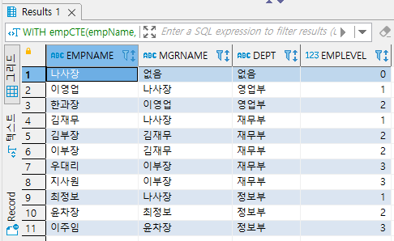
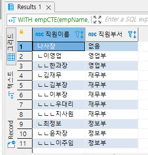
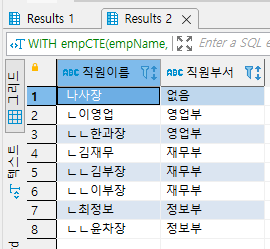
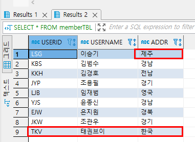

## 2022-06-03-WITH-절,-INSERT,-UPDATE,-DELETE,-MERGE

## 목차

>01.WITH절과 CTE
>
>>01.1 비재귀적 CTE
>>
>>> 01.1.1 중복  CTE
>>
>>01.2 재귀적 CTE
>
>02.SQL구분
>
>>02.1 DML
>>
>>02.2 DDL
>>
>>02.3 DCL
>
>03.데이터의 변경을 위한 SQL문
>
>04.자동으로 증가하는 시퀀스
>
>05.대량의 샘플 데이터 생성
>
>>05.1 데이터의 수정 UPDATE
>>
>>05.2 테이터의 삭제 DELETE FROM
>>
>>> 05.2.1 데이터 삭제하는 방식
>
>06.조건부 데이터 변경 MERGE

## 01.WITH절과 CTE

- WITH절은 CTE(Common Table Expression) 표현하기 위한 구문
  - CTE는 기존의 뷰, 파생의 테이블, 임시 테이블등으로 사용되던 것을 대신할 수 있음

### 01.1 비재귀적 CTE

- 말 그대로 재귀적이지 않은 CTE이다.

  - 복잡한 쿼리 문장을 단순화시킨 데에 적합하게 사용될 수 있음

- 형식

  ```sql
  WITH CTE 테이블이름(열 이름)
  AS
  (
  	<쿼리문>
  )
  SELECT 열 이름 FROM CTE_테이블 이름;
  ```

- 사용 법

  ```sql
  WITH abc(userID, total)
  AS
  (
  	SELECT userID, SUM(price*amount)
  		FROM buyTBL
  	GROUP BY USERID 		
  )
  SELECT * FROM abc ORDER BY total DESC;
  ```

- **각 지역별로 가장 큰 키 뽑는 쿼리**

  - 1단계

    ```sql
    SELECT addr, MAX(height) FROM userTbl GROUP BY addr
    ```

  - 2단계

    ```sql
    WITH cte_table(addr, maxHeight)
    AS
    (
        SELECT addr, MAX(height) FROM userTbl GROUP BY addr
    )
    ```

  - 3단계

    ```sql
    SELECT AVG(height) FROM cte_table;
    ```

  - 4단계

    ```sql
    WITH cte_table(addr, maxHeight)
    AS
    (
    	SELECT addr, MAX(height) FROM userTbl GROUP BY addr
    )
    SELECT AVG(maxHeight) FROM cte_table;
    ```

#### 01.1.1 중복  CTE

- 형식

  ```sql
  WITH AAA (컬럼들) AS
  (AAA의 쿼리문)
  , BBB (컬럼들)
  AS (BBB의 쿼리문)
  , CCC (컬럼들)
  AS (CCC의 쿼리문)
  SELECT * FROM [AAA 또는 BBB 또는 CCC]
  ```

- 사용법

  ```sql
  WITH AAA (userID, total) AS
  (SELECT userID, SUM(price*amount) FROM buyTbl GROUP BY userID)
  , BBB (sumtotal)
  AS (SELECT SUM(total) FROM AAA)
  , CCC (sumavg)
  AS (SELECT sumtotal / (SELECT count(*) FROM buyTbl) FROM BBB)
  SELECT * FROM CCC;
  ```

### 01.2 재귀적 CTE

- 재귀적이란 자기자신을 반복적으로 호출한다는 의미를 내포

  - 왜 조직도가 재귀적인가?
    - 어떤 사람은 직원일 수 도 있고 상관일 수도 있는 경우가 있기 때문에

- 형식

  ```sql
  WITH CTE_테이블이름(열 이름)
  AS
  (
      	<쿼리문1: SELECT * FROM 테이블A>
      	UNION ALL
      	<쿼리문2: SELECT * FROM 테이블A JOIN CTE_테이블이름>
  )
  SELECT * FROM CTE_테이블 이름;
  ```

  - <쿼리문1>을 앵커 멤버
  - <쿼리문2>f를 재귀 멤버라고 지칭

- 사용법1

  ```sql
  WITH empCTE(empName, mgrName, dept, empLevel)
  AS
  (
   ( SELECT emp, manager, department , 0  
         FROM empTbl 
         WHERE manager = '없음' ) -- 상관이 없는 사람이 바로 사장
    UNION ALL
    (SELECT empTbl.emp, empTbl.manager, empTbl.department, empCTE.empLevel+1
     FROM empTbl INNER JOIN empCTE 
          ON empTbl.manager = empCTE.empName)
  )
  SELECT * FROM empCTE ORDER BY dept, empLevel;
  ```

  

- 사용법2

  ```sql
  
  WITH empCTE(empName, mgrName, dept, empLevel)
  AS
  (
   ( SELECT emp, manager, department , 0  
         FROM empTbl 
         WHERE manager = '없음' ) -- 상관이 없는 사람이 바로 사장
    UNION ALL
    (SELECT empTbl.emp, empTbl.manager, empTbl.department, empCTE.empLevel+1
     FROM empTbl INNER JOIN empCTE 
          ON empTbl.manager = empCTE.empName)
  )
  SELECT CONCAT(RPAD(' ㄴ', empLevel*2 + 1, 'ㄴ'),  empName) AS "직원이름", dept AS "직원부서"
     FROM empCTE  ORDER BY dept, empLevel;
  ```

  

- 사용법3 | 사원 제외한 결과 보여주기

  ```sql
  WITH empCTE(empName, mgrName, dept, empLevel)
  AS
  (
   ( SELECT emp, manager, department , 0  
         FROM empTbl 
         WHERE manager = '없음' ) -- 상관이 없는 사람이 바로 사장
    UNION ALL
    (SELECT empTbl.emp, empTbl.manager, empTbl.department, empCTE.empLevel+1
     FROM empTbl INNER JOIN empCTE 
          ON empTbl.manager = empCTE.empName
     WHERE empLevel < 2)
  )
  SELECT CONCAT(RPAD(' ㄴ', empLevel*2 + 1, 'ㄴ'),  empName) AS "직원이름", dept AS "직원부서"
     FROM empCTE  ORDER BY dept, empLevel;
  ```

  

## 02.SQL구분

- SQL문은 크게 DML, DDL, DCL로 분류

### 02.1 DML

- 데이터 조작 언어는 데이터를 조작(선택, 삽입, 수정, 삭제)하는 데 사용되는 언어
  - DML 구문이 사용되는 대상은 테이블
    - 그래서 테이블이 정의되어 있어야함
- SELECT, INSERT, UPDATE, DELETE가 DML문에 해당
  - 트랜잭션이 발생하는 SQL도 DML
    - **트랜잭션이란?**
      - 테이블의 데이터를 변경(입력/수정/삭제) 할 때 실제 테이블에 완전히 적용하지 않고, 임시로 적용시키는 것을 말함
        - 실수를 하더라도 임시로 적용시킨 것을 취소시킬 수 있게 해줌
      - COMMIT문을 사용하면 트랜잭션 완전히 적용
      - ROLLBACK문을 사용하면 트랜잭션 취소이다.

### 02.2 DDL

- 데이터 정의 언어는 데이터베이스, 테이블, 뷰, 인덱스등의 데이터베이스 개체를 
  - 생성, 삭제, 변경하는 역할을 함
    - 자주사용하는 DDL (CREATE, DROP, ALTER)등
  - DDL은 트랜잭션을 발생시키지 않음
    - 따라서 ROLLBACK, COMMIT을 시킬 수 없음
    - 즉, 실행 즉시 Oracle에서 적용됨

### 02.3 DCL

- 데이터 제어 언어는 사용자에게 어떤 권한을 부여하거나 빼앗을때 주로 사용
  - GRANT/ REVOKE/ DENY등이 있음

## 03.데이터의 변경을 위한 SQL문

- 형식

  ```sql
  INSERT INTO 테이블이름 (열1, 열2, ...) VALUES (값1, 값2, ...)
  ```

- 사용법

  ```sql
  INSERT INTO testTBL1 VALUES (1, '홍길동', 25);
  
  INSERT INTO testTBL1(id, userName) VALUES (2, '설현');
  
  INSERT INTO testTBL1(userName, age, id) VALUES ('지민', 26,  3);
  ```

  - 열이름을 안써도 되지만 순서를 잘 맞춰야하고 대개 3번째 형식을 원칙으로 한다.

## 04.자동으로 증가하는 시퀀스

- 사용법

  ```sql
  CREATE TABLE testTBL2 
     (id NUMBER(4), 
      userName NCHAR(3), 
      age NUMBER(2),
      nation NCHAR(4) DEFAULT '대한민국');
  
  CREATE SEQUENCE idSEQ
      START WITH 1   -- 시작값
      INCREMENT BY 1 ;  -- 증가값
  
  DROP SEQUENCE idSEQ;
  
  INSERT INTO testTBL2 VALUES (idSEQ.NEXTVAL, '유나' ,25 , DEFAULT);
  INSERT INTO testTBL2 VALUES (idSEQ.NEXTVAL, '혜정' ,24 , '영국');
  SELECT * FROM testTBL2;
  
  INSERT INTO testTBL2 VALUES (11, '쯔위' , 18, '대만'); 
  ALTER SEQUENCE idSEQ  
     INCREMENT BY  10; 
  INSERT INTO testTBL2 VALUES (idSEQ.NEXTVAL, '미나' , 21, '일본'); 
  ALTER SEQUENCE idSEQ  
     INCREMENT BY  1; 
  SELECT * FROM testTBL2;
  
  SELECT idSEQ.CURRVAL FROM DUAL;
  
  SELECT 100*100 FROM DUAL;
  
  CREATE TABLE testTBL3 (id  NUMBER(3));
  
  CREATE  SEQUENCE cycleSEQ
    START WITH 100
    INCREMENT BY 100
    MINVALUE 100   -- 최소값
    MAXVALUE 300   -- 최대값
    CYCLE           -- 반복설정
    NOCACHE ;       -- 캐시 사용 안함
  INSERT INTO testTBL3 VALUES  (cycleSEQ.NEXTVAL);
  INSERT INTO testTBL3 VALUES  (cycleSEQ.NEXTVAL);
  INSERT INTO testTBL3 VALUES  (cycleSEQ.NEXTVAL);
  INSERT INTO testTBL3 VALUES  (cycleSEQ.NEXTVAL);
  
  SELECT * FROM testTBL3;
  ```

## 05.대량의 샘플 데이터 생성

- 대량의 샘플 데이터를 만들기 위해서는 

  - INSERT INTO ... SELECT구문을 사용

- 형식

  ```sql
  INSERT INTO 테이블이름 (열이름1, 열이름2, ...)
  	SELECT 문;
  ```

  - SELECT문의 열의 개수와 INSERT를 할 테이블 열 개수가 일치해야함

- 사용법

  ```sql
  CREATE TABLE testTBL4 (empID NUMBER(6), FirstName VARCHAR2(20), 
      LastName VARCHAR2(25), Phone VARCHAR2(20));
  INSERT INTO testTBL4 
    SELECT EMPLOYEE_ID, FIRST_NAME, LAST_NAME, PHONE_NUMBER
      FROM HR.employees ;
  
  CREATE TABLE testTBL5 AS
     (SELECT EMPLOYEE_ID, FIRST_NAME, LAST_NAME, PHONE_NUMBER
         FROM HR.employees) ;
  
  COMMIT;
  ```

### 05.1 데이터의 수정 UPDATE

- 형식

  ```sql
  UPDATE 테이블이름
  	SET 열1 = 값1, 열2 = 값2 ...
  	WHERE 조건;
  ```

- 사용법

  ```sql
  UPDATE testTBL4
  	SET Phone = '없음'
  	WHERE FirstName = 'David';
  	
  -- 전체 테이블 내용 변경
  UPDATE buyTBL SET price = price * 1.5;
  ```

### 05.2 테이터의 삭제 DELETE FROM

- 행 단위로 삭제함

- 형식

  ```sql
  DELETE FROM 테이블이름 WHERE 조건;
  ```

- 사용법

  ```sql
  DELETE FROM testTBL4 WHERE FirstName = 'Peter'; -- Peter이름 전체 삭제
   
  DELETE FROM testTBL4 WHERE FirstName = 'Peter' AND ROWNUM <=2;
  ```

#### 05.2.1 데이터 삭제하는 방식

```sql
DELETE FROM 테이블이름;

DROP TABLE 테이블이름;

TRUNCATE TABLE 테이블이름;
```

- 데이터가 많은 경우 DELETE는 너무 느리다.
  - 그냥 테이블이 필요가 없다면 DROP으로 하는게 더 빠름
  - TRUNCATE는 트랜잭션이 발생하지 않으므로 빠르게 제거된다.

## 06.조건부 데이터 변경 MERGE

- 하나의 문장에서 INSERT, UPDATE, delete를 수행할 수 있는 구문

- 형식

  ```sql
  MERGE [hint]
  	INTO 테이블이름 테이블별칭
  	USING {테이블
  			서브쿼리
  	}테이블 별칭
  	ON (조건)
  	WHEN MATCHED THEN
  		UPDATE SET WHERE
  		DELETE 
  	WHEN NOT MATCHED THEN
  		INSERT VALUES
  ... 
  ```

- 사용법

  ```sql
  MERGE INTO memberTBL M -- 변경될 테이블(target 테이블)
  -- 변경할 기준이 되는 테이블 (source 테이블)
    USING (SELECT changeType, userID, userName, addr FROM changeTBL)  C  
    ON (M.userID = C.userID)  
    WHEN MATCHED  THEN
        UPDATE SET M.addr = C.addr
        -- target 테이블에 source테이블의 행이 있고, 사유가 회원탈퇴라면 행 삭제
        DELETE WHERE C.changeType = '회원탈퇴'
        -- target 테이블에 source 테이블의 행이 없으면 새로운 행 추가
    WHEN NOT MATCHED  THEN
       INSERT (userID, userName,  addr)  VALUES(C.userID, C.userName,  C.addr) ;



- 변경되고 추가됨 확인하면됨