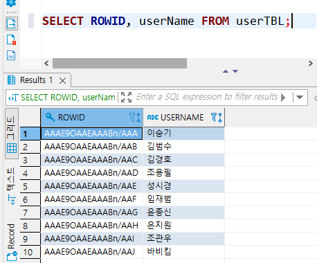
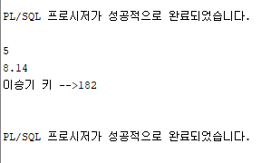
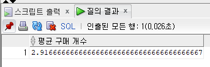
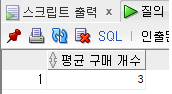
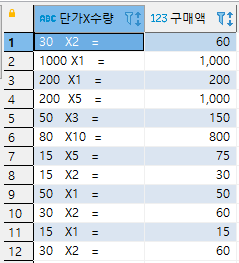
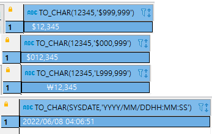
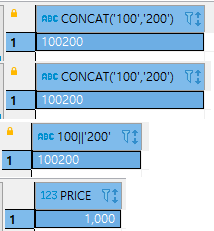

## 2022-06-08-Oracle-데이터형식,-변수,-형변환

## 목차

>01.데이터 형식
>
>>01.1 숫자 데이터 형식
>>
>>01.2 문자 데이터 형식
>>
>>01.3 이진 데이터 형식
>>
>>01.4 날짜와 시간 데이터 형식
>>
>>01.5 기타데이터형식
>
>02.PL/SQL의 바인드 변수
>
>03.데이터 형식과 형변환
>
>04.날짜형식
>
>05.나머지 변환
>
>>05.1 데이터 형식과 형 변환
>>
>>05.2 암시적인 형 변환
>

## 01.데이터 형식

### 01.1 숫자 데이터 형식

| 자주사용 유무 | Oracle        | 바이트 수 | 숫자 범위              | 설명                                                         |
| ------------- | ------------- | --------- | ---------------------- | ------------------------------------------------------------ |
| X             | BINARY_FLOAT  | 4         |                        | 32bit 부동 소수점                                            |
| X             | BINARY_DOUBLE | 8         |                        | 64bit 부동 소수점                                            |
| O             | NUMBER(p,[s]) | 5 ~ 21    | p: 1~38<br />s: 84~127 | 전체 자리수 (p)와 소수점 이하 자릿수(s)를 가진 숫자형 (예: NUMBER(5,2)는 전체 자릿수를 5자리로 하되, 그 중 소수점 이하를 2자리로 하겠다는 의미) |

```sql
SELECT CAST(1234567.89 AS NUMBER) FROM DUAL; --1234567.89
SELECT CAST(1234567.89 AS NUMBER(9)) FROM DUAL; --1234568
SELECT CAST(1234567.89 AS NUMBER(9,2)) FROM DUAL; --1234567.89
SELECT CAST(1234567.89 AS NUMBER(9,1)) FROM DUAL; --1234567.9
SELECT CAST(1234567.89 AS NUMBER(*,1)) FROM DUAL; --1234567.9
SELECT CAST(1234567.89 AS NUMBER(7,-2)) FROM DUAL; --1234600
SELECT CAST(1234567.89 AS NUMBER(6)) FROM DUAL; --실행안됨
```

### 01.2 문자 데이터 형식

| 자주사용 유무 | Oracle       | 바이트 수  | 설명                                                         |
| ------------- | ------------ | ---------- | ------------------------------------------------------------ |
| O             | CHAR[(n)]    | 1~2000     | 고정 길이 문자형, 숫자 없이 사용시 CHAR(1)과 동일            |
| O             | NCHAR[(n)]   | 2~2000     | 유니코드 고정길이 문자형, n을 1부터 1000까지 지정, 한글을 저장할 수 있음(한글자 당 2Byte사용됨), 숫자 없이 사용시 NCHAR(1)과 동일 |
| O             | VARCHAR2(n)  | 1~4000     | 가변길이 문자형                                              |
| O             | NVARCHAR2(n) | 2~4000     | 유니코드 가변길이 문자형, 한글을 저장할 수 있음, 한글자당 2Byte가 사용됨 |
| O             | CLOB         | 최대 128TB | 대용량 덱스트의 데이터 타입(영문)                            |
| O             | NCLOB        | 최대 128TB | 대용량 텍스트의 유니코드 데이터 타입(한글, 일본어, 한자등)   |

- CHAR나 NCHAR의 경우 고정이라서 CHAR(100)에 'ABC' 3글자만 저장하는 경우
  - 100자리를 모두 확보한 후에 앞에 3자리를 사용하고 뒤의 97자리는 낭비됨
- VARCHAR2, NVARCHAR2의 경우 'ABC'저장하면 딱 3자리만 사용한다.
  - 그래서 상황에 맞게 쓰면된다.

### 01.3 이진 데이터 형식

| 자주사용 유무 | Oracle | 바이트 수                            | 설명                                                         |
| ------------- | ------ | ------------------------------------ | ------------------------------------------------------------ |
| O             | BLOB   | 최대 128TB                           | 대용량 이진(Binary) 데이터를 저장할 수 있는 데이터 타입, Binary LOB의 약자 |
| X             | BFILE  | 운영체제에서 허용하는 크기(대개 4GB) | 대용량 이진(Binary)데이터를 파일 형태로 저장함, Oracle 내부에 저장하지 않고, 운영체제에 외부 파일 형태로 저장됨, Binary FILE의 약자 |

- 위의 경우는 이미지, 동영상, 음악, 지도 데이터 등을 저장하기 위한 데이터 형식
  - 차이는 BLOB는 오라클 내부에 저장
  - BFILE은 운영체제 파일 형태로 저장하고 파일 위치만 Oracle내부에 저장

### 01.4 날짜와 시간 데이터 형식

| 자주사용 유무 | Oracle                         | 바이트 수 | 설명                                                         |
| ------------- | ------------------------------ | --------- | ------------------------------------------------------------ |
| O             | DATE                           | 7         | 날짜는 기원전 4712년 1월 1일 부터 9999년 12월 31일까지 저장됨(연, 월, 일 , 시, 분, 초가 저장됨) |
| X             | TIMESTAMP                      | 11        | DATE와 같으나 밀리초 단위까지 저장됨                         |
| X             | TIMESTAMP WITH TIME ZONE       | 13        | 날짜 및 시간대 형태의 데이터 형식                            |
| X             | TIMESTAMP WITH LOCAL TIME ZONE | 11        | 날짜 및 시간대 데이터 형식, 단 조회시에는 클라이언트의 시간대로 보여짐 |

```sql
SELECT SYSDATE FROM DUAL ; -- 현재 날짜
SELECT TO_CHAR(SYSDATE, 'YYYY/MM/DD HH:MM:SS') "현재 날짜" FROM DUAL; 
SELECT TO_DATE('20201231235959', 'YYYYMMDDHH24MISS') "날짜 형식" FROM DUAL; 
```

### 01.5 기타데이터형식

| 자주사용 유무 | Oracle   | 바이트 수 | 설명                                                         |
| ------------- | -------- | --------- | ------------------------------------------------------------ |
| X             | RAWID    | 10        | 행의 물리적인 주소를 저장하기 위한 데이터 형식으로 모든 행에 자동으로 RAWID열이 생성됨 |
| X             | XML Type | N/A       | XML 데이터를 저장하기 위한 데이터 형식                       |
| X             | URLType  | N/A       | URL 형식의 데이터를 저장하기 위한 데이터 형식                |

```sql
SELECT ROWID, userName FROM userTBL;
```




 ## 02.PL/SQL의 바인드 변수

- **형식**

  ```sql
  DECLARE
  	변수이름1 데이터형식;
  	변수이름2 데이터형식;
  BEGIN
  	변수이름1 := 값;
  	SELECT 열 이름 INTO 변수이름2 FROM 테이블;
  END;
  ```

- 사용법

  - **Oracle**

    ```sql
    SET SERVEROUTPUT ON;
    
    DECLARE
       myVar1 NUMBER(3) ; 
       myVar2 NUMBER(5,2) := 3.14 ; 
       myVar3 NVARCHAR2(20) := '이승기 키 -->' ; 
    BEGIN
       myVar1 := 5;
       DBMS_OUTPUT.PUT_LINE(myVar1);
       DBMS_OUTPUT.PUT_LINE(myVar1 + myVar2);
       SELECT height INTO myVar1 FROM userTbl WHERE userName = '이승기' ;
       DBMS_OUTPUT.PUT_LINE(myVar3 || TO_CHAR(myVar1));
    END ;
    ```

    

  - **준비**

    ```sql
    CREATE TABLE userTBL -- 회원 테이블
    ( userID  	CHAR(8) NOT NULL PRIMARY KEY, -- 사용자 아이디(PK)
      userName  	NVARCHAR2(10) NOT NULL, -- 이름
      birthYear 	NUMBER(4) NOT NULL,  -- 출생년도
      addr	  	NCHAR(2) NOT NULL, -- 지역(경기,서울,경남 식으로 2글자만입력)
      mobile1	CHAR(3), -- 휴대폰의 국번(010, 011, 016, 017, 018, 019 등)
      mobile2	CHAR(8), -- 휴대폰의 나머지 전화번호(하이픈제외)
      height    	NUMBER(3),  -- 키
      mDate    	DATE  -- 회원 가입일
    );
    
    CREATE TABLE buyTBL -- 회원 구매 테이블
    (  idNum 	NUMBER(8) NOT NULL PRIMARY KEY, -- 순번(PK)
       userID  	CHAR(8) NOT NULL, -- 아이디(FK)
       prodName 	NCHAR(6) NOT NULL, --  물품명
       groupName 	NCHAR(4)  , -- 분류
       price     	NUMBER(8)  NOT NULL, -- 단가
       amount    	NUMBER(3)  NOT NULL, -- 수량
       FOREIGN KEY (userID) REFERENCES userTBL(userID)
    );
    
    INSERT INTO userTBL VALUES('LSG', '이승기', 1987, '서울', '011', '11111111', 182, '2008-8-8');
    INSERT INTO userTBL VALUES('KBS', '김범수', 1979, '경남', '011', '22222222', 173, '2012-4-4');
    INSERT INTO userTBL VALUES('KKH', '김경호', 1971, '전남', '019', '33333333', 177, '2007-7-7');
    INSERT INTO userTBL VALUES('JYP', '조용필', 1950, '경기', '011', '44444444', 166, '2009-4-4');
    INSERT INTO userTBL VALUES('SSK', '성시경', 1979, '서울', NULL  , NULL      , 186, '2013-12-12');
    INSERT INTO userTBL VALUES('LJB', '임재범', 1963, '서울', '016', '66666666', 182, '2009-9-9');
    INSERT INTO userTBL VALUES('YJS', '윤종신', 1969, '경남', NULL  , NULL      , 170, '2005-5-5');
    INSERT INTO userTBL VALUES('EJW', '은지원', 1972, '경북', '011', '88888888', 174, '2014-3-3');
    INSERT INTO userTBL VALUES('JKW', '조관우', 1965, '경기', '018', '99999999', 172, '2010-10-10');
    INSERT INTO userTBL VALUES('BBK', '바비킴', 1973, '서울', '010', '00000000', 176, '2013-5-5');
    
    drop SEQUENCE idSEQ;
    CREATE SEQUENCE idSEQ; -- 순차번호 입력을 위해서 시퀀스 생성
    INSERT INTO buyTBL VALUES(idSEQ.NEXTVAL, 'KBS', '운동화', NULL   , 30,   2);
    INSERT INTO buyTBL VALUES(idSEQ.NEXTVAL, 'KBS', '노트북', '전자', 1000, 1);
    INSERT INTO buyTBL VALUES(idSEQ.NEXTVAL, 'JYP', '모니터', '전자', 200,  1);
    INSERT INTO buyTBL VALUES(idSEQ.NEXTVAL, 'BBK', '모니터', '전자', 200,  5);
    INSERT INTO buyTBL VALUES(idSEQ.NEXTVAL, 'KBS', '청바지', '의류', 50,   3);
    INSERT INTO buyTBL VALUES(idSEQ.NEXTVAL, 'BBK', '메모리', '전자', 80,  10);
    INSERT INTO buyTBL VALUES(idSEQ.NEXTVAL, 'SSK', '책'    , '서적', 15,   5);
    INSERT INTO buyTBL VALUES(idSEQ.NEXTVAL, 'EJW', '책'    , '서적', 15,   2);
    INSERT INTO buyTBL VALUES(idSEQ.NEXTVAL, 'EJW', '청바지', '의류', 50,   1);
    INSERT INTO buyTBL VALUES(idSEQ.NEXTVAL, 'BBK', '운동화', NULL   , 30,   2);
    INSERT INTO buyTBL VALUES(idSEQ.NEXTVAL, 'EJW', '책'    , '서적', 15,   1);
    INSERT INTO buyTBL VALUES(idSEQ.NEXTVAL, 'BBK', '운동화', NULL   , 30,   2); 
    ```

## 03.데이터 형식과 형변환

- 일반적으로 CAST()함수 사용

  - 그 외에도 TO_CHAR(), TO_NUMBER(), TO_DATE()함수도 사용

- 형식

  ```sql
  CAST( expression AS 데이터 형식)
  ```

  - 데이터 형식 중 가능한 것
    - BINARY_FLOAT,  BINARY_DOUBLE, CHAR, VARCHAR2, NUMBER, DATETIME, NCHAR, NVARCHAR2

- 사용법

  ```sql
  SELECT AVG(amount) AS "평균 구매 개수" FROM buyTBL;
  ```

  

  - **Oracle**

    ```sql
    SELECT CAST(AVG(amount) AS NUMBER(3))AS "평균 구매 개수" FROM buyTBL;
    ```

    

  - **Postgres**

    ```sql
    SELECT CAST(AVG(amount) AS SMALLINT)AS "평균 구매 개수" FROM buyTBL;
    ```

## 04.날짜형식

- **Oracle**

  ```sql
  SELECT CAST('2020$12$12' AS DATE) FROM DUAL;
  SELECT CAST('2020/12/12' AS DATE) FROM DUAL;
  SELECT CAST('2020%12%12' AS DATE) FROM DUAL;
  SELECT CAST('2020@12@12' AS DATE) FROM DUAL;
  ```

  - 위처럼 다양한 구분자라도 날짜 형식으로 변경 가능

## 05.나머지 변환

### 05.1 데이터 형식과 형 변환

- **Oracle**

  ```sql
  SELECT CAST(price AS CHAR(5)) || 'X' || CAST(amount AS CHAR(4)) || '=' AS "단가X수량",	price*amount AS "구매액" 
    FROM buyTbl ;
  ```

  

  ```sql
  SELECT TO_CHAR(12345, '$999,999') FROM DUAL;
  SELECT TO_CHAR(12345, '$000,999') FROM DUAL;
  SELECT TO_CHAR(12345, 'L999,999') FROM DUAL;
  SELECT TO_CHAR(SYSDATE, 'YYYY/MM/DD HH:MM:SS') FROM DUAL;
  ```

  

  ```sql
  SELECT TO_CHAR(10, 'X'), TO_CHAR(255, 'XX') FROM DUAL;
  
  SELECT TO_NUMBER('A', 'X'), TO_NUMBER('FF', 'XX') FROM DUAL;
  
  SELECT TO_NUMBER('0123'), TO_NUMBER('1234.456') FROM DUAL;
  ```

  

### 05.2 암시적인 형 변환

- 형변환 방식에는 명시적 변환과 암시적인 변환 있음
  - 명시적 변환
    - CAST(), TO_CHAR(), TO_NUMBER()등 함수를 이용해서 데이터 형식 변환
  - 암시적 변환
    - 위를 사용하지 않고 형이 변환되는 것

```sql
SELECT '100' + '200' FROM DUAL; -- 문자와 문자를 더함 (정수로 변환되서 연산됨)
SELECT CONCAT('100', '200') FROM DUAL; -- 문자와 문자를 연결 (문자로 처리)
SELECT 100 || '200' FROM DUAL; -- 정수와 문자를 연결 (정수가 문자로 변환되서 처리)
SELECT price  FROM buyTBL WHERE price >= '500'; -- 정수 500으로 변환
```




