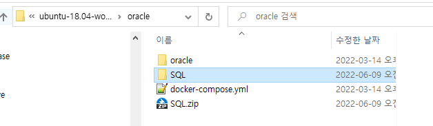
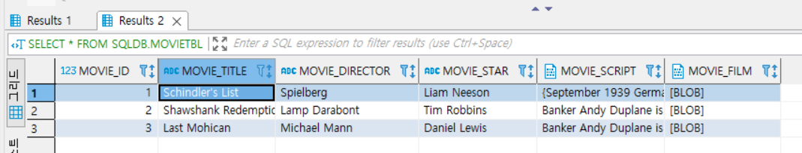

## 2022-06-08-oracle과-postgres-8일차비교

## 목차

> 01.문자열 함수
>
> 02.숫자 및 수학 함수
>
> 03.날짜 및 시간 함수
>
> 04.형 변환 함수
>
> 05.분석 함수/순위 함수
>
> >  05.1 순위 함수
> >
> >  05.2 분석 함수
> >
> >  05.3 피벗 테이블 실습
>
> 06.CLOB, BLOB 데이터 타입에 대용량 데이터 입력
>
> >  06.1 docker db접속
> >
> >  06.2 컨테이너에 파일 복사
> >
> >  06.3 sqlldr 명령어 사용
>

## 01.문자열 함수

- **Oracle**

  ```sql
  SELECT ASCII('A'), CHR(65), ASCIISTR('한'), UNISTR('\D55C') FROM DUAL;

  SELECT LENGTH('한글'), LENGTH('AB'), LENGTHB('한글'), LENGTHB('AB') FROM DUAL;

  SELECT CONCAT('이것이',' Oracle이다'), '이것이' || ' ' || 'Oracle이다'  FROM DUAL;

  SELECT INSTR('이것이 Oracle이다. 이것도 오라클이다', '이것') FROM DUAL;

  SELECT INSTR('이것이 Oracle이다. 이것도 오라클이다', '이것', 2) FROM DUAL;
  
  SELECT INSTRB('이것이 Oracle이다. 이것도 오라클이다', '이것', 2) FROM DUAL;
  
  SELECT LOWER('abcdEFGH'), UPPER('abcdEFGH'), INITCAP('this is oracle') FROM DUAL;
  
  SELECT REPLACE ('이것이 Oracle이다', '이것이' , 'This is') FROM DUAL;
  
  SELECT TRANSLATE('이것이 Oracle이다', '이것' , 'AB') FROM DUAL;
  
  SELECT SUBSTR('대한민국만세', 3, 2) FROM DUAL;
  
  SELECT REVERSE('Oracle') FROM DUAL;
  
  SELECT LPAD('이것이', 10, '##'), RPAD('이것이', 10, '##') FROM DUAL;
  
  SELECT LTRIM('   이것이'), RTRIM('이것이$$$', '$') FROM DUAL;
  
  SELECT TRIM('   이것이   '), TRIM(BOTH 'ㅋ' FROM 'ㅋㅋㅋ재밌어요.ㅋㅋㅋ') FROM DUAL;
  
  SELECT REGEXP_COUNT('이것이 오라클이다.', '이') FROM DUAL;
  ```

- **Postgres**

  ```sql
  SELECT ASCII('A'), CHR(65), UNISTR('\D55C');
  
  SELECT LENGTH('한글'), LENGTH('AB'), octet_length('한글'), octet_length('AB');
  
  SELECT CONCAT('이것이',' Oracle이다'), '이것이' || ' ' || 'Oracle이다' ;
  
  SELECT POSITION('이것' IN '이것이 Oracle이다. 이것도 오라클이다');
  
  SELECT INSTR('이것이 Oracle이다. 이것도 오라클이다', '이것',3, 2);
  
  SELECT INSTRB('이것이 Oracle이다. 이것도 오라클이다', '이것', 2);
  
  SELECT LOWER('abcdEFGH'), UPPER('abcdEFGH'), INITCAP('this is oracle');
  
  SELECT REPLACE ('이것이 Oracle이다', '이것이' , 'This is');
  
  SELECT TRANSLATE('이것이 Oracle이다', '이것' , 'AB');
  
  SELECT SUBSTR('대한민국만세', 3, 2);
  
  SELECT REVERSE('Oracle');
  
  SELECT LPAD('이것이', 10, '##'), RPAD('이것이', 10, '##');
  
  SELECT LTRIM('   이것이'), RTRIM('이것이$$$', '$');
  
  SELECT TRIM('   이것이   '), TRIM(BOTH 'ㅋ' FROM 'ㅋㅋㅋ재밌어요.ㅋㅋㅋ');
  ```

  - ASCIISTR() 없음
  - LENGTHB -> octet_length
  - INSTR, INSTRB 없음
  - REGEXP_COUNT의 경우 15버전부터는 추가됨

## 02.숫자 및 수학 함수

- **Oracle**

  ```sql
  SELECT ABS(-100) FROM DUAL;
  
  SELECT CEIL(4.7), FLOOR(4.7), ROUND(4.7) FROM DUAL;
  
  SELECT MOD(157, 10) FROM DUAL;
  
  SELECT POWER(2,3), SQRT(9) FROM DUAL;
  
  SELECT SIGN(100), SIGN(0), SIGN(-100.123) FROM DUAL;
  
  SELECT TRUNC(12345.12345, 2), TRUNC(12345.12345, -2) FROM DUAL;
  ```

- **Postgres**

  ```sql
  SELECT ABS(-100);
  
  SELECT CEIL(4.7), FLOOR(4.7), ROUND(4.7);
  
  SELECT MOD(157, 10);
  
  SELECT POWER(2,3), SQRT(9);
  
  SELECT SIGN(100), SIGN(0), SIGN(-100.123);
  
  SELECT TRUNC(12345.12345, 2), TRUNC(12345.12345, -2);
  ```

## 03.날짜 및 시간 함수

- **Oracle**

  ```sql
  
  SELECT ADD_MONTHS('2020-01-01', 5), ADD_MONTHS(SYSDATE, -5)  FROM DUAL;
  SELECT TO_DATE('2020-01-01') + 5,  SYSDATE - 5  FROM DUAL;
  
  SELECT CURRENT_DATE, SYSDATE, CURRENT_TIMESTAMP FROM DUAL;
  
  SELECT EXTRACT(YEAR FROM DATE '2020-12-25'), EXTRACT(DAY FROM SYSDATE) FROM DUAL;
  
  SELECT LAST_DAY('2020-02-01') FROM DUAL;
  
  SELECT NEXT_DAY('2020-02-01', '월요일'), NEXT_DAY(SYSDATE, '일요일')  FROM DUAL;
  
  SELECT MONTHS_BETWEEN (SYSDATE, '1988-09-17') FROM DUAL;
  ```

- **Postgres**

  ```sql
  SELECT TO_DATE('2020-01-01','YYYYMMDD')+ interval'5' month, NOW() -interval '5' month;
  
  SELECT CURRENT_DATE, NOW(), CURRENT_TIMESTAMP;
  
  SELECT EXTRACT(YEAR FROM DATE '2020-12-25'), EXTRACT(DAY FROM CURRENT_TIMESTAMP);
  
  SELECT EXTRACT(YEAR FROM AGE(CURRENT_TIMESTAMP, TIMESTAMP '1988-09-17')) * 12 +
                EXTRACT(MONTH FROM AGE(CURRENT_TIMESTAMP, TIMESTAMP '1988-09-17'));
  ```

  - LAST_DAY
  - NEXT_DAY
  - MONTHS_BETWEEN 없어서 만들어야함 다른것도 만들어서 써야함

## 04.형 변환 함수

- **Oracle**

  ```sql
  SELECT BIN_TO_NUM(1,0), BIN_TO_NUM(1,1,1,1)  FROM DUAL;
  
  SELECT NUMTODSINTERVAL(48, 'HOUR'), NUMTODSINTERVAL(360000, 'SECOND') FROM DUAL;
  
  SELECT NUMTOYMINTERVAL(37, 'MONTH'), NUMTOYMINTERVAL(1.5, 'YEAR') FROM DUAL;
  ```

- **Postgres**

  ```sql
  select ('0010'::bit(4))::integer, ('1111'::bit(4))::integer;
  ```

  - BIN_TO_NUM 없음
  - NUMTODSINTERVAL 없음

## 05.분석 함수/순위 함수

### 05.1 순위 함수

- **Oracle**

  ```sql
  SELECT ROW_NUMBER( ) OVER(ORDER BY height DESC) "키큰순위", userName, addr, height
     FROM userTBL ;
  
  SELECT ROW_NUMBER( ) OVER(ORDER BY height DESC, userName ASC) "키큰순위", userName, addr, height
     FROM userTbl ;
  
  SELECT addr, ROW_NUMBER( ) OVER(PARTITION BY addr ORDER BY height DESC, userName ASC) "지역별키큰순위", userName, height
     FROM userTbl ;
  
  SELECT DENSE_RANK( ) OVER(ORDER BY height DESC)"키큰순위", userName, addr, height
     FROM userTbl ;
  
  SELECT RANK( ) OVER(ORDER BY height DESC)"키큰순위", userName, addr, height
     FROM userTbl ;
  
  SELECT NTILE(2) OVER(ORDER BY height DESC) "반번호", userName, addr, height
     FROM userTbl;
  
  SELECT NTILE(4) OVER(ORDER BY height DESC) "반번호", userName, addr, height
     FROM userTbl;
  ```

- **Postgres**

  ```sql
  SELECT ROW_NUMBER( ) OVER(ORDER BY height DESC) "키큰순위", userName, addr, height
     FROM userTBL ;
  
  SELECT ROW_NUMBER( ) OVER(ORDER BY height DESC, userName ASC) "키큰순위", userName, addr, height
     FROM userTbl ;
  
  SELECT addr, ROW_NUMBER( ) OVER(PARTITION BY addr ORDER BY height DESC, userName ASC) "지역별키큰순위", userName, height
     FROM userTbl ;
  
  SELECT DENSE_RANK( ) OVER(ORDER BY height DESC)"키큰순위", userName, addr, height
     FROM userTbl ;
  
  SELECT RANK( ) OVER(ORDER BY height DESC)"키큰순위", userName, addr, height
     FROM userTbl ;
  
  SELECT NTILE(2) OVER(ORDER BY height DESC) "반번호", userName, addr, height
     FROM userTbl;
  
  SELECT NTILE(4) OVER(ORDER BY height DESC) "반번호", userName, addr, height
     FROM userTbl;
  ```

### 05.2 분석 함수

- **Oracle**

  ```sql
  SELECT  userName, addr, height AS "키",
         height - (LEAD(height, 1, 0) OVER (ORDER BY height DESC)) AS "다음 사람과 키 차이"
     FROM userTbl ;
  
  SELECT addr, userName, height AS "키",
         height - ( FIRST_VALUE(height) OVER (PARTITION BY addr ORDER BY height DESC) ) 
               AS "지역별 최대키와 차이"
     FROM userTbl ;
  
  SELECT  addr, userName, height AS "키",
        (CUME_DIST() OVER (PARTITION BY addr ORDER BY height DESC)) * 100 AS "누적인원 백분율%"
     FROM userTbl ;
  
  SELECT  DISTINCT addr,
  	PERCENTILE_CONT(0.5) WITHIN GROUP (ORDER BY height) OVER (PARTITION BY addr) 
                 AS "지역별 키의 중앙값"
     FROM userTbl ; 
  ```

- **Postgres**

  ```sql
  SELECT  userName, addr, height AS "키",
         height - (LEAD(height, 1, 0) OVER (ORDER BY height DESC)) AS "다음 사람과 키 차이"
     FROM userTbl ;
  
  SELECT addr, userName, height AS "키",
         height - ( FIRST_VALUE(height) OVER (PARTITION BY addr ORDER BY height DESC) ) 
               AS "지역별 최대키와 차이"
     FROM userTbl ;
  
  SELECT  addr, userName, height AS "키",
        (CUME_DIST() OVER (PARTITION BY addr ORDER BY height DESC)) * 100 AS "누적인원 백분율%"
     FROM userTbl ;
  
  SELECT  DISTINCT usertbl.addr, 
  	PERCENTILE_CONT(0.5) WITHIN GROUP (ORDER BY height) AS "지역별 키의 중앙값" 
  FROM userTbl 
  group by addr;  
  ```

  - PERCENTILE_CONT(0.5) WITHIN GROUP (ORDER BY height) OVER (PARTITION BY addr) 
    - PERCENTILE_CONT(0.5) WITHIN GROUP (ORDER BY height) AS "지역별 키의 중앙값"  하고 group by 해야함

### 05.3 피벗 테이블 실습

- **Oracle**

  ```sql
  CREATE TABLE pivotTest
     (  uName NCHAR(3),
        season NCHAR(2),
        amount NUMBER(3));
  
  INSERT  INTO  pivotTest VALUES ('김범수' , '겨울',  10) ;
  INSERT  INTO  pivotTest VALUES ('윤종신' , '여름',  15) ;
  INSERT  INTO  pivotTest VALUES ('김범수' , '가을',  25) ;
  INSERT  INTO  pivotTest VALUES ('김범수' , '봄',    3) ;
  INSERT  INTO  pivotTest VALUES ('김범수' , '봄',    37) ;
  INSERT  INTO  pivotTest VALUES ('윤종신' , '겨울',  40) ;
  INSERT  INTO  pivotTest VALUES ('김범수' , '여름',  14) ;
  INSERT  INTO  pivotTest VALUES ('김범수' , '겨울',  22) ;
  INSERT  INTO  pivotTest VALUES ('윤종신' , '여름',  64) ;
  SELECT * FROM pivotTest;
  
  SELECT * FROM pivotTest
     PIVOT ( SUM(amount) 
             FOR season 
             IN ('봄','여름','가을','겨울') )   ;  
  ```

- **Postgres**

  ```sql
  CREATE TABLE pivotTest
  ( 
  	uName CHAR(3),
  	season CHAR(2),
  	amount smallint
  );
  
  INSERT  INTO  pivotTest VALUES 
   ('김범수' , '겨울',  10)
  ,('윤종신' , '여름',  15) 
  ,('김범수' , '가을',  25)
  ,('김범수' , '봄',    3)
  ,('김범수' , '봄',    37)
  ,('윤종신' , '겨울',  40)
  ,('김범수' , '여름',  14)
  ,('김범수' , '겨울',  22)
  ,('윤종신' , '여름',  64);
  
  SELECT * FROM pivotTest;	
  
  SELECT uName,
      COALESCE( SUM(amount) FILTER(WHERE season='봄'), 0) as 봄,
      COALESCE( SUM(amount) FILTER(WHERE season='여름'), 0) as 여름,
      COALESCE( SUM(amount) FILTER(WHERE season='가을'), 0) as 가을,
      COALESCE( SUM(amount) FILTER(WHERE season='겨울'), 0) as 겨울
  FROM pivotTest
  GROUP BY uName
  ORDER BY uName;    
  ```

  - pivot 없음 coalesce를 이용하여 비슷하게 구현

## 06.CLOB, BLOB 데이터 타입에 대용량 데이터 입력

### 06.1 docker db접속

- 사용법

  ```sh
  docker exec -it 컨테이너 이름 bash
  ```

- 실제 사용 (컨테이너 이름 : demo_oracle)

  ```sql
  docker exec -it demo_oracle bash
  ```

### 06.2 컨테이너에 파일 복사



- 현재 위치에서 명령 프롬프트창 실행

- 사용법

  ```sh
  docker cp 파일이름 컨테이너이름:컨테이너 디렉토리
  ```

- 실제 사용법 

  - 파일이름: SQL
  - 컨테이너 이름: demo_oracle 
  - 컨테이너 디렉토리 . (.은 루트위치에 파일 복사)

  ```sh
  docker cp SQL demo_oracle:.
  ```

  

- 컨테이너로 들어가면 위와 같이 나오는것을 알 수 있음

### 06.3 sqlldr 명령어 사용

- 스키마가 없다면 아래 실행 후 

  ```sql
  -- [로컬-SYSTEM]에서 연결한 후 실행
  DROP USER sqlDB CASCADE; -- 기존 사용자 삭제
  CREATE USER sqlDB IDENTIFIED BY 1234 -- 사용자 이름: sqlDB, 비밀번호 : 1234
      DEFAULT TABLESPACE USERS
      TEMPORARY TABLESPACE TEMP;
  GRANT connect, resource, dba TO sqlDB; -- 권한 부여
  ```

- 테이블 미리 생성

  ```sql
  CREATE TABLE movieTBL 
    (movie_id        NUMBER(4),
     movie_title     NVARCHAR2(30),
     movie_director  NVARCHAR2(20),
     movie_star      NVARCHAR2(20),
     movie_script    CLOB,
     movie_film      BLOB
  );
  
  SELECT * FROM movieTBl;
  ```

- 명령어 실행

  - /SQL/Movies/ 디렉토리로 이동후 실행

  ```sql
  sqlldr  sqlDB/1234@XE  control=movieLoader.txt
  ```



